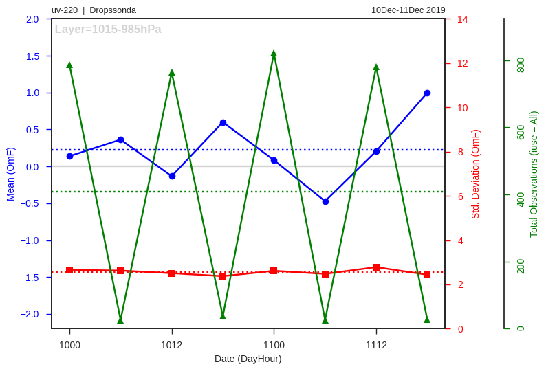
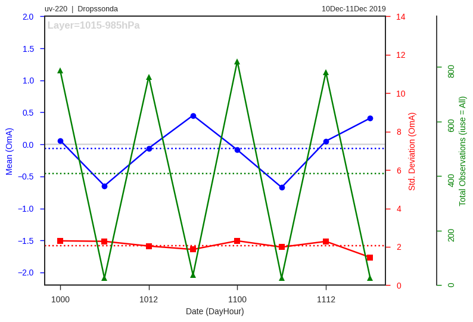
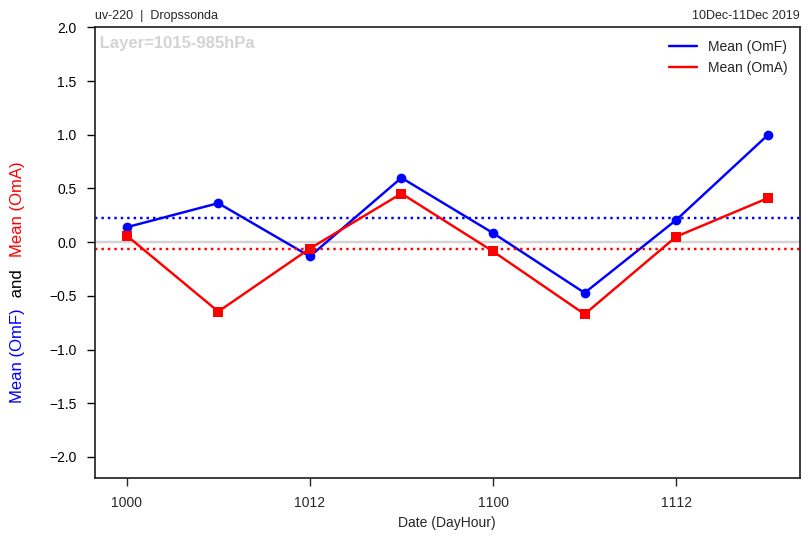
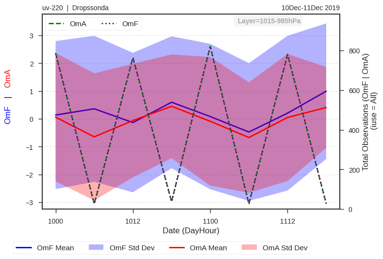
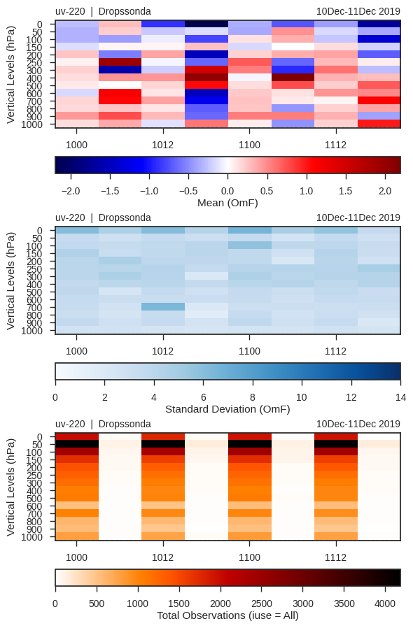
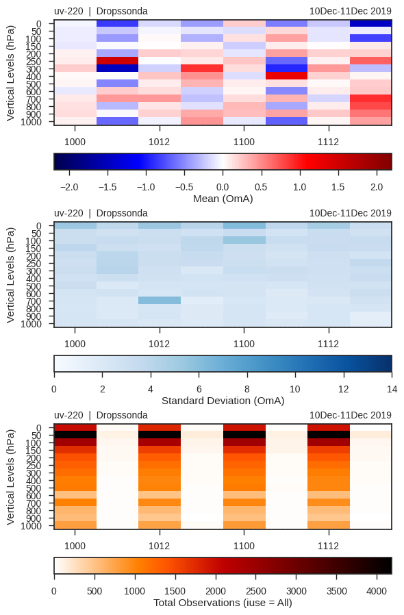
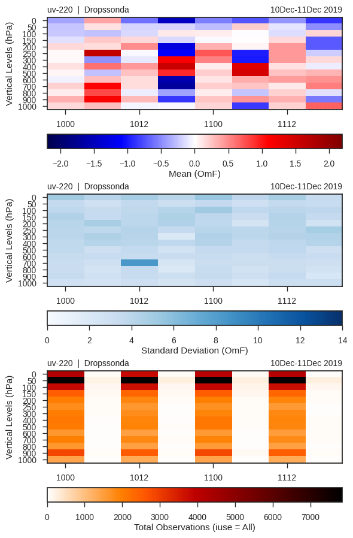
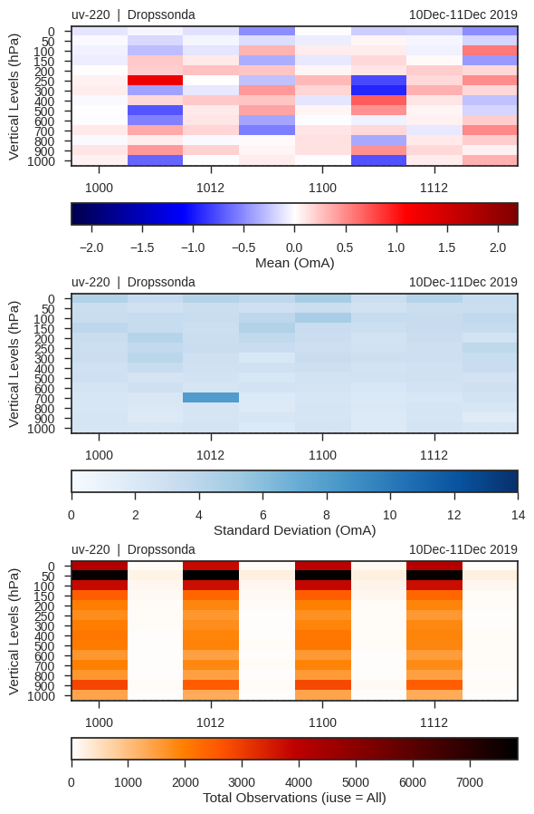
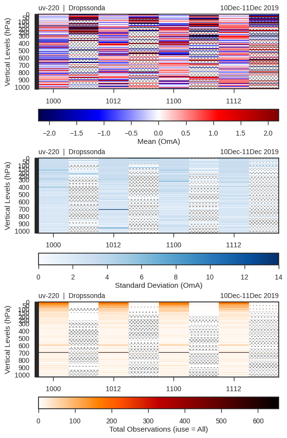

# Application - Usage

## Using the `read_diag` Class

### Required Libraries

To start using `readDiag`, first load the necessary libraries for its usage:

* `gsidiag`: it is the library that contains the `read_diag` and `plot_diag` classes;
* `pandas`: it is the library that provides tabulated data structures used by `readDiag`;
* `matplotlib`: it is the library from which figures are created;
* `datetime`: it is the library used for date manipulation.

The `%matplotlib inline` instruction is a Jupyter magic command and only adjusts the environment so that the `plt.show()` command is not needed whenever figures are displayed within the notebook. If you are using `readDiag` within a Python script, this directive can be omitted, and the `plt.show()` command should be used as needed.

```python linenums="1"
import gsidiag as gd

import pandas as pd
import matplotlib.pyplot as plt
from datetime import datetime, timedelta
```


### Main Variables

In the table below, the default values of the variables used throughout this tutorial are listed. Note that the variables have different types, and some can be declared as `None`.

| Variables |     | Values          | Type              |
| :---:     |:---:| :---             | :---              |
| `DIRdiag` | =   | `/pesq/share/das/dist/joao.gerd/EXP18/GSI/dataout` | string |
|`varName`  | =   | `uv`             | string            |
|`varType`  | =   | `220`            | integer           |
|`dateIni`  | =   | `2019121000`     | string            |
|`dateFin`  | =   | `2019121118`     | string            |
|`nHour`    | =   | `6`              | string            |
|`vminOMA`  | =   | `-2.0`           | float             |
|`vmaxOMA`  | =   | `2.0`            | float             |
|`vminSTD`  | =   | `0.0`            | float             |
|`vmaxSTD`  | =   | `14.0`           | float             |
|`Level`    | =   | `1000`           | integer or `None` |
|`Lay`      | =   | `15`             | integer or `None` |
|`SingleL`  | =   | `OneL`           | string            |

Thus, in the following cell, the variables are adjusted according to the values in the table above. Additionally, the date values are also adjusted to compose the path and names of the GSI diagnostic files:

=== "Command"

    ```python linenums="1"
    # For use in Egeon
    #DIRdiag = "/pesq/share/das/dist/joao.gerd/EXP18/GSI/dataout"

    # For use in Itapemirim (Colorado, Ilopolis, and other virtual machines)
    #DIRdiag = "/share/das/dist/joao.gerd/EXP18/GSI/dataout"

    # For use on a local machine (in this case, the remote directory should be mounted locally with the sshfs command)
    # Example:
    # $ sshfs username@egeon.cptec.inpe.br:/pesq/share/das/dist/joao.gerd/EXP18/GSI/dataout /extra2/EGEON_EXP18_GSI_dataout
    # or
    # $ sshfs username@itapemirim.cptec.inpe.br:/share/das/dist/joao.gerd/EXP18/GSI/dataout /extra2/EGEON_EXP18_GSI_dataout
    DIRdiag = '/extra2/EGEON_EXP18_GSI_dataout'

    varName = 'uv'
    varType = 220
    dateIni = '2019121000'
    dateFin = '2019121118'
    nHour = '6'
    vminOMA = -2.0
    vmaxOMA = 2.0
    vminSTD = 0.0
    vmaxSTD = 14.0
    Level = 1000
    Lay = 15
    SingleL = 'OneL'

    datei = datetime.strptime(str(dateIni), '%Y%m%d%H')
    datef = datetime.strptime(str(dateFin), '%Y%m%d%H')
    dates = [dates.strftime('%Y%m%d%H') for dates in pd.date_range(datei, datef,freq='6H').tolist()]

    print(dates)
    ```

=== "Result"

    ```python linenums="1"
    ['2019121000', '2019121006', '2019121012', '2019121018', '2019121100', '2019121106', '2019121112', '2019121118']
    ```

Generating the `path` and `pathc` variables where the complete paths (including the file name) of the diagnostic files for the first (OmF) and last (OmA) outer loops will be:

=== "Command"

    ```python linenums="1"
    paths, pathsc = [], []
    
    OuterL = '01'
    [paths.append(DIRdiag + '/' + dt + '/diag_conv_' + OuterL + '.' + dt) for dt in dates]
    
    OuterLc = '03'
    [pathsc.append(DIRdiag + '/' + dt + '/diag_conv_' + OuterLc + '.' + dt) for dt in dates]
    
    print(paths)
    print('')
    print(pathsc)
    ```

=== "Result"

    ```python linenums="1"
    ['/extra2/EGEON_EXP18_GSI_dataout/2019121000/diag_conv_01.2019121000', '/extra2/EGEON_EXP18_GSI_dataout/2019121006/diag_conv_01.2019121006', '/extra2/EGEON_EXP18_GSI_dataout/2019121012/diag_conv_01.2019121012', '/extra2/EGEON_EXP18_GSI_dataout/2019121018/diag_conv_01.2019121018', '/extra2/EGEON_EXP18_GSI_dataout/2019121100/diag_conv_01.2019121100', '/extra2/EGEON_EXP18_GSI_dataout/2019121106/diag_conv_01.2019121106', '/extra2/EGEON_EXP18_GSI_dataout/2019121112/diag_conv_01.2019121112', '/extra2/EGEON_EXP18_GSI_dataout/2019121118/diag_conv_01.2019121118']

    ['/extra2/EGEON_EXP18_GSI_dataout/2019121000/diag_conv_03.2019121000', '/extra2/EGEON_EXP18_GSI_dataout/2019121006/diag_conv_03.2019121006', '/extra2/EGEON_EXP18_GSI_dataout/2019121012/diag_conv_03.2019121012', '/extra2/EGEON_EXP18_GSI_dataout/2019121018/diag_conv_03.2019121018', '/extra2/EGEON_EXP18_GSI_dataout/2019121100/diag_conv_03.2019121100', '/extra2/EGEON_EXP18_GSI_dataout/2019121106/diag_conv_03.2019121106', '/extra2/EGEON_EXP18_GSI_dataout/2019121112/diag_conv_03.2019121112', '/extra2/EGEON_EXP18_GSI_dataout/2019121118/diag_conv_03.2019121118']
    ```

### Reading Diagnostic Files

!!! warning "Warning"

    Reading diagnostic files using the values adjusted for the parameters above requires at least 8GB of RAM. If necessary, adjust the parameters to consider a smaller interval.

Reading diagnostic files with the `read_diag()` function from the `readDiag` package. In the following code snippet, note that the `read_diag()` function is used within a loop that iterates over all the files in the `paths` and `pathsc` lists defined in the previous step. At the end of the loop, the `gdf_list` list is generated, which will contain all the files read by `readDiag`:

=== "Command"

    ```python linenums="1"
    read = True

    if read:
        gdf_list = []
        print('')

        print('Please wait; the estimated total time for reading the files is ' +
              str(int((float(len(paths))*20)/60)) + ' minutes and ' +
              str(int((float(len(paths))*20)%60)) + ' seconds.')

        print('')

        for path, pathc in zip(paths, pathsc):
            print('Reading ' + path)

            gdf = gd.read_diag(path, pathc)

            gdf_list.append(gdf)

        print('Done!')
    ```


=== "Result"

    ```python linenums="1"
    Please wait; the estimated total time for reading the files is 2 minutes and 40 seconds.
    
    Reading /extra2/EGEON_EXP18_GSI_dataout/2019121000/diag_conv_01.2019121000
    
    >>> GSI DIAG <<<
    
    Reading /extra2/EGEON_EXP18_GSI_dataout/2019121006/diag_conv_01.2019121006
    
    >>> GSI DIAG <<<
    
    Reading /extra2/EGEON_EXP18_GSI_dataout/2019121012/diag_conv_01.2019121012
    
    >>> GSI DIAG <<<
    
    Reading /extra2/EGEON_EXP18_GSI_dataout/2019121018/diag_conv_01.2019121018
    
    >>> GSI DIAG <<<
    
    Reading /extra2/EGEON_EXP18_GSI_dataout/2019121100/diag_conv_01.2019121100
    
    >>> GSI DIAG <<<
    
    Reading /extra2/EGEON_EXP18_GSI_dataout/2019121106/diag_conv_01.2019121106
    
    >>> GSI DIAG <<<
    
    Reading /extra2/EGEON_EXP18_GSI_dataout/2019121112/diag_conv_01.2019121112
    
    >>> GSI DIAG <<<
    
    Reading /extra2/EGEON_EXP18_GSI_dataout/2019121118/diag_conv_01.2019121118
    
    >>> GSI DIAG <<<
    
    Done!
    ```

The `gdf_list` variable is a list of dataframes containing the data from each diagnostic file. To work with a single time, simply refer to the list with a fixed index, for example: `gdf_list[0]`:

=== "Command"

    ```python linenums="1"
    gdf_list
    ```


=== "Result"

    ```python linenums="1"
    [<gsidiag.__main__.read_diag at 0x7f9005378790>,
     <gsidiag.__main__.read_diag at 0x7f8ff18e65d0>,
     <gsidiag.__main__.read_diag at 0x7f8fda8d2f50>,
     <gsidiag.__main__.read_diag at 0x7f8fc0b68bd0>,
     <gsidiag.__main__.read_diag at 0x7f8fabb26e10>,
     <gsidiag.__main__.read_diag at 0x7f8f97e89b90>,
     <gsidiag.__main__.read_diag at 0x7f8f83823350>,
     <gsidiag.__main__.read_diag at 0x7f8f67a70b90>]
    ```

Setting `tidx = 0` retrieves the first object from the `gdf_list`:

=== "Command"

    ```python linenums="1"
    tidx = 0
    gdf_list[tidx]
    ```


=== "Result"

    ```python linenums="1"
    <gsidiag.__main__.read_diag at 0x7f9005378790>
    ```

### Obtaining File Information

Use the `pfileinfo()` function to get a list of observations and their respective types (`kx`) contained within the file:

=== "Command"

    ```python linenums="1"
    gdf_list[tidx].pfileinfo()
    ```


=== "Result"

    ```python linenums="1"
    Variable Name: ps
                  └── kx => 181  120  187  180  183
    
    Variable Name: t
                  └── kx => 181  120  187  180  183  130  126
    
    Variable Name: q
                  └── kx => 181  120  187  180  183
    
    Variable Name: uv
                  └── kx => 257  259  258  244  281  253  254  220  287  280  221  284  230  243  210  252  242  250  229  224  282  245  246  247  240
    ```

In addition to the `pfileinfo()` method, other methods and functions can also be used to access information about the opened files. To get a list of available methods and functions, type `gdf_list[tidx].` and press the `<TAB>` key twice on the keyboard:

```python linenums="1"
>>> gdf_list[tidx].
gdf_list[tidx].close(      gdf_list[tidx].obsInfo     gdf_list[tidx].pfileinfo(  gdf_list[tidx].zlevs
gdf_list[tidx].tocsv(      gdf_list[tidx].overview(   gdf_list[tidx].varNames
gdf_list[tidx].obs
```

The built-in methods and functions have documentation, which can be accessed as follows:

```python linenums="1"
print(object.function_name.__doc__)
```

or

```python linenums="1"
help(object.function_name)
```

For example:

=== "Command"

    ```python linenums="1"
    print(gdf_list[tidx].pfileinfo.__doc__)
    ```

=== "Result"

    ```python linenums="1"
    Prints a fancy list of the existing variables and types.
    
    Usage: pfileinfo()
    ```

or alternatively:

=== "Command"

    ```python linenums="1"
    help(gdf_list[tidx].pfileinfo)
    ```

=== "Result"

    ```python linenums="1"
    Help on method pfileinfo in module gsidiag.__main__:
    
    pfileinfo() method of gsidiag.__main__.read_diag instance
        Prints a fancy list of the existing variables and types.
    
        Usage: pfileinfo()
    ```

To get a dictionary with all the information about the variables and types contained in the file, use the `obsInfo` method:

=== "Command"

    ```python linenums="1"
    gdf_list[tidx].obsInfo
    ```

=== "Result"

    ```python linenums="1"
    {'ps':                   lat         lon    elev         prs     hgt  press   time  \
     kx  points
     181 0      -72.000000    2.520000  1290.0  852.099976  1290.0  800.0    0.0
         1      -70.760002   11.830000   123.0  987.700012   123.0  900.0    0.0
         2      -72.000000    2.520000  1290.0  852.400024  1290.0  800.0   60.0
         3      -72.000000    2.520000  1290.0  852.099976  1290.0  800.0  120.0
         4      -72.000000    2.520000  1290.0  852.400024  1290.0  800.0  -60.0
     ...               ...         ...     ...         ...     ...    ...    ...
     183 3600    65.680000  341.929993    27.0  982.299988    27.0  900.0 -180.0
         3601    63.779999  341.929993    38.0  977.599976    38.0  900.0 -180.0
         3602    66.449997  344.049988    10.0  989.299988    10.0  900.0 -180.0
         3603    63.779999  341.929993    38.0  972.599976    38.0  900.0    0.0
         3604    66.449997  344.049988    10.0  984.200012    10.0  900.0    0.0

                 idqc  iuse  iusev  ...       inp_err       adj_err        inverr  \
     kx  points                     ...
     181 0        2.0   1.0    0.0  ...  1.000000e+00  1.000000e+00  2.684909e-01
         1        2.0   1.0    0.0  ...  1.000000e+00  1.000000e+00  5.507368e-01
         2        2.0   1.0    0.0  ...  1.000000e+00  1.000000e+00  2.689506e-01
         3        2.0   1.0    0.0  ...  1.000000e+00  1.000000e+00  2.738240e-01
         4        2.0   1.0    0.0  ...  1.000000e+00  1.000000e+00  2.748610e-01
     ...          ...   ...    ...  ...           ...           ...           ...
     183 3600     9.0  -1.0  101.0  ...  1.000000e-11  1.000000e-11  1.000000e-11
         3601     9.0  -1.0  101.0  ...  1.000000e-11  1.000000e-11  1.000000e-11
         3602     9.0  -1.0  101.0  ...  1.000000e-11  1.000000e-11  1.000000e-11
         3603     9.0  -1.0  101.0  ...  1.000000e-11  1.000000e-11  1.000000e-11
         3604     9.0  -1.0  101.0  ...  1.000000e-11  1.000000e-11  1.000000e-11

                          oer         obs       omf       oma           imp  \
     kx  points
     181 0       3.689821e+00  852.099976  2.616960  1.882513 -8.956059e-01
         1       1.795848e+00  987.700012  1.048871  0.143297 -6.011624e-01
         2       3.683941e+00  852.400024  2.931195  2.196748 -1.022330e+00
         3       3.618501e+00  852.099976  2.632484  1.898037 -9.195598e-01
         4       3.603527e+00  852.400024  2.977133  2.242685 -1.063870e+00
     ...                  ...         ...       ...       ...           ...
     183 3600    1.000000e+11  982.299988  4.375452  0.995740 -1.815308e-10
         3601    1.000000e+11  977.599976 -0.614942 -3.658909  1.300946e-10
         3602    1.000000e+11  989.299988  4.233233  1.677821 -1.510518e-10
         3603    1.000000e+11  972.599976 -1.276419 -4.320014  1.703327e-10
         3604    1.000000e+11  984.200012  4.378825  1.823362 -1.584946e-10

                          dfs                    geometry
     kx  points
     181 0      -5.208976e-01   POINT (2.52000 -72.00000)
         1      -5.289034e-01  POINT (11.83000 -70.76000)
         2      -5.843764e-01   POINT (2.52000 -72.00000)
         3      -5.343153e-01   POINT (2.52000 -72.00000)
         4      -6.067804e-01   POINT (2.52000 -72.00000)
     ...                  ...                         ...
     183 3600   -1.478777e-10  POINT (-18.07001 65.68000)
         3601    1.871863e-11  POINT (-18.07001 63.78000)
         3602   -1.081766e-10  POINT (-15.95001 66.45000)
         3603    3.884901e-11  POINT (-18.07001 63.78000)
         3604   -1.118992e-10  POINT (-15.95001 66.45000)

     [82566 rows x 21 columns],
     't':                   lat        lon    elev         prs     hgt  press   time  \
     kx  points
     181 0      -72.000000    2.52000  1290.0  852.099976  1290.0  800.0    0.0
         1      -70.760002   11.83000   123.0  987.700012   123.0  900.0    0.0
         2      -72.000000    2.52000  1290.0  852.400024  1290.0  800.0   60.0
         3      -72.000000    2.52000  1290.0  852.099976  1290.0  800.0  120.0
         4      -72.000000    2.52000  1290.0  852.400024  1290.0  800.0  -60.0
     ...               ...        ...     ...         ...     ...    ...    ...
     126 3351    39.709999  280.98999   763.0  892.900024  1054.0  800.0  150.0
         3352    39.709999  280.98999   763.0  886.000000  1118.0  800.0  150.0
         3353    39.709999  280.98999   763.0  879.000000  1183.0  800.0  150.0
         3354    39.709999  280.98999   763.0  872.099976  1247.0  800.0  150.0
         3355    39.709999  280.98999   763.0  865.299988  1312.0  800.0  150.0

                 idqc  iuse  iusev  ...       inp_err       adj_err        inverr  \
     kx  points                     ...
     181 0        9.0  -1.0  101.0  ...  1.000000e-11  1.000000e-11  9.090909e-12
         1        9.0  -1.0  101.0  ...  1.000000e-11  1.000000e-11  9.090909e-12
         2        9.0  -1.0  101.0  ...  1.000000e-11  1.000000e-11  9.090909e-12
         3        9.0  -1.0  101.0  ...  1.000000e-11  1.000000e-11  9.090909e-12
         4        9.0  -1.0  101.0  ...  1.000000e-11  1.000000e-11  9.090909e-12
     ...          ...   ...    ...  ...           ...           ...           ...
     126 3351     9.0  -1.0  101.0  ...  1.000000e-11  1.000000e-17  1.000000e-17
         3352     9.0  -1.0  101.0  ...  1.000000e-11  1.000000e-17  1.000000e-17
         3353     9.0  -1.0  101.0  ...  1.000000e-11  1.000000e-17  1.000000e-17
         3354     9.0  -1.0  101.0  ...  1.000000e-11  1.000000e-17  1.000000e-17
         3355     9.0  -1.0  101.0  ...  1.000000e-11  1.000000e-17  1.000000e-17

                          oer         obs       omf       oma           imp  \
     kx  points
     181 0       1.100000e+11  266.750000  5.638822  5.409732 -2.301008e-11
         1       1.100000e+11  273.850006  6.480910  6.229341 -2.906831e-11
         2       1.100000e+11  267.049988  5.925752  5.696663 -2.420519e-11
         3       1.100000e+11  267.149994  6.012683  5.783593 -2.456731e-11
         4       1.100000e+11  266.549988  5.074802  4.845712 -2.066080e-11
     ...                  ...         ...       ...       ...           ...
     126 3351    1.000000e+17  287.250000  4.286700  2.850528 -1.025029e-16
         3352    1.000000e+17  286.350006  3.588516  2.029374 -8.759085e-17
         3353    1.000000e+17  286.350006  3.845302  2.211233 -9.896797e-17
         3354    1.000000e+17  286.149994  3.865214  2.203462 -1.008463e-16
         3355    1.000000e+17  285.149994  3.036773  1.390132 -7.289526e-17

                          dfs                    geometry
     kx  points
     181 0      -1.174360e-11   POINT (2.52000 -72.00000)
         1      -1.482183e-11  POINT (11.83000 -70.76000)
         2      -1.234115e-11   POINT (2.52000 -72.00000)
         3      -1.252222e-11   POINT (2.52000 -72.00000)
         4      -1.056896e-11   POINT (2.52000 -72.00000)
     ...                  ...                         ...
     126 3351   -6.156439e-17  POINT (-79.01001 39.71000)
         3352   -5.595004e-17  POINT (-79.01001 39.71000)
         3353   -6.283490e-17  POINT (-79.01001 39.71000)
         3354   -6.423026e-17  POINT (-79.01001 39.71000)
         3355   -5.000478e-17  POINT (-79.01001 39.71000)

     [116439 rows x 21 columns],
     'q':                   lat         lon    elev         prs     hgt  press   time  \
     kx  points
     181 0      -72.000000    2.520000  1290.0  852.099976  1290.0  800.0    0.0
         1      -70.760002   11.830000   123.0  987.700012   123.0  900.0    0.0
         2      -72.000000    2.520000  1290.0  852.400024  1290.0  800.0   60.0
         3      -72.000000    2.520000  1290.0  852.099976  1290.0  800.0  120.0
         4      -72.000000    2.520000  1290.0  852.400024  1290.0  800.0  -60.0
     ...               ...         ...     ...         ...     ...    ...    ...
     183 2660    65.680000  341.929993    27.0  982.299988    27.0  900.0 -180.0
         2661    63.779999  341.929993    38.0  977.599976    38.0  900.0 -180.0
         2662    66.449997  344.049988    10.0  989.299988    10.0  900.0 -180.0
         2663    63.779999  341.929993    38.0  972.599976    38.0  900.0    0.0
         2664    66.449997  344.049988    10.0  984.200012    10.0  900.0    0.0

                 idqc  iuse  iusev  ...   inp_err   adj_err    inverr  \
     kx  points                     ...
     181 0        9.0  -1.0  101.0  ...  0.000054  0.000054  0.000054
         1        9.0  -1.0  101.0  ...  0.000039  0.000039  0.000039
         2        9.0  -1.0  101.0  ...  0.000054  0.000054  0.000054
         3        9.0  -1.0  101.0  ...  0.000054  0.000054  0.000054
         4        9.0  -1.0  101.0  ...  0.000053  0.000053  0.000053
     ...          ...   ...    ...  ...       ...       ...       ...
     183 2660     9.0  -1.0  102.0  ...  0.000028  0.000028  0.000028
         2661     9.0  -1.0  102.0  ...  0.000024  0.000024  0.000024
         2662     9.0  -1.0  102.0  ...  0.000024  0.000024  0.000024
         2663     9.0  -1.0  102.0  ...  0.000024  0.000024  0.000024
         2664     9.0  -1.0  102.0  ...  0.000025  0.000025  0.000025

                          oer    obs       omf       oma           imp  \
     kx  points
     181 0       1.871621e+10  1.562  0.147178  0.146827 -5.506964e-15
         1       2.613980e+10  2.092  0.246853  0.246150 -1.326650e-14
         2       1.876213e+10  1.523  0.143555  0.143204 -5.358170e-15
         3       1.880805e+10  1.462  0.117932  0.117581 -4.389752e-15
         4       1.926510e+10  1.667  0.163603  0.163252 -5.947479e-15
     ...                  ...    ...       ...       ...           ...
     183 2660    3.369109e+10  3.083 -0.273933 -0.258595 -2.424459e-13
         2661    3.843422e+10  4.159  0.867337  0.867106 -1.045875e-14
         2662    3.916033e+10  3.604 -0.224209 -0.135418 -8.154096e-13
         2663    3.862750e+10  4.241  1.041719  1.041487 -1.249572e-14
         2664    3.823060e+10  3.955 -0.032830  0.132701  4.324247e-13

                          dfs                    geometry
     kx  points
     181 0      -2.756724e-15   POINT (2.52000 -72.00000)
         1      -6.642705e-15  POINT (11.83000 -70.76000)
         2      -2.682395e-15   POINT (2.52000 -72.00000)
         3      -2.198141e-15   POINT (2.52000 -72.00000)
         4      -2.976934e-15   POINT (2.52000 -72.00000)
     ...                  ...                         ...
     183 2660   -1.247146e-13  POINT (-18.07001 65.68000)
         2661   -5.229694e-15  POINT (-18.07001 63.78000)
         2662   -5.083661e-13  POINT (-15.95001 66.45000)
         2663   -6.249719e-15  POINT (-18.07001 63.78000)
         2664   -1.421482e-13  POINT (-15.95001 66.45000)

     [102785 rows x 21 columns],
     'uv':                   lat         lon     elev    prs   hgt  press   time  idqc  \
     kx  points
     257 0      -78.699997   14.860000  61068.0  487.0  30.0  400.0  -66.0   2.0
         1      -78.769997   16.080000  60056.0  487.0  54.0  400.0  -66.0   2.0
         2      -78.870003   16.120001  72079.0  500.0  37.0  500.0  -66.0   2.0
         3      -80.500000   12.490000  80084.0  562.0  47.0  500.0  -66.0   2.0
         4      -80.290001   13.620000  64059.0  512.0  56.0  500.0  -66.0   2.0
     ...               ...         ...      ...    ...   ...    ...    ...   ...
     240 7107    13.980000  245.070007  74084.0  925.0  47.0  900.0  171.0   2.0
         7108    13.690000  241.919998  79080.0  887.0  64.0  800.0  171.0   2.0
         7109    13.710000  244.139999  57051.0  887.0  70.0  800.0  171.0   2.0
         7110    13.520000  247.809998  56054.0  906.0  65.0  900.0  171.0   2.0
         7111    13.510000  250.479996  80087.0  906.0  60.0  900.0  171.0   2.0

                 iuse  iusev  ...       inp_err       adj_err        inverr  \
     kx  points               ...
     257 0       -1.0    0.0  ...  2.307337e-01  2.307337e-01  2.938736e-39
         1       -1.0    0.0  ...  2.307337e-01  2.307337e-01  2.938736e-39
         2       -1.0    0.0  ...  2.439024e-01  2.439024e-01  2.938736e-39
         3       -1.0    0.0  ...  2.500000e-01  2.500000e-01  2.938736e-39
         4       -1.0    0.0  ...  2.453386e-01  2.453386e-01  2.938736e-39
     ...          ...    ...  ...           ...           ...           ...
     240 7107    -1.0  100.0  ...  1.000000e-09  1.000000e-09  1.000000e-09
         7108    -1.0  100.0  ...  1.000000e-09  1.000000e-09  1.000000e-09
         7109    -1.0  100.0  ...  1.000000e-09  1.000000e-09  1.000000e-09
         7110    -1.0  100.0  ...  1.000000e-09  1.000000e-09  1.000000e-09
         7111    -1.0  100.0  ...  1.000000e-09  1.000000e-09  1.000000e-09

                          oer       obs       omf       oma           imp  \
     kx  points
     257 0                NaN -2.250000 -5.155063 -5.807309           NaN
         1                NaN  0.934964 -2.355014 -2.984500           NaN
         2                NaN  0.988129 -2.418580 -3.046497           NaN
         3                NaN  3.983431  0.595628  0.257419           NaN
         4                NaN  3.680218  0.498253  0.008589           NaN
     ...                  ...       ...       ...       ...           ...
     240 7107    1.000000e+09 -7.203239 -0.806275 -0.955513  2.629265e-10
         7108    1.000000e+09 -7.751757 -1.638531 -1.589939 -1.568761e-10
         7109    1.000000e+09 -7.044833 -4.839164 -4.851346  1.180420e-10
         7110    1.000000e+09 -7.018799 -2.621243 -2.872725  1.381637e-09
         7111    1.000000e+09 -4.978588 -1.019387 -1.283688  6.087035e-10

                          dfs                     geometry
     kx  points
     257 0                NaN   POINT (14.86000 -78.70000)
         1                NaN   POINT (16.08000 -78.77000)
         2                NaN   POINT (16.12000 -78.87000)
         3                NaN   POINT (12.49001 -80.50000)
         4                NaN   POINT (13.62000 -80.29000)
     ...                  ...                          ...
     240 7107    1.203272e-10  POINT (-114.92999 13.98000)
         7108   -7.961867e-11  POINT (-118.08002 13.69000)
         7109    5.894722e-11  POINT (-115.85999 13.71000)
         7110    6.591968e-10  POINT (-112.19000 13.52000)
         7111    2.694244e-10  POINT (-109.52002 13.51000)

     [435598 rows x 21 columns]}
    ```

To access a specific variable (e.g., `uv`), do the following:

=== "Command"

    ```python linenums="1"
    print('Variable: ', varName)
    
    gdf_list[tidx].obsInfo[varName]
    ```

=== "Result"

    Variable:  uv
    
    |     |   		|lat 	      |lon 	      |elev 	  |  prs 	  |hgt 	|press 	|time 	|  idqc|iuse 	|iusev | ... 	|inp_err 	    |adj_err 	      |inverr 	      |oer 	        |obs 	      |omf 	      |  oma 	      | imp 	      |  dfs 	        |geometry                     |
    |-----|-------|-----------|-----------|---------|---------|-----|-------|-------|-----|-------|------|------|-------------|---------------|---------------|-------------|-----------|-----------|-------------|-------------|---------------|-----------------------------|
    |**kx** 	|**points** |						|						|					|				  |     |       |       |     |       |      |      |             |               |               |             |           |           |             |             |               |                             |
    |**257** 	| **0** 	  |-78.699997 |	14.860000 |	61068.0 |	487.0 	|30.0 |	400.0 |	-66.0 |	2.0 |	-1.0 	|0.0 	 | ... 	|2.307337e-01 |	2.307337e-01 	|2.938736e-39 	|NaN 	        |-2.250000 	|-5.155063 	|  -5.807309 	|  NaN 	      |  NaN 	        |POINT (14.86000 -78.70000)   |
    |     | **1** 	  |-78.769997 |	16.080000 |	60056.0 |	487.0 	|54.0 |	400.0 |	-66.0 |	2.0 |	-1.0 	|0.0 	 | ... 	|2.307337e-01 |	2.307337e-01 	|2.938736e-39 	|NaN 	        |0.934964 	|  -2.355014| 	-2.984500 |	NaN 	      |  NaN 	        |POINT (16.08000 -78.77000)   | 
    |     | **2** 	  |-78.870003 |	16.120001 |	72079.0 |	500.0 	|37.0 |	500.0 |	-66.0 |	2.0 |	-1.0 	|0.0 	 | ... 	|2.439024e-01 |	2.439024e-01 	|2.938736e-39 	|NaN 	        |0.988129 	|  -2.418580| 	-3.046497 |	NaN 	      |  NaN 	        |POINT (16.12000 -78.87000)   |
    |     | **3** 	  |-80.500000 |	12.490000 |	80084.0 |	562.0 	|47.0 |	500.0 |	-66.0 |	2.0 |	-1.0 	|0.0 	 | ... 	|2.500000e-01 |	2.500000e-01 	|2.938736e-39 	|NaN 	        |3.983431 	|  0.595628 |	  0.257419 	|  NaN 	      |  NaN 	        |POINT (12.49001 -80.50000)   |
    |     | **4** 	  |-80.290001 |	13.620000 |	64059.0 |	512.0 	|56.0 |	500.0 |	-66.0 |	2.0 |	-1.0 	|0.0 	 | ... 	|2.453386e-01 |	2.453386e-01 	|2.938736e-39 	|NaN 	        |3.680218 	|  0.498253 |	  0.008589  |  NaN 	      |  NaN 	        |POINT (13.62000 -80.29000)   |
    |... 	|... 	  |... 	      |... 	      |... 	    |... 	    |... 	|... 	  |... 	  |... 	|  ... 	|... 	 | ... 	|... 	        |... 	          |... 	          | ... 	      |  ... 	    |  ... 	    |  ... 	      |... 	        |  ... 	        |...                          |
    |**240** 	|**7107** 	|13.980000 	|245.070007 |	74084.0 |	925.0 	|47.0 |	900.0 |	171.0 |	2.0 |	-1.0 	|100.0 |	... |1.000000e-09 |	1.000000e-09 	|1.000000e-09 	|1.000000e+09 |	-7.203239 |	-0.806275 |	-0.955513 	|2.629265e-10 |	1.203272e-10 	|POINT (-114.92999 13.98000)  |
    |     | **7108** 	|13.690000 	|241.919998 |	79080.0 |	887.0 	|64.0 |	800.0 |	171.0 |	2.0 |	-1.0 	|100.0 |	... |1.000000e-09 |	1.000000e-09 	|1.000000e-09 	|1.000000e+09 |	-7.751757 |	-1.638531 |	-1.589939 	|-1.568761e-10|	-7.961867e-11 |POINT (-118.08002 13.69000)  |
    |     | **7109** 	|13.710000 	|244.139999 |	57051.0 |	887.0 	|70.0 |	800.0 |	171.0 |	2.0 |	-1.0 	|100.0 |	... |1.000000e-09 |	1.000000e-09 	|1.000000e-09 	|1.000000e+09 |	-7.044833 |	-4.839164 |	-4.851346 	|1.180420e-10 |	5.894722e-11 	|POINT (-115.85999 13.71000)  |
    |     | **7110** 	|13.520000 	|247.809998 |	56054.0 |	906.0 	|65.0 |	900.0 |	171.0 |	2.0 |	-1.0 	|100.0 |	... |1.000000e-09 |	1.000000e-09 	|1.000000e-09 	|1.000000e+09 |	-7.018799 |	-2.621243 |	-2.872725 	|1.381637e-09 |	6.591968e-10 	|POINT (-112.19000 13.52000)  |
    |     | **7111** 	|13.510000 	|250.479996 |	80087.0 |	906.0 	|60.0 |	900.0 |	171.0 |	2.0 |	-1.0 	|100.0 |	... |1.000000e-09 |	1.000000e-09 	|1.000000e-09 	|1.000000e+09 |	-4.978588 |	-1.019387 |	-1.283688 	|6.087035e-10 |	2.694244e-10 	|POINT (-109.52002 13.51000)  |
    
    435598 rows × 21 columns

To access specific variable and type (e.g., `uv` of type `220`), do:

=== "Command"

    ```python linenums="1"
    print('Variable: ', varName, ' and Type: ', varType)

    gdf_list[tidx].obsInfo[varName].loc[varType]
    ```

=== "Result"


    Variable:  uv  and Type:  220
    
    |      | 	lat 	    |     lon     |	elev  | 	prs      |   	hgt        | 	press |	time    	 |idqc 	|iuse 	|iusev|	...| 	inp_err 	|adj_err 	|inverr       	|oer     	|obs   |	omf     	|oma 	    |imp      	 |dfs 	      |geometry                 |
    |------|------------|-------------|-------|------------|---------------|--------|------------|------|-------|-----|----|------------|---------|---------------|---------|------|------------|---------|------------|------------|-------------------------|
    |**points**| 						|							|				|			       |               |        |            |      |       |     |    |            |         |               |         |      |            |         |            |            |	                        |
    |**0**|	-33.980000| 	18.600000 |	52.0 	|1004.000000 |	1.000000e+11 |	1000.0|	-45.000000 |	2.0 |	1.0 	|0.0 	|... |	0.714286 	|0.553566 |	1.418077e-01 	|7.787335 |	-1.0 |	5.123084 	|2.253895 |	-2.717996  | -1.887564 	|POINT (18.60001 -33.98000)|
    |**1**|	-33.979839| 	18.599819 |	52.0 	|1000.000000 |	1.000000e+11 |	1000.0|	-44.880001 |	2.0 |	1.0 	|0.0 	|... |	0.714286 	|0.553565 |	2.351083e-01 	|4.988861 |	-3.5 |	2.621643 	|-0.247218|	-1.365421  | -1.507585 	|POINT (18.59982 -33.97984)|
    |**2**|	-33.978512| 	18.598080 |	52.0 	|975.700012  |   3.000000e+02| 	900.0 |	-44.173199 |	2.0 |	1.0 	|0.0 	|... |	0.714286 	|0.714286 |	7.142857e-01 	|1.400000 |	-4.0 |	9.577692 	|3.444868 |	-57.046478 |	-41.955929| 	POINT (18.59808 -33.97851)|
    |**3**|	-33.977551| 	18.596769 |	52.0 	|942.400024  |   6.000000e+02| 	900.0 |	-43.173000 |	2.0 |	-1.0 	|0.0 	|... |	0.666667 	|0.652960 |	2.938736e-39 	|1.531486 |	0.0  | 16.411770  |9.015676 |	-122.798218| -79.258301 |	POINT (18.59677 -33.97755)|
    |**4**|	-33.977921| 	18.596710 |	52.0 	|925.000000  |   1.000000e+11| 	900.0 |	-42.640198 |	2.0 |	-1.0 	|0.0 	|... |	0.666667 	|0.619352 |	2.938736e-39 	|1.614591 |	-0.4 |	13.814748 |6.904759 |	-88.673553 |	-59.123161| 	POINT (18.59671 -33.97792)|
    |   ...| 	  ... 	  |     ...     | 	... | 	... 	   |    ...        |  	... |	    ... 	 |  ... |  	... |... 	|... |	  ... 	  |  ... 	  |   ...         |	... 	  |... 	 |   ... 	    | ...     | 	... 	   |   ... 	    | ...                         |
    |**37461**|	75.934608 |	344.023560 	|14.0 	|8.200000 	 |   1.000000e+11| 	0.0 	|  48.249001 |	2.0 |	1.0 	|0.0 	|... |	0.476190 	|0.396825 |	3.968254e-01 	|2.520000 |	15.0 |	-3.926741 |-4.877170|	3.320431 	 | 1.480986 	|  POINT (-15.97644 75.93461)|
    |**37462**|	75.892578 |	344.104126 	|14.0 	|7.400000 	 |   1.000000e+11| 	0.0 	|  50.231998 |	2.0 |	1.0 	|0.0 	|... |	0.476190 	|0.396825 |	3.968254e-01 	|2.520000 |	21.6 |	3.278691 	|2.275991 |	-2.210190  | -1.304581  | POINT (-15.89587 75.89258)|
    |**37463**|	75.865311 |	344.162476 	|14.0 	|6.900000 	 |   1.000000e+11| 	0.0 	|  51.583801 |	2.0 |	1.0 	|0.0 	|... |	0.476190 	|0.396825 |	3.968254e-01 	|2.520000 |	17.4 |	-0.492477 |-1.526073|	0.827923 	 | 0.201993 	|  POINT (-15.83752 75.86531)|
    |**37464**|	75.810112 |	344.267883 	|14.0 	|6.100000 	 |   1.000000e+11| 	0.0 	|  53.967602 |	2.0 |	1.0 	|0.0 	|... |	0.476190 	|0.346399 |	3.463990e-01 	|2.886844 |	22.6 |	5.281235 	|3.752217 |	-4.784572  | -2.797208  | POINT (-15.73212 75.81011)|
    |**37465**|	75.793587 |	344.295898 	|14.0 	|5.900000 	 |   1.000000e+11| 	0.0 	|  54.613201 |	2.0 |	1.0 	|0.0 	|... |	0.476190 	|0.348412 |	3.484119e-01 	|2.870166 |	16.9 |	-0.252810 |-1.935140|	1.282453 	 | 0.148183 	|  POINT (-15.70410 75.79359)|
    
    37466 rows × 21 columns


The `varType` parameter can also be a list, for example: `varType=[220, 221]`:


=== "Command"

    ```python linenums="1"
    varTypes = [220,221]

    print('Variable: ', varName, ' e Types: ', varTypes)

    gdf_list[tidx].obsInfo[varName].loc[varTypes]
    ```

=== "Result"

    Variable:  uv  e Types:  [220, 221]

    |   |       |  lat	    |  lon	   |     elev|	prs	       | hgt	        |  press| 	  time	 |idqc | iuse	|iusev	|...	|inp_err 	|adj_err	| inverr      | 	oer	  | obs	|  omf	   |   oma	   |   imp	     |   dfs	    |    geometry               |
    |---|-------|-----------|----------|---------|-------------|--------------|-------|------------|-----|------|-------|-----|---------|---------|-------------|---------|-----|----------|-----------|-------------|------------|---------------------------|
    |**kx**	|**points**	|						|					 | 				 | 		         |              |       |            |     |      |       |	    |         |         |             |         |     |          |           |             |            |                           |
    |**220**|	**0**	    | -33.980000|	18.600000|	  52.0 | 1004.000000 | 1.000000e+11	|1000.0	| -45.000000 | 2.0 |  1.0	| 0.0	  |...	|0.714286	|0.553566	|1.418077e-01	|7.787335	|-1.0	|5.123084	 |  2.253895 | -2.717996	 | -1.887564 	|POINT (18.60001 -33.98000) |
    |   | **1**	    | -33.979839|	18.599819|	  52.0 | 1000.000000 | 1.000000e+11	|1000.0	| -44.880001 | 2.0 |  1.0	| 0.0	  |...	|0.714286	|0.553565	|2.351083e-01	|4.988861	|-3.5	|2.621643	 | -0.247218 | -1.365421	 | -1.507585  |	POINT (18.59982 -33.97984)|
    |   | **2**	    | -33.978512|	18.598080|	  52.0 | 975.700012	 | 3.000000e+02	|900.0	|  -44.173199|	2.0|	 1.0|	0.0	  |...	|0.714286	|0.714286	|7.142857e-01	|1.400000	|-4.0	|9.577692	 |  3.444868 | -57.046478	 | -41.955929	|POINT (18.59808 -33.97851) |
    |   | **3**	    | -33.977551|	18.596769|	  52.0 | 942.400024	 | 6.000000e+02	|900.0	|  -43.173000|	2.0|	-1.0|	0.0	  |...	|0.666667	|0.652960	|2.938736e-39	|1.531486	| 0.0	|16.411770 |  9.015676 | -122.798218 | -79.258301	|POINT (18.59677 -33.97755) |
    |   | **4**	    | -33.977921|	18.596710|	  52.0 | 925.000000	 | 1.000000e+11	|900.0	|  -42.640198|	2.0|	-1.0|	0.0	  |...	|0.666667	|0.619352	|2.938736e-39	|1.614591	|-0.4	|13.814748 |  6.904759 | -88.673553	 | -59.123161	|POINT (18.59671 -33.97792) |
    |...|	...	  |  ...	    |  ...	   |     ... |   ...	     |   ...	      |    ...|	    ...	   | ... |...	  |  ...	|...	|  ...	  | ...	    |  ...	      |...	    | ...	|      ... |   ...	   |   ...	     | ...	      |  ...	                    |
    |**221**|	**639**	  |  7.378550	|352.432678|	336.0	 | 616.083801	 | 4.200000e+03	|600.0	|  -32.119801|	2.0|	 1.0|	0.0	  |...	|0.526316	|0.526316	|5.263158e-01	|1.900000	|-10.0|	-1.387435|	 0.471839|	-0.895970	 | -1.357695  | POINT (-7.56732 7.37855)  |
    |   | **640**	  |  7.382580	|352.415344|	336.0	 | 551.021729	 | 5.100000e+03	|500.0	|  -29.119799|	2.0|	 1.0|	0.0	  |...	|0.500000	|0.500000	|5.000000e-01	|2.000000	|-11.3|	-0.546905|	 1.363278|	 0.779710	 | -0.522345  | POINT (-7.58466 7.38258)  |
    |   | **641**	  |  7.385930	|352.406006|	336.0	 | 500.000000	 | 1.000000e+11	|500.0	|  -27.538200|	2.0|	 1.0|	0.0	  |...	|0.476190	|0.412661	|4.126614e-01	|2.423294	|-10.3|	-3.802699|	-2.725824|	-2.901176	 | -1.689862  | POINT (-7.59399 7.38593)  |
    |   | **642**	  |  7.386930	|352.403564|	336.0	 | 510.839386	 | 5.700000e+03	|500.0	|  -27.119999|	2.0|	 1.0|	0.0	  |...	|0.476190	|0.412666	|4.126657e-01	|2.423269	|-10.9|	-3.664526|	-2.379657|	-3.204753	 | -1.943009  | POINT (-7.59644 7.38693)  |
    |   | **643**	  |  7.392140	|352.394043|	336.0	 | 473.089569	 | 6.300000e+03	|400.0	|  -25.120199|	2.0|	 1.0|	0.0	  |...	|0.434783	|0.434783	|4.347826e-01	|2.300000	|-6.5	| 2.720051 |	 3.510464|	 2.141166	 |  0.934767  | POINT (-7.60596 7.39214)  |

    38110 rows × 21 columns


To access the observation value, use the `obs` method:

=== "Command"

    ```python linenums="1"
    print('Variable: ', varName, ' e Type: ', varType)

    gdf_list[tidx].obsInfo[varName].loc[varType].obs
    ```

=== "Result"

    ```python linenums="1"
    Variable  uv e Type:  220

    points
    0        -1.0
    1        -3.5
    2        -4.0
    3         0.0
    4        -0.4
             ...
    37461    15.0
    37462    21.6
    37463    17.4
    37464    22.6
    37465    16.9
    Name: obs, Length: 37466, dtype: float32
    ```

## Using the `plot_diag` Class

### Spatial Distribution

The usage of the `plot_diag` class functions is presented below, along with commands to generate various types of figures.

Generating a figure with observation values (`param='obs'`) for the selected variable and type:

=== "Command"

    ```python linenums="1"
    param = 'obs'

    gd.plot_diag.plot(gdf_list[tidx],
                      varName=varName,
                      varType=varType,
                      param=param,
                      mask='iuse == 1',
                      legend='true')
    ```

=== "Result"

    

To save the figure, define its name (`figname`) and execute the following commands:


```python linenums="1"
figname = varName + '_' + param + '_' + 'plot.png'

plt.tight_layout()
plt.savefig(figname)
```

Generating the same figure, but considering various different types (`kx`) of the selected observation:

=== "Command"

    ```python linenums="1"
    varTypes = [254,242,221,220,257,258,281,280]
    idschar = '_'.join([str(item) for item in varTypes])

    gd.plot_diag.ptmap(gdf_list[tidx], varName=varName, varType=varTypes)

    figname = varName + '_' + idschar + '_' + 'ptmap.png'

    plt.tight_layout()
    plt.savefig(figname)
    ```

=== "Result"

    

Generating a figure with different variables, considering the mask `iuse==1`:

=== "Command"

    ```python linenums="1"
    varNames = ['uv','ps','t']
    idschar = '_'.join([str(item) for item in varNames])

    gd.plot_diag.pvmap(gdf_list[tidx], varName=varNames, mask='iuse==1')

    figname = idschar + '_pvmap.png'

    plt.tight_layout()
    plt.savefig(figname)
    ```

=== "Result"

    

### Histogram

Use the `pcount()` function from the `plot_diag` class to obtain a histogram with the count of the number of observations for a specific variable:

=== "Command"

    ```python linenums="1"
    gd.plot_diag.pcount(gdf_list[tidx], varName)
    ```

=== "Result"

    

Use the `vcount()` function from the `plot_diag` class to obtain a histogram with the count of the number of observations for all types of variables:

=== "Command"

    ```python linenums="1"
    gd.plot_diag.vcount(gdf_list[tidx])
    ```

=== "Result"

    

Similarly, use the `kxcount()` function from the `plot_diag` class to obtain a histogram with the count of the number of observations per type:

=== "Command"

    ```python linenums="1"
    gd.plot_diag.kxcount(gdf_list[tidx])
    ```

=== "Result"

    

### Time Series

<a id='time_series'></a>
Below are the options for figures using the `time_series()` function, included in the `plot_diag` class. Initially, a figure is generated with the parameters already set in this section. Figures are then presented by changing the `Level`, `Lay`, and `SingleL` parameters.

Plotting a time series for OmA and OmF:

=== "Command"

    ```python linenums="1"
    gd.plot_diag.time_series(gdf_list,
                             varName=varName,
                             varType=varType,
                             dateIni=dateIni,
                             dateFin=dateFin,
                             nHour=nHour,
                             vminOMA=vminOMA,
                             vmaxOMA=vmaxOMA,
                             vminSTD=vminSTD,
                             vmaxSTD=vmaxSTD,
                             Level=Level,
                             Lay=Lay,
                             SingleL=SingleL,
                             Clean=False)
    ```

=== "Result"

    ```python linenums="1"
     =====================================================================================================
     Analyzing data of variable: uv  ||  type: 220  ||  Dropssonda  ||  check: OmF
     =====================================================================================================

    [1000, 900, 800, 700, 600, 500, 400, 300, 250, 200, 150, 100, 50, 0]
     Preparing data for: 2019-12-10:00  - Level:  1000
     Preparing data for: 2019-12-10:06  - Level:  1000
     Preparing data for: 2019-12-10:12  - Level:  1000
     Preparing data for: 2019-12-10:18  - Level:  1000
     Preparing data for: 2019-12-11:00  - Level:  1000
     Preparing data for: 2019-12-11:06  - Level:  1000
     Preparing data for: 2019-12-11:12  - Level:  1000
     Preparing data for: 2019-12-11:18  - Level:  1000

     =====================================================================================================

     Calculating for 2019-12-10:00
     Calculating for 2019-12-10:06
     Calculating for 2019-12-10:12
     Calculating for 2019-12-10:18
     Calculating for 2019-12-11:00
     Calculating for 2019-12-11:06
     Calculating for 2019-12-11:12
     Calculating for 2019-12-11:18

     =====================================================================================================

     Making Graphics...
     Done!
    ```

    <Figure size 600x400 with 0 Axes>

    

    <Figure size 600x400 with 0 Axes>

    

    <Figure size 600x400 with 0 Axes>

    

    <Figure size 600x400 with 0 Axes>

    

In the previous case, the `Level` parameter was fixed at 1000 hPa with `SingleL` equal to `All`, meaning that the entire atmosphere was considered as a single layer, and the value 1000 hPa serves as a flag to indicate that there is no variation in height. Even with `Level=1000`, you can use `SingleL='OneL'` for a single layer around the `Level` value, in this case, 1000 hPa, varying between `Level-Lay` and `Level+Lay` (in the variable definition, `Lay` was fixed at 15 hPa; in case it is `None`, the default value of 50 hPa is used).

=== "Command"

    ```python linenums="1"
    SingleL = 'OneL'
    Lay = 15

    gd.plot_diag.time_series(gdf_list,
                             varName=varName,
                             varType=varType,
                             dateIni=dateIni,
                             dateFin=dateFin,
                             nHour=nHour,
                             vminOMA=vminOMA,
                             vmaxOMA=vmaxOMA,
                             vminSTD=vminSTD,
                             vmaxSTD=vmaxSTD,
                             Level=Level,
                             Lay=Lay,
                             SingleL=SingleL,
                             Clean=False)
    ```

=== "Result"

    ```python linenums="1"
     =====================================================================================================
     Analyzing data of variable: uv  ||  type: 220  ||  Dropssonda  ||  check: OmF
     =====================================================================================================

    [1000, 900, 800, 700, 600, 500, 400, 300, 250, 200, 150, 100, 50, 0]
     Preparing data for: 2019-12-10:00  - Level:  1000
     Preparing data for: 2019-12-10:06  - Level:  1000
     Preparing data for: 2019-12-10:12  - Level:  1000
     Preparing data for: 2019-12-10:18  - Level:  1000
     Preparing data for: 2019-12-11:00  - Level:  1000
     Preparing data for: 2019-12-11:06  - Level:  1000
     Preparing data for: 2019-12-11:12  - Level:  1000
     Preparing data for: 2019-12-11:18  - Level:  1000

     =====================================================================================================

     Calculating for 2019-12-10:00
     Calculating for 2019-12-10:06
     Calculating for 2019-12-10:12
     Calculating for 2019-12-10:18
     Calculating for 2019-12-11:00
     Calculating for 2019-12-11:06
     Calculating for 2019-12-11:12
     Calculating for 2019-12-11:18

     =====================================================================================================

     Making Graphics...
     Done!
    ```

    <Figure size 600x400 with 0 Axes>

    

    <Figure size 600x400 with 0 Axes>

    

    <Figure size 600x400 with 0 Axes>

    

    <Figure size 600x400 with 0 Axes>

    


Notice how in the example above, the amount of data decreases since now a layer between 1015 and 985 hPa is being used.

Now, let's change it to not fix it at a single level or layer, i.e., change the `Level` variable to `None` or `Zlevs`. The `None` option looks for data at each level existing in the files and creates the plot for all these levels, but the values on the y-axis (ordinate) are only for the standard levels. It's important to clarify that the so-called standard levels are defined in the `read_diag` class and can be accessed using the `zlevs` method as follows:

=== "Command"

    ```python linenums="1"
    gdf_list[tidx].zlevs
    ```

=== "Result"

    ```python linenums="1"
    [1000.0,
     900.0,
     800.0,
     700.0,
     600.0,
     500.0,
     400.0,
     300.0,
     250.0,
     200.0,
     150.0,
     100.0,
     50.0,
     0.0]
    ```

This way, you can use the `Level='Zlevs'` parameter to produce a time series by levels:

=== "Command"

    ```python linenums="1"
    Level = 'Zlevs'
    Lay = 15

    gd.plot_diag.time_series(gdf_list,
                             varName=varName,
                             varType=varType,
                             dateIni=dateIni,
                             dateFin=dateFin,
                             nHour=nHour,
                             vminOMA=vminOMA,
                             vmaxOMA=vmaxOMA,
                             vminSTD=vminSTD,
                             vmaxSTD=vmaxSTD,
                             Level=Level,
                             Lay=Lay,
                             SingleL=SingleL,
                             Clean=False)
    ```

=== "Result"

    ```python linenums="1"
     =====================================================================================================
     Analyzing data of variable: uv  ||  type: 220  ||  Dropssonda  ||  check: OmF
     =====================================================================================================

    [1000, 900, 800, 700, 600, 500, 400, 300, 250, 200, 150, 100, 50, 0]
     Preparing data for: 2019-12-10:00
     Levels:  [0, 50, 100, 150, 200, 250, 300, 400, 500, 600, 700, 800, 900, 1000]

     Preparing data for: 2019-12-10:06
     Levels:  [0, 50, 100, 150, 200, 250, 300, 400, 500, 600, 700, 800, 900, 1000]

     Preparing data for: 2019-12-10:12
     Levels:  [0, 50, 100, 150, 200, 250, 300, 400, 500, 600, 700, 800, 900, 1000]

     Preparing data for: 2019-12-10:18
     Levels:  [0, 50, 100, 150, 200, 250, 300, 400, 500, 600, 700, 800, 900, 1000]

     Preparing data for: 2019-12-11:00
     Levels:  [0, 50, 100, 150, 200, 250, 300, 400, 500, 600, 700, 800, 900, 1000]

     Preparing data for: 2019-12-11:06
     Levels:  [0, 50, 100, 150, 200, 250, 300, 400, 500, 600, 700, 800, 900, 1000]

     Preparing data for: 2019-12-11:12
     Levels:  [0, 50, 100, 150, 200, 250, 300, 400, 500, 600, 700, 800, 900, 1000]

     Preparing data for: 2019-12-11:18
     Levels:  [0, 50, 100, 150, 200, 250, 300, 400, 500, 600, 700, 800, 900, 1000]


     =====================================================================================================

     Calculating for 2019-12-10:00
     Calculating for 2019-12-10:06
     Calculating for 2019-12-10:12
     Calculating for 2019-12-10:18
     Calculating for 2019-12-11:00
     Calculating for 2019-12-11:06
     Calculating for 2019-12-11:12
     Calculating for 2019-12-11:18

     =====================================================================================================

     Making Graphics...
     Done!
    ```

    

    

If `Lay=None`, then the layers are filled, varying between the mean value considering the lower and upper layers. For example, for the 700 hPa level, a layer is constructed between 750 and 650 hPa, since the lower and upper levels are 800 and 600 hPa, respectively. For the 1000 hPa level, the layer varies between 1050 and 950 hPa.

The same previous example, but considering `Level='Zlevs'`:

=== "Command"

    ```python linenums="1"
    Level = 'Zlevs'
    Lay = None

    gd.plot_diag.time_series(gdf_list,
                             varName=varName,
                             varType=varType,
                             dateIni=dateIni,
                             dateFin=dateFin,
                             nHour=nHour,
                             vminOMA=vminOMA,
                             vmaxOMA=vmaxOMA,
                             vminSTD=vminSTD,
                             vmaxSTD=vmaxSTD,
                             Level=Level,
                             Lay=Lay,
                             SingleL=SingleL,
                             Clean=False)
    ```

=== "Result"

    ```python linenums="1"
     =====================================================================================================
     Analyzing data of variable: uv  ||  type: 220  ||  Dropssonda  ||  check: OmF
     =====================================================================================================

    [1000, 900, 800, 700, 600, 500, 400, 300, 250, 200, 150, 100, 50, 0]
     Preparing data for: 2019-12-10:00
     Levels:  [0, 50, 100, 150, 200, 250, 300, 400, 500, 600, 700, 800, 900, 1000]

     Preparing data for: 2019-12-10:06
     Levels:  [0, 50, 100, 150, 200, 250, 300, 400, 500, 600, 700, 800, 900, 1000]

     Preparing data for: 2019-12-10:12
     Levels:  [0, 50, 100, 150, 200, 250, 300, 400, 500, 600, 700, 800, 900, 1000]

     Preparing data for: 2019-12-10:18
     Levels:  [0, 50, 100, 150, 200, 250, 300, 400, 500, 600, 700, 800, 900, 1000]

     Preparing data for: 2019-12-11:00
     Levels:  [0, 50, 100, 150, 200, 250, 300, 400, 500, 600, 700, 800, 900, 1000]

     Preparing data for: 2019-12-11:06
     Levels:  [0, 50, 100, 150, 200, 250, 300, 400, 500, 600, 700, 800, 900, 1000]

     Preparing data for: 2019-12-11:12
     Levels:  [0, 50, 100, 150, 200, 250, 300, 400, 500, 600, 700, 800, 900, 1000]

     Preparing data for: 2019-12-11:18
     Levels:  [0, 50, 100, 150, 200, 250, 300, 400, 500, 600, 700, 800, 900, 1000]


     =====================================================================================================

     Calculating for 2019-12-10:00
     Calculating for 2019-12-10:06
     Calculating for 2019-12-10:12
     Calculating for 2019-12-10:18
     Calculating for 2019-12-11:00
     Calculating for 2019-12-11:06
     Calculating for 2019-12-11:12
     Calculating for 2019-12-11:18

     =====================================================================================================

     Making Graphics...
     Done!
    ```

    

    

Finally, there is the option to consider all levels, i.e., `Level=None`. This option brings some difficulty in visualizing the information in the figure due to the large number of levels and distribution of data across all levels:

=== "Command"

    ```python linenums="1"
    Level = None

    gd.plot_diag.time_series(gdf_list,
                             varName=varName,
                             varType=varType,
                             dateIni=dateIni,
                             dateFin=dateFin,
                             nHour=nHour,
                             vminOMA=vminOMA,
                             vmaxOMA=vmaxOMA,
                             vminSTD=vminSTD,
                             vmaxSTD=vmaxSTD,
                             Level=Level,
                             Lay=Lay,
                             SingleL=SingleL,
                             Clean=False)
    ```

=== "Result"

    ```python linenums="1"
     =====================================================================================================
     Analyzing data of variable: uv  ||  type: 220  ||  Dropssonda  ||  check: OmF
     =====================================================================================================

    [1000, 900, 800, 700, 600, 500, 400, 300, 250, 200, 150, 100, 50, 0]
     Preparing data for: 2019-12-10:00
     Levels:  [1, 2, 3, 4, 5, 6, 7, 8, 9, 10, 11, 12, 13, 14, 15, 16, 17, 18, 19, 20, 21, 22, 23, 24, 25, 26, 27, 28, 29, 30, 31, 32, 33, 34, 35, 36, 37, 38, 39, 40, 41, 42, 43, 44, 45, 46, 47, 48, 49, 50, 51, 52, 53, 54, 55, 56, 57, 58, 59, 60, 61, 62, 63, 64, 65, 66, 67, 68, 69, 70, 71, 72, 73, 74, 75, 76, 77, 78, 79, 80, 81, 82, 83, 84, 85, 86, 87, 88, 89, 90, 91, 92, 93, 94, 95, 96, 97, 98, 99, 100, 101, 102, 103, 104, 105, 106, 107, 108, 109, 110, 111, 112, 113, 114, 115, 116, 117, 118, 119, 120, 121, 122, 123, 124, 125, 126, 127, 128, 129, 130, 131, 132, 133, 134, 135, 136, 137, 138, 139, 140, 141, 142, 143, 144, 145, 146, 147, 148, 149, 150, 151, 152, 153, 154, 155, 156, 157, 158, 159, 160, 161, 162, 163, 164, 165, 166, 167, 168, 169, 170, 171, 172, 173, 174, 175, 176, 177, 178, 179, 180, 181, 182, 183, 184, 185, 186, 187, 188, 189, 190, 191, 192, 193, 194, 195, 196, 197, 198, 199, 200, 201, 202, 203, 204, 205, 206, 207, 208, 209, 210, 211, 212, 213, 214, 215, 216, 217, 218, 219, 220, 221, 222, 223, 224, 225, 226, 227, 228, 229, 230, 231, 232, 233, 234, 235, 236, 237, 238, 239, 240, 241, 242, 243, 244, 245, 246, 247, 248, 249, 250, 251, 252, 253, 254, 255, 256, 257, 258, 259, 260, 261, 262, 263, 264, 265, 266, 267, 268, 269, 270, 271, 272, 273, 274, 275, 276, 277, 278, 279, 280, 281, 282, 283, 284, 285, 286, 287, 288, 289, 290, 291, 292, 293, 294, 295, 296, 297, 298, 299, 300, 301, 302, 303, 304, 305, 306, 307, 308, 309, 310, 311, 312, 313, 314, 315, 316, 317, 318, 319, 320, 321, 322, 323, 324, 325, 326, 327, 328, 329, 330, 331, 332, 333, 334, 335, 336, 337, 338, 339, 340, 341, 342, 343, 344, 345, 346, 347, 348, 349, 350, 351, 352, 353, 354, 355, 356, 357, 358, 359, 360, 361, 362, 363, 364, 365, 366, 367, 368, 369, 370, 371, 372, 373, 374, 375, 376, 377, 378, 379, 380, 381, 382, 383, 384, 385, 386, 387, 388, 389, 390, 391, 392, 393, 394, 395, 396, 397, 398, 399, 400, 401, 402, 403, 404, 405, 406, 407, 408, 409, 410, 411, 412, 413, 414, 415, 416, 417, 418, 419, 420, 421, 422, 423, 424, 425, 426, 427, 428, 429, 430, 431, 432, 433, 434, 435, 436, 437, 438, 439, 440, 441, 442, 443, 444, 445, 446, 447, 448, 449, 450, 451, 452, 453, 454, 455, 456, 457, 458, 459, 460, 461, 462, 463, 464, 465, 466, 467, 468, 469, 470, 471, 472, 473, 474, 475, 476, 477, 478, 479, 480, 481, 482, 483, 484, 485, 486, 487, 488, 489, 490, 491, 492, 493, 494, 495, 496, 497, 498, 499, 500, 501, 502, 503, 504, 505, 506, 507, 508, 509, 510, 511, 512, 513, 514, 515, 516, 517, 518, 519, 520, 521, 522, 523, 524, 525, 526, 527, 528, 529, 530, 531, 532, 533, 534, 535, 536, 537, 538, 539, 540, 541, 542, 543, 544, 545, 546, 547, 548, 549, 550, 551, 552, 553, 554, 555, 556, 557, 558, 559, 560, 561, 562, 563, 564, 565, 566, 567, 568, 569, 570, 571, 572, 573, 574, 575, 576, 577, 578, 579, 580, 581, 582, 583, 584, 585, 586, 587, 588, 589, 590, 591, 592, 593, 594, 595, 596, 597, 598, 599, 600, 601, 602, 603, 604, 605, 606, 607, 608, 609, 610, 611, 612, 613, 614, 615, 616, 617, 618, 619, 620, 621, 622, 623, 624, 625, 626, 627, 628, 629, 630, 631, 632, 633, 634, 635, 636, 637, 638, 639, 640, 641, 642, 643, 644, 645, 646, 647, 648, 649, 650, 651, 652, 653, 654, 655, 656, 657, 658, 659, 660, 661, 662, 663, 664, 665, 666, 667, 668, 669, 670, 671, 672, 673, 674, 675, 676, 677, 678, 679, 680, 681, 682, 683, 684, 685, 686, 687, 688, 689, 690, 691, 692, 693, 694, 695, 696, 697, 698, 699, 700, 701, 702, 703, 704, 705, 706, 707, 708, 709, 710, 711, 712, 713, 714, 715, 716, 717, 718, 719, 720, 721, 722, 723, 724, 725, 726, 727, 728, 729, 730, 731, 732, 733, 734, 735, 736, 737, 738, 739, 740, 741, 742, 743, 744, 745, 746, 747, 748, 749, 750, 751, 752, 753, 754, 755, 756, 757, 758, 759, 760, 761, 762, 763, 764, 765, 766, 767, 768, 769, 770, 771, 772, 773, 774, 775, 776, 777, 778, 779, 780, 781, 782, 783, 784, 785, 786, 787, 788, 789, 790, 791, 792, 793, 794, 795, 796, 797, 798, 799, 800, 801, 802, 803, 804, 805, 806, 807, 808, 809, 810, 811, 812, 813, 814, 815, 816, 817, 818, 819, 820, 821, 822, 823, 824, 825, 826, 827, 828, 829, 830, 831, 832, 833, 834, 835, 836, 837, 838, 839, 840, 841, 842, 843, 844, 845, 846, 847, 848, 849, 850, 851, 852, 853, 854, 855, 856, 857, 858, 859, 860, 861, 862, 863, 864, 865, 866, 867, 868, 869, 870, 871, 872, 873, 874, 875, 876, 877, 878, 879, 880, 881, 882, 883, 884, 885, 886, 887, 888, 889, 890, 891, 892, 893, 894, 895, 896, 897, 898, 899, 900, 901, 902, 903, 904, 905, 906, 907, 908, 909, 910, 911, 912, 913, 914, 915, 916, 917, 918, 919, 920, 921, 922, 923, 924, 925, 926, 927, 928, 929, 930, 931, 932, 933, 934, 935, 936, 937, 938, 939, 940, 941, 942, 943, 944, 945, 946, 947, 948, 949, 950, 951, 952, 953, 954, 955, 956, 957, 958, 959, 960, 961, 962, 963, 964, 965, 966, 967, 968, 969, 970, 971, 972, 973, 974, 975, 976, 977, 978, 979, 980, 981, 982, 983, 984, 985, 986, 987, 988, 989, 990, 991, 992, 993, 994, 995, 996, 997, 998, 999, 1000, 1001, 1002, 1003, 1004, 1005, 1006, 1007, 1008, 1009, 1010, 1011, 1012, 1013, 1014, 1015, 1016, 1017, 1018, 1019, 1020, 1021, 1022, 1023, 1024, 1025, 1026]

     Preparing data for: 2019-12-10:06
     Levels:  [1, 2, 3, 4, 4, 5, 5, 6, 6, 7, 7, 8, 8, 9, 9, 10, 10, 11, 11, 12, 12, 13, 13, 14, 14, 15, 15, 16, 16, 17, 17, 18, 18, 19, 19, 20, 20, 21, 21, 22, 22, 23, 23, 24, 24, 25, 25, 26, 26, 27, 27, 28, 28, 29, 29, 30, 30, 31, 31, 32, 32, 33, 33, 34, 34, 35, 35, 36, 36, 37, 37, 38, 38, 39, 39, 40, 40, 41, 41, 42, 42, 43, 43, 44, 44, 45, 45, 46, 46, 47, 47, 48, 48, 49, 49, 50, 50, 51, 51, 52, 52, 53, 53, 54, 54, 55, 55, 56, 56, 57, 57, 58, 58, 59, 59, 60, 60, 61, 61, 62, 62, 63, 63, 64, 64, 65, 65, 66, 66, 67, 67, 68, 68, 69, 69, 70, 70, 71, 71, 72, 72, 73, 73, 74, 74, 75, 75, 76, 76, 77, 77, 78, 78, 79, 79, 80, 80, 81, 81, 82, 82, 83, 83, 84, 84, 85, 85, 86, 86, 87, 87, 88, 88, 89, 89, 90, 90, 91, 91, 92, 92, 93, 93, 94, 94, 95, 95, 96, 96, 97, 97, 98, 99, 100, 100, 101, 101, 102, 102, 103, 103, 104, 105, 105, 106, 106, 107, 107, 108, 108, 109, 109, 110, 110, 111, 112, 112, 113, 113, 114, 115, 115, 116, 116, 117, 117, 118, 119, 119, 120, 121, 121, 122, 122, 123, 123, 124, 125, 126, 126, 127, 127, 128, 128, 129, 129, 130, 130, 131, 131, 132, 132, 133, 133, 134, 134, 135, 135, 136, 136, 137, 137, 138, 138, 139, 139, 140, 140, 141, 141, 142, 142, 143, 144, 144, 145, 145, 146, 147, 147, 148, 148, 149, 149, 150, 150, 151, 152, 152, 153, 153, 154, 154, 155, 155, 156, 156, 157, 158, 158, 159, 159, 160, 160, 161, 161, 162, 162, 163, 163, 164, 164, 165, 165, 166, 166, 167, 167, 168, 169, 170, 170, 171, 171, 172, 172, 173, 173, 174, 174, 175, 176, 176, 177, 178, 178, 179, 179, 180, 180, 181, 181, 182, 182, 183, 183, 184, 184, 185, 185, 186, 187, 187, 188, 188, 189, 189, 190, 190, 191, 191, 192, 192, 193, 193, 194, 194, 195, 195, 196, 196, 197, 198, 198, 199, 199, 200, 200, 201, 202, 203, 203, 204, 205, 205, 206, 206, 207, 207, 208, 208, 209, 209, 210, 211, 211, 212, 213, 213, 214, 215, 215, 216, 216, 217, 218, 218, 219, 220, 220, 221, 221, 222, 222, 223, 223, 224, 225, 225, 226, 226, 227, 227, 228, 228, 229, 229, 230, 230, 231, 231, 232, 233, 233, 234, 234, 235, 236, 236, 237, 237, 238, 238, 239, 240, 240, 241, 241, 242, 242, 243, 244, 245, 245, 246, 246, 247, 247, 248, 249, 249, 250, 250, 251, 251, 252, 252, 253, 253, 254, 254, 255, 255, 256, 256, 257, 258, 258, 259, 260, 261, 261, 262, 262, 263, 263, 264, 264, 265, 266, 266, 267, 267, 268, 268, 269, 269, 270, 271, 272, 272, 273, 273, 274, 274, 275, 275, 276, 276, 277, 277, 278, 278, 279, 280, 281, 281, 282, 282, 283, 283, 284, 284, 285, 286, 286, 287, 287, 288, 289, 290, 291, 292, 292, 293, 294, 294, 295, 296, 297, 297, 298, 299, 300, 300, 301, 302, 302, 303, 304, 305, 306, 307, 307, 308, 308, 309, 310, 311, 311, 312, 313, 314, 315, 316, 317, 317, 318, 319, 320, 320, 321, 321, 322, 323, 324, 324, 325, 326, 327, 327, 328, 329, 329, 330, 330, 331, 331, 332, 332, 333, 334, 334, 335, 336, 337, 337, 338, 338, 339, 339, 340, 340, 341, 341, 342, 343, 344, 345, 346, 347, 348, 348, 349, 349, 350, 351, 352, 353, 354, 354, 355, 355, 356, 357, 358, 358, 359, 360, 361, 361, 362, 363, 363, 364, 365, 365, 366, 367, 368, 368, 369, 370, 370, 371, 371, 372, 372, 373, 374, 375, 376, 376, 377, 377, 378, 379, 379, 380, 380, 381, 382, 383, 384, 384, 385, 386, 387, 387, 388, 389, 390, 391, 392, 393, 393, 394, 395, 396, 397, 398, 399, 400, 400, 401, 401, 402, 402, 403, 403, 404, 404, 405, 406, 407, 408, 409, 410, 410, 411, 411, 412, 413, 414, 414, 415, 416, 417, 418, 419, 420, 421, 422, 422, 423, 423, 424, 424, 425, 426, 427, 427, 428, 429, 430, 431, 431, 432, 433, 434, 435, 436, 437, 438, 439, 440, 441, 441, 442, 443, 444, 444, 445, 446, 447, 447, 448, 449, 450, 450, 451, 452, 453, 454, 455, 455, 456, 456, 457, 458, 458, 459, 460, 461, 461, 462, 462, 463, 464, 465, 466, 466, 467, 468, 468, 469, 470, 471, 472, 473, 474, 475, 476, 477, 477, 478, 479, 480, 481, 482, 483, 484, 485, 486, 487, 488, 489, 489, 490, 490, 491, 491, 492, 493, 493, 494, 495, 496, 497, 498, 499, 500, 500, 501, 502, 503, 504, 505, 506, 506, 507, 508, 509, 510, 511, 512, 513, 514, 515, 516, 517, 517, 518, 519, 520, 521, 522, 523, 524, 524, 525, 526, 527, 527, 528, 528, 529, 530, 530, 531, 532, 533, 534, 535, 536, 536, 537, 538, 538, 539, 540, 541, 542, 543, 544, 544, 545, 545, 546, 547, 548, 549, 549, 550, 551, 551, 552, 553, 554, 555, 556, 557, 558, 558, 559, 560, 561, 562, 563, 563, 564, 565, 566, 566, 567, 568, 569, 569, 570, 571, 571, 572, 572, 573, 574, 574, 575, 576, 577, 578, 578, 579, 580, 581, 581, 582, 583, 584, 584, 585, 586, 587, 588, 589, 590, 591, 591, 592, 593, 594, 595, 596, 596, 597, 597, 598, 599, 600, 600, 601, 602, 603, 604, 605, 606, 607, 608, 609, 609, 610, 611, 612, 613, 613, 614, 615, 615, 616, 617, 618, 618, 619, 619, 620, 620, 621, 621, 622, 623, 624, 625, 626, 626, 627, 628, 629, 630, 630, 631, 632, 632, 633, 634, 635, 636, 637, 638, 639, 640, 641, 642, 643, 644, 645, 645, 646, 647, 648, 649, 650, 651, 652, 653, 654, 654, 655, 656, 657, 657, 658, 659, 659, 660, 661, 661, 662, 663, 664, 665, 665, 666, 667, 667, 668, 669, 670, 671, 671, 672, 673, 673, 674, 674, 675, 675, 676, 676, 677, 678, 679, 680, 681, 682, 683, 684, 685, 685, 686, 687, 687, 688, 689, 690, 691, 692, 692, 693, 694, 695, 695, 696, 696, 697, 697, 698, 699, 700, 700, 701, 702, 703, 703, 704, 704, 705, 706, 707, 708, 709, 710, 711, 711, 712, 712, 713, 714, 715, 716, 717, 717, 718, 718, 719, 720, 721, 722, 723, 724, 725, 725, 726, 726, 727, 728, 729, 730, 731, 731, 732, 732, 733, 734, 734, 735, 735, 736, 736, 737, 738, 739, 739, 740, 741, 742, 742, 743, 743, 744, 744, 745, 746, 747, 748, 749, 749, 750, 750, 751, 752, 753, 754, 754, 755, 756, 757, 758, 759, 760, 761, 762, 763, 764, 764, 765, 766, 767, 768, 768, 769, 770, 771, 772, 772, 773, 774, 775, 776, 777, 778, 778, 779, 779, 780, 781, 781, 782, 783, 783, 784, 784, 785, 786, 786, 787, 788, 788, 789, 790, 791, 792, 792, 793, 794, 795, 796, 796, 797, 797, 798, 798, 799, 800, 800, 801, 802, 803, 804, 805, 805, 806, 807, 808, 809, 810, 811, 811, 812, 813, 814, 814, 815, 816, 817, 818, 818, 819, 820, 820, 821, 822, 823, 823, 824, 825, 826, 827, 828, 829, 829, 830, 831, 832, 832, 833, 834, 835, 836, 837, 838, 838, 839, 839, 840, 841, 841, 842, 843, 844, 845, 846, 847, 847, 848, 849, 850, 850, 851, 852, 853, 853, 854, 855, 855, 856, 857, 857, 858, 859, 860, 861, 861, 862, 862, 863, 863, 864, 864, 865, 865, 866, 866, 867, 867, 868, 869, 870, 871, 872, 873, 874, 874, 875, 875, 876, 877, 878, 878, 879, 880, 880, 881, 881, 882, 883, 884, 885, 885, 886, 887, 887, 888, 889, 890, 891, 891, 892, 892, 893, 893, 894, 895, 895, 896, 897, 898, 898, 899, 899, 900, 901, 901, 902, 902, 903, 903, 904, 905, 906, 906, 907, 907, 908, 908, 909, 910, 911, 912, 912, 913, 914, 914, 915, 916, 916, 917, 918, 919, 920, 921, 921, 922, 923, 924, 925, 925, 926, 926, 927, 928, 928, 929, 930, 930, 931, 932, 933, 934, 934, 935, 936, 936, 937, 938, 939, 940, 941, 942, 942, 943, 943, 944, 945, 946, 946, 947, 948, 949, 950, 950, 951, 952, 953, 953, 954, 955, 956, 957, 958, 959, 960, 961, 962, 962, 963, 963, 964, 965, 966, 967, 967, 968, 969, 970, 970, 971, 971, 972, 973, 974, 975, 975, 976, 977, 978, 978, 979, 980, 980, 981, 982, 982, 983, 983, 984, 985, 985, 986, 986, 987, 988, 989, 989, 990, 990, 991, 992, 992, 993, 994, 994, 995, 995, 996, 996, 997, 997, 998, 999, 999, 1000, 1000, 1001, 1002, 1002, 1003, 1003, 1004, 1005, 1005, 1006, 1007, 1008, 1009, 1009, 1010, 1011, 1012, 1012, 1013, 1014, 1015, 1016, 1017, 1018, 1018, 1019, 1019, 1020, 1021, 1021, 1022, 1023, 1024, 1025, 1026]

     Preparing data for: 2019-12-10:12
     Levels:  [1, 1, 2, 2, 3, 3, 4, 4, 4, 5, 5, 5, 6, 6, 6, 7, 7, 7, 8, 8, 8, 9, 9, 9, 10, 10, 10, 11, 11, 11, 12, 12, 12, 13, 13, 13, 14, 14, 14, 15, 15, 15, 16, 16, 16, 17, 17, 17, 18, 18, 18, 19, 19, 19, 20, 20, 20, 21, 21, 21, 22, 22, 22, 23, 23, 23, 24, 24, 24, 25, 25, 25, 26, 26, 26, 27, 27, 27, 28, 28, 28, 29, 29, 29, 30, 30, 30, 31, 31, 31, 32, 32, 32, 33, 33, 33, 34, 34, 34, 35, 35, 35, 36, 36, 36, 37, 37, 37, 38, 38, 38, 39, 39, 39, 40, 40, 40, 41, 41, 41, 42, 42, 42, 43, 43, 43, 44, 44, 44, 45, 45, 45, 46, 46, 46, 47, 47, 47, 48, 48, 48, 49, 49, 49, 50, 50, 50, 51, 51, 51, 52, 52, 52, 53, 53, 53, 54, 54, 54, 55, 55, 55, 56, 56, 56, 57, 57, 57, 58, 58, 58, 59, 59, 59, 60, 60, 60, 61, 61, 61, 62, 62, 62, 63, 63, 63, 64, 64, 64, 65, 65, 65, 66, 66, 66, 67, 67, 67, 68, 68, 68, 69, 69, 69, 70, 70, 70, 71, 71, 71, 72, 72, 72, 73, 73, 73, 74, 74, 74, 75, 75, 75, 76, 76, 76, 77, 77, 77, 78, 78, 78, 79, 79, 79, 80, 80, 80, 81, 81, 81, 82, 82, 82, 83, 83, 83, 84, 84, 84, 85, 85, 85, 86, 86, 86, 87, 87, 87, 88, 88, 88, 89, 89, 89, 90, 90, 90, 91, 91, 91, 92, 92, 92, 93, 93, 93, 94, 94, 94, 95, 95, 95, 96, 96, 96, 97, 97, 97, 98, 98, 99, 99, 100, 100, 100, 101, 101, 101, 102, 102, 102, 103, 103, 103, 104, 104, 105, 105, 105, 106, 106, 106, 107, 107, 107, 108, 108, 108, 109, 109, 109, 110, 110, 110, 111, 111, 112, 112, 112, 113, 113, 113, 114, 114, 115, 115, 115, 116, 116, 116, 117, 117, 117, 118, 118, 119, 119, 119, 120, 120, 121, 121, 121, 122, 122, 122, 123, 123, 123, 124, 124, 125, 125, 126, 126, 126, 127, 127, 127, 128, 128, 128, 129, 129, 129, 130, 130, 130, 131, 131, 131, 132, 132, 132, 133, 133, 133, 134, 134, 134, 135, 135, 135, 136, 136, 136, 137, 137, 137, 138, 138, 138, 139, 139, 139, 140, 140, 140, 141, 141, 141, 142, 142, 142, 143, 143, 144, 144, 144, 145, 145, 145, 146, 146, 147, 147, 147, 148, 148, 148, 149, 149, 149, 150, 150, 150, 151, 151, 152, 152, 152, 153, 153, 153, 154, 154, 154, 155, 155, 155, 156, 156, 156, 157, 157, 158, 158, 158, 159, 159, 159, 160, 160, 160, 161, 161, 161, 162, 162, 162, 163, 163, 163, 164, 164, 164, 165, 165, 165, 166, 166, 166, 167, 167, 167, 168, 168, 169, 169, 170, 170, 170, 171, 171, 171, 172, 172, 172, 173, 173, 173, 174, 174, 174, 175, 175, 176, 176, 176, 177, 177, 178, 178, 178, 179, 179, 179, 180, 180, 180, 181, 181, 181, 182, 182, 182, 183, 183, 183, 184, 184, 184, 185, 185, 185, 186, 186, 187, 187, 187, 188, 188, 188, 189, 189, 189, 190, 190, 190, 191, 191, 191, 192, 192, 192, 193, 193, 193, 194, 194, 194, 195, 195, 195, 196, 196, 196, 197, 197, 198, 198, 198, 199, 199, 199, 200, 200, 200, 201, 201, 202, 202, 203, 203, 203, 204, 204, 205, 205, 205, 206, 206, 206, 207, 207, 207, 208, 208, 208, 209, 209, 209, 210, 210, 211, 211, 211, 212, 212, 213, 213, 213, 214, 214, 215, 215, 215, 216, 216, 216, 217, 217, 218, 218, 218, 219, 219, 220, 220, 220, 221, 221, 221, 222, 222, 222, 223, 223, 223, 224, 224, 225, 225, 225, 226, 226, 226, 227, 227, 227, 228, 228, 228, 229, 229, 229, 230, 230, 230, 231, 231, 231, 232, 232, 233, 233, 233, 234, 234, 234, 235, 235, 236, 236, 236, 237, 237, 237, 238, 238, 238, 239, 239, 240, 240, 240, 241, 241, 241, 242, 242, 242, 243, 243, 244, 244, 245, 245, 245, 246, 246, 246, 247, 247, 247, 248, 248, 249, 249, 249, 250, 250, 250, 251, 251, 251, 252, 252, 252, 253, 253, 253, 254, 254, 254, 255, 255, 255, 256, 256, 256, 257, 257, 258, 258, 258, 259, 259, 260, 260, 261, 261, 261, 262, 262, 262, 263, 263, 263, 264, 264, 264, 265, 265, 266, 266, 266, 267, 267, 267, 268, 268, 268, 269, 269, 269, 270, 270, 271, 271, 272, 272, 272, 273, 273, 273, 274, 274, 274, 275, 275, 275, 276, 276, 276, 277, 277, 277, 278, 278, 278, 279, 279, 280, 280, 281, 281, 281, 282, 282, 282, 283, 283, 283, 284, 284, 284, 285, 285, 286, 286, 286, 287, 287, 287, 288, 288, 289, 289, 290, 290, 291, 291, 292, 292, 292, 293, 293, 294, 294, 294, 295, 295, 296, 296, 297, 297, 297, 298, 298, 299, 299, 300, 300, 300, 301, 301, 302, 302, 302, 303, 303, 304, 304, 305, 305, 306, 306, 307, 307, 307, 308, 308, 308, 309, 309, 310, 310, 311, 311, 311, 312, 312, 313, 313, 314, 314, 315, 315, 316, 316, 317, 317, 317, 318, 318, 319, 319, 320, 320, 320, 321, 321, 321, 322, 322, 323, 323, 324, 324, 324, 325, 325, 326, 326, 327, 327, 327, 328, 328, 329, 329, 329, 330, 330, 330, 331, 331, 331, 332, 332, 332, 333, 333, 334, 334, 334, 335, 335, 336, 336, 337, 337, 337, 338, 338, 338, 339, 339, 339, 340, 340, 340, 341, 341, 341, 342, 342, 343, 343, 344, 344, 345, 345, 346, 346, 347, 347, 348, 348, 348, 349, 349, 349, 350, 350, 351, 351, 352, 352, 353, 353, 354, 354, 354, 355, 355, 355, 356, 356, 357, 357, 358, 358, 358, 359, 359, 360, 360, 361, 361, 361, 362, 362, 363, 363, 363, 364, 364, 365, 365, 365, 366, 366, 367, 367, 368, 368, 368, 369, 369, 370, 370, 370, 371, 371, 371, 372, 372, 372, 373, 373, 374, 374, 375, 375, 376, 376, 376, 377, 377, 377, 378, 378, 379, 379, 379, 380, 380, 380, 381, 381, 382, 382, 383, 383, 384, 384, 384, 385, 385, 386, 386, 387, 387, 387, 388, 388, 389, 389, 390, 390, 391, 391, 392, 392, 393, 393, 393, 394, 394, 395, 395, 396, 396, 397, 397, 398, 398, 399, 399, 400, 400, 400, 401, 401, 401, 402, 402, 402, 403, 403, 403, 404, 404, 404, 405, 405, 406, 406, 407, 407, 408, 408, 409, 409, 410, 410, 410, 411, 411, 411, 412, 412, 413, 413, 414, 414, 414, 415, 415, 416, 416, 417, 417, 418, 418, 419, 419, 420, 420, 421, 421, 422, 422, 422, 423, 423, 423, 424, 424, 424, 425, 425, 426, 426, 427, 427, 427, 428, 428, 429, 429, 430, 430, 431, 431, 431, 432, 432, 433, 433, 434, 434, 435, 435, 436, 436, 437, 437, 438, 438, 439, 439, 440, 440, 441, 441, 441, 442, 442, 443, 443, 444, 444, 444, 445, 445, 446, 446, 447, 447, 447, 448, 448, 449, 449, 450, 450, 450, 451, 451, 452, 452, 453, 453, 454, 454, 455, 455, 455, 456, 456, 456, 457, 457, 458, 458, 458, 459, 459, 460, 460, 461, 461, 461, 462, 462, 462, 463, 463, 464, 464, 465, 465, 466, 466, 466, 467, 467, 468, 468, 468, 469, 469, 470, 470, 471, 471, 472, 472, 473, 473, 474, 474, 475, 475, 476, 476, 477, 477, 477, 478, 478, 479, 479, 480, 480, 481, 481, 482, 482, 483, 483, 484, 484, 485, 485, 486, 486, 487, 487, 488, 488, 489, 489, 489, 490, 490, 490, 491, 491, 491, 492, 492, 493, 493, 493, 494, 494, 495, 495, 496, 496, 497, 497, 498, 498, 499, 499, 500, 500, 500, 501, 501, 502, 502, 503, 503, 504, 504, 505, 505, 506, 506, 506, 507, 507, 508, 508, 509, 509, 510, 510, 511, 511, 512, 512, 513, 513, 514, 514, 515, 515, 516, 516, 517, 517, 517, 518, 518, 519, 519, 520, 520, 521, 521, 522, 522, 523, 523, 524, 524, 524, 525, 525, 526, 526, 527, 527, 527, 528, 528, 528, 529, 529, 530, 530, 530, 531, 531, 532, 532, 533, 533, 534, 534, 535, 535, 536, 536, 536, 537, 537, 538, 538, 538, 539, 539, 540, 540, 541, 541, 542, 542, 543, 543, 544, 544, 544, 545, 545, 545, 546, 546, 547, 547, 548, 548, 549, 549, 549, 550, 550, 551, 551, 551, 552, 552, 553, 553, 554, 554, 555, 555, 556, 556, 557, 557, 558, 558, 558, 559, 559, 560, 560, 561, 561, 562, 562, 563, 563, 563, 564, 564, 565, 565, 566, 566, 566, 567, 567, 568, 568, 569, 569, 569, 570, 570, 571, 571, 571, 572, 572, 572, 573, 573, 574, 574, 574, 575, 575, 576, 576, 577, 577, 578, 578, 578, 579, 579, 580, 580, 581, 581, 581, 582, 582, 583, 583, 584, 584, 584, 585, 585, 586, 586, 587, 587, 588, 588, 589, 589, 590, 590, 591, 591, 591, 592, 592, 593, 593, 594, 594, 595, 595, 596, 596, 596, 597, 597, 597, 598, 598, 599, 599, 600, 600, 600, 601, 601, 602, 602, 603, 603, 604, 604, 605, 605, 606, 606, 607, 607, 608, 608, 609, 609, 609, 610, 610, 611, 611, 612, 612, 613, 613, 613, 614, 614, 615, 615, 615, 616, 616, 617, 617, 618, 618, 618, 619, 619, 619, 620, 620, 620, 621, 621, 621, 622, 622, 623, 623, 624, 624, 625, 625, 626, 626, 626, 627, 627, 628, 628, 629, 629, 630, 630, 630, 631, 631, 632, 632, 632, 633, 633, 634, 634, 635, 635, 636, 636, 637, 637, 638, 638, 639, 639, 640, 640, 641, 641, 642, 642, 643, 643, 644, 644, 645, 645, 645, 646, 646, 647, 647, 648, 648, 649, 649, 650, 650, 651, 651, 652, 652, 653, 653, 654, 654, 654, 655, 655, 656, 656, 657, 657, 657, 658, 658, 659, 659, 659, 660, 660, 661, 661, 661, 662, 662, 663, 663, 664, 664, 665, 665, 665, 666, 666, 667, 667, 667, 668, 668, 669, 669, 670, 670, 671, 671, 671, 672, 672, 673, 673, 673, 674, 674, 674, 675, 675, 675, 676, 676, 676, 677, 677, 678, 678, 679, 679, 680, 680, 681, 681, 682, 682, 683, 683, 684, 684, 685, 685, 685, 686, 686, 687, 687, 687, 688, 688, 689, 689, 690, 690, 691, 691, 692, 692, 692, 693, 693, 694, 694, 695, 695, 695, 696, 696, 696, 697, 697, 697, 698, 698, 699, 699, 700, 700, 700, 701, 701, 702, 702, 703, 703, 703, 704, 704, 704, 705, 705, 706, 706, 707, 707, 708, 708, 709, 709, 710, 710, 711, 711, 711, 712, 712, 712, 713, 713, 714, 714, 715, 715, 716, 716, 717, 717, 717, 718, 718, 718, 719, 719, 720, 720, 721, 721, 722, 722, 723, 723, 724, 724, 725, 725, 725, 726, 726, 726, 727, 727, 728, 728, 729, 729, 730, 730, 731, 731, 731, 732, 732, 732, 733, 733, 734, 734, 734, 735, 735, 735, 736, 736, 736, 737, 737, 738, 738, 739, 739, 739, 740, 740, 741, 741, 742, 742, 742, 743, 743, 743, 744, 744, 744, 745, 745, 746, 746, 747, 747, 748, 748, 749, 749, 749, 750, 750, 750, 751, 751, 752, 752, 753, 753, 754, 754, 754, 755, 755, 756, 756, 757, 757, 758, 758, 759, 759, 760, 760, 761, 761, 762, 762, 763, 763, 764, 764, 764, 765, 765, 766, 766, 767, 767, 768, 768, 768, 769, 769, 770, 770, 771, 771, 772, 772, 772, 773, 773, 774, 774, 775, 775, 776, 776, 777, 777, 778, 778, 778, 779, 779, 779, 780, 780, 781, 781, 781, 782, 782, 783, 783, 783, 784, 784, 784, 785, 785, 786, 786, 786, 787, 787, 788, 788, 788, 789, 789, 790, 790, 791, 791, 792, 792, 792, 793, 793, 794, 794, 795, 795, 796, 796, 796, 797, 797, 797, 798, 798, 798, 799, 799, 800, 800, 800, 801, 801, 802, 802, 803, 803, 804, 804, 805, 805, 805, 806, 806, 807, 807, 808, 808, 809, 809, 810, 810, 811, 811, 811, 812, 812, 813, 813, 814, 814, 814, 815, 815, 816, 816, 817, 817, 818, 818, 818, 819, 819, 820, 820, 820, 821, 821, 822, 822, 823, 823, 823, 824, 824, 825, 825, 826, 826, 827, 827, 828, 828, 829, 829, 829, 830, 830, 831, 831, 832, 832, 832, 833, 833, 834, 834, 835, 835, 836, 836, 837, 837, 838, 838, 838, 839, 839, 839, 840, 840, 841, 841, 841, 842, 842, 843, 843, 844, 844, 845, 845, 846, 846, 847, 847, 847, 848, 848, 849, 849, 850, 850, 850, 851, 851, 852, 852, 853, 853, 853, 854, 854, 855, 855, 855, 856, 856, 857, 857, 857, 858, 858, 859, 859, 860, 860, 861, 861, 861, 862, 862, 862, 863, 863, 863, 864, 864, 864, 865, 865, 865, 866, 866, 866, 867, 867, 867, 868, 868, 869, 869, 870, 870, 871, 871, 872, 872, 873, 873, 874, 874, 874, 875, 875, 875, 876, 876, 877, 877, 878, 878, 878, 879, 879, 880, 880, 880, 881, 881, 881, 882, 882, 883, 883, 884, 884, 885, 885, 885, 886, 886, 887, 887, 887, 888, 888, 889, 889, 890, 890, 891, 891, 891, 892, 892, 892, 893, 893, 893, 894, 894, 895, 895, 895, 896, 896, 897, 897, 898, 898, 898, 899, 899, 899, 900, 900, 901, 901, 901, 902, 902, 902, 903, 903, 903, 904, 904, 905, 905, 906, 906, 906, 907, 907, 907, 908, 908, 908, 909, 909, 910, 910, 911, 911, 912, 912, 912, 913, 913, 914, 914, 914, 915, 915, 916, 916, 916, 917, 917, 918, 918, 919, 919, 920, 920, 921, 921, 921, 922, 922, 923, 923, 924, 924, 925, 925, 925, 926, 926, 926, 927, 927, 928, 928, 928, 929, 929, 930, 930, 930, 931, 931, 932, 932, 933, 933, 934, 934, 934, 935, 935, 936, 936, 936, 937, 937, 938, 938, 939, 939, 940, 940, 941, 941, 942, 942, 942, 943, 943, 943, 944, 944, 945, 945, 946, 946, 946, 947, 947, 948, 948, 949, 949, 950, 950, 950, 951, 951, 952, 952, 953, 953, 953, 954, 954, 955, 955, 956, 956, 957, 957, 958, 958, 959, 959, 960, 960, 961, 961, 962, 962, 962, 963, 963, 963, 964, 964, 965, 965, 966, 966, 967, 967, 967, 968, 968, 969, 969, 970, 970, 970, 971, 971, 971, 972, 972, 973, 973, 974, 974, 975, 975, 975, 976, 976, 977, 977, 978, 978, 978, 979, 979, 980, 980, 980, 981, 981, 982, 982, 982, 983, 983, 983, 984, 984, 985, 985, 985, 986, 986, 986, 987, 987, 988, 988, 989, 989, 989, 990, 990, 990, 991, 991, 992, 992, 992, 993, 993, 994, 994, 994, 995, 995, 995, 996, 996, 996, 997, 997, 997, 998, 998, 999, 999, 999, 1000, 1000, 1000, 1001, 1001, 1002, 1002, 1002, 1003, 1003, 1003, 1004, 1004, 1005, 1005, 1005, 1006, 1006, 1007, 1007, 1008, 1008, 1009, 1009, 1009, 1010, 1010, 1011, 1011, 1012, 1012, 1012, 1013, 1013, 1014, 1014, 1015, 1015, 1016, 1016, 1017, 1017, 1018, 1018, 1018, 1019, 1019, 1019, 1020, 1020, 1021, 1021, 1021, 1022, 1022, 1023, 1023, 1024, 1024, 1025, 1025, 1026, 1026, 1035]

     Preparing data for: 2019-12-10:18
     Levels:  [1, 1, 2, 2, 3, 3, 4, 4, 4, 5, 5, 5, 5, 6, 6, 6, 6, 7, 7, 7, 7, 8, 8, 8, 8, 9, 9, 9, 9, 10, 10, 10, 10, 11, 11, 11, 11, 12, 12, 12, 12, 13, 13, 13, 13, 14, 14, 14, 14, 15, 15, 15, 15, 16, 16, 16, 16, 17, 17, 17, 17, 18, 18, 18, 18, 19, 19, 19, 19, 20, 20, 20, 20, 21, 21, 21, 21, 22, 22, 22, 22, 23, 23, 23, 23, 24, 24, 24, 24, 25, 25, 25, 25, 26, 26, 26, 26, 27, 27, 27, 27, 28, 28, 28, 28, 29, 29, 29, 29, 30, 30, 30, 30, 31, 31, 31, 31, 32, 32, 32, 32, 33, 33, 33, 33, 34, 34, 34, 34, 35, 35, 35, 35, 36, 36, 36, 36, 37, 37, 37, 37, 38, 38, 38, 38, 39, 39, 39, 39, 40, 40, 40, 40, 41, 41, 41, 41, 42, 42, 42, 42, 43, 43, 43, 43, 44, 44, 44, 44, 45, 45, 45, 45, 46, 46, 46, 46, 47, 47, 47, 47, 48, 48, 48, 48, 49, 49, 49, 49, 50, 50, 50, 50, 51, 51, 51, 51, 52, 52, 52, 52, 53, 53, 53, 53, 54, 54, 54, 54, 55, 55, 55, 55, 56, 56, 56, 56, 57, 57, 57, 57, 58, 58, 58, 58, 59, 59, 59, 59, 60, 60, 60, 60, 61, 61, 61, 61, 62, 62, 62, 62, 63, 63, 63, 63, 64, 64, 64, 64, 65, 65, 65, 65, 66, 66, 66, 66, 67, 67, 67, 67, 68, 68, 68, 68, 69, 69, 69, 69, 70, 70, 70, 70, 71, 71, 71, 71, 72, 72, 72, 72, 73, 73, 73, 73, 74, 74, 74, 74, 75, 75, 75, 75, 76, 76, 76, 76, 77, 77, 77, 78, 78, 78, 78, 79, 79, 79, 79, 80, 80, 80, 80, 81, 81, 81, 81, 82, 82, 82, 82, 83, 83, 83, 83, 84, 84, 84, 84, 85, 85, 85, 85, 86, 86, 86, 87, 87, 87, 87, 88, 88, 88, 88, 89, 89, 89, 89, 90, 90, 90, 90, 91, 91, 91, 91, 92, 92, 92, 92, 93, 93, 93, 93, 94, 94, 94, 94, 95, 95, 95, 95, 96, 96, 96, 96, 97, 97, 97, 97, 98, 98, 98, 99, 99, 99, 100, 100, 100, 100, 101, 101, 101, 102, 102, 102, 102, 103, 103, 103, 103, 104, 104, 104, 105, 105, 105, 106, 106, 106, 106, 107, 107, 107, 107, 108, 108, 108, 108, 109, 109, 109, 109, 110, 110, 110, 110, 111, 111, 111, 112, 112, 112, 112, 113, 113, 113, 113, 114, 114, 114, 115, 115, 115, 115, 116, 116, 116, 116, 117, 117, 117, 117, 118, 118, 118, 119, 119, 119, 119, 120, 120, 120, 121, 121, 121, 121, 122, 122, 122, 122, 123, 123, 123, 123, 124, 124, 124, 125, 125, 125, 126, 126, 126, 126, 127, 127, 127, 127, 128, 128, 128, 128, 129, 129, 129, 130, 130, 130, 130, 131, 131, 131, 131, 132, 132, 132, 132, 133, 133, 133, 133, 134, 134, 134, 134, 135, 135, 135, 135, 136, 136, 136, 136, 137, 137, 137, 138, 138, 138, 138, 139, 139, 139, 139, 140, 140, 140, 140, 141, 141, 141, 141, 142, 142, 142, 142, 143, 143, 143, 144, 144, 144, 145, 145, 145, 145, 146, 146, 146, 147, 147, 147, 148, 148, 148, 148, 149, 149, 149, 150, 150, 150, 150, 151, 151, 152, 152, 152, 153, 153, 153, 153, 154, 154, 154, 154, 155, 155, 155, 155, 156, 156, 156, 156, 157, 157, 158, 158, 158, 158, 159, 159, 159, 160, 160, 160, 161, 161, 161, 161, 162, 162, 162, 162, 163, 163, 163, 163, 164, 164, 164, 165, 165, 165, 165, 166, 166, 166, 166, 167, 167, 167, 168, 168, 169, 169, 169, 170, 170, 170, 170, 171, 171, 171, 171, 172, 172, 172, 172, 173, 173, 173, 173, 174, 174, 174, 174, 175, 175, 175, 176, 176, 176, 176, 177, 177, 177, 178, 178, 178, 178, 179, 179, 179, 179, 180, 180, 180, 180, 181, 181, 181, 181, 182, 182, 182, 183, 183, 183, 184, 184, 184, 185, 185, 185, 186, 186, 186, 187, 187, 187, 187, 188, 188, 188, 189, 189, 189, 189, 190, 190, 190, 190, 191, 191, 191, 191, 192, 192, 192, 192, 193, 193, 193, 193, 194, 194, 194, 194, 195, 195, 195, 196, 196, 196, 196, 197, 197, 197, 198, 198, 198, 199, 199, 199, 199, 200, 200, 200, 200, 201, 201, 201, 202, 202, 203, 203, 203, 204, 204, 204, 205, 205, 205, 206, 206, 206, 206, 207, 207, 207, 207, 208, 208, 208, 209, 209, 209, 209, 210, 210, 210, 211, 211, 211, 212, 212, 212, 213, 213, 213, 214, 214, 214, 215, 215, 215, 215, 216, 216, 216, 216, 217, 217, 217, 218, 218, 218, 219, 219, 219, 220, 220, 220, 221, 221, 221, 222, 222, 222, 223, 223, 223, 223, 224, 224, 224, 225, 225, 225, 225, 226, 226, 226, 226, 227, 227, 227, 227, 228, 228, 228, 228, 229, 229, 229, 229, 230, 230, 230, 231, 231, 231, 231, 232, 232, 233, 233, 233, 233, 234, 234, 234, 234, 235, 235, 236, 236, 236, 237, 237, 237, 238, 238, 238, 238, 239, 239, 240, 240, 240, 240, 241, 241, 241, 242, 242, 242, 243, 243, 244, 244, 244, 245, 245, 245, 246, 246, 246, 247, 247, 247, 248, 248, 248, 249, 249, 249, 249, 250, 250, 250, 250, 251, 251, 251, 251, 252, 252, 252, 253, 253, 253, 253, 254, 254, 254, 255, 255, 255, 255, 256, 256, 256, 257, 257, 257, 258, 258, 258, 259, 259, 260, 260, 261, 261, 261, 262, 262, 262, 263, 263, 263, 264, 264, 264, 265, 265, 266, 266, 266, 266, 267, 267, 267, 268, 268, 268, 269, 269, 269, 270, 270, 271, 271, 272, 272, 272, 273, 273, 273, 274, 274, 274, 275, 275, 275, 275, 276, 276, 276, 276, 277, 277, 277, 278, 278, 278, 279, 279, 279, 280, 280, 281, 281, 281, 282, 282, 282, 283, 283, 283, 284, 284, 284, 284, 285, 285, 286, 286, 286, 287, 287, 287, 288, 288, 288, 289, 289, 289, 290, 290, 291, 291, 292, 292, 292, 293, 293, 294, 294, 294, 294, 295, 295, 296, 296, 297, 297, 297, 298, 298, 299, 299, 300, 300, 300, 300, 301, 301, 302, 302, 302, 302, 303, 303, 303, 304, 304, 304, 305, 305, 306, 306, 306, 307, 307, 307, 308, 308, 308, 309, 309, 309, 310, 310, 311, 311, 311, 312, 312, 313, 313, 313, 314, 314, 314, 315, 315, 315, 316, 316, 317, 317, 317, 318, 318, 319, 319, 319, 320, 320, 320, 321, 321, 321, 322, 322, 322, 323, 323, 324, 324, 324, 325, 325, 326, 326, 327, 327, 327, 328, 328, 329, 329, 329, 330, 330, 330, 331, 331, 331, 332, 332, 332, 333, 333, 334, 334, 334, 334, 335, 335, 336, 336, 336, 337, 337, 337, 338, 338, 338, 339, 339, 339, 340, 340, 340, 341, 341, 341, 342, 342, 343, 343, 343, 344, 344, 345, 345, 346, 346, 347, 347, 348, 348, 348, 349, 349, 349, 350, 350, 351, 351, 352, 352, 353, 353, 354, 354, 354, 355, 355, 355, 356, 356, 357, 357, 358, 358, 358, 359, 359, 359, 360, 360, 360, 361, 361, 361, 361, 362, 362, 363, 363, 363, 364, 364, 365, 365, 365, 366, 366, 367, 367, 368, 368, 368, 368, 369, 369, 370, 370, 370, 371, 371, 371, 371, 372, 372, 372, 373, 373, 374, 374, 374, 375, 375, 375, 376, 376, 376, 376, 377, 377, 377, 378, 378, 378, 379, 379, 379, 380, 380, 380, 381, 381, 382, 382, 382, 383, 383, 384, 384, 384, 385, 385, 386, 386, 387, 387, 387, 387, 388, 388, 389, 389, 389, 390, 390, 390, 391, 391, 391, 392, 392, 393, 393, 393, 393, 394, 394, 394, 395, 395, 396, 396, 397, 397, 398, 398, 398, 399, 399, 400, 400, 400, 400, 401, 401, 401, 402, 402, 402, 403, 403, 403, 404, 404, 404, 405, 405, 406, 406, 406, 407, 407, 408, 408, 409, 409, 410, 410, 410, 410, 411, 411, 411, 411, 412, 412, 412, 413, 413, 414, 414, 414, 415, 415, 415, 416, 416, 417, 417, 418, 418, 419, 419, 420, 420, 421, 421, 422, 422, 422, 423, 423, 423, 424, 424, 424, 425, 425, 425, 426, 426, 427, 427, 427, 428, 428, 428, 429, 429, 430, 430, 431, 431, 431, 432, 432, 433, 433, 433, 434, 434, 434, 435, 435, 436, 436, 437, 437, 437, 438, 438, 439, 439, 440, 440, 441, 441, 441, 442, 442, 442, 443, 443, 443, 444, 444, 444, 445, 445, 446, 446, 447, 447, 447, 447, 448, 448, 449, 449, 450, 450, 450, 451, 451, 452, 452, 453, 453, 454, 454, 455, 455, 455, 455, 456, 456, 456, 457, 457, 458, 458, 458, 459, 459, 460, 460, 460, 461, 461, 461, 462, 462, 462, 462, 463, 463, 463, 464, 464, 464, 465, 465, 465, 466, 466, 466, 467, 467, 467, 468, 468, 468, 469, 469, 470, 470, 471, 471, 472, 472, 473, 473, 474, 474, 475, 475, 475, 476, 476, 477, 477, 477, 478, 478, 478, 479, 479, 479, 480, 480, 480, 481, 481, 481, 482, 482, 482, 483, 483, 483, 484, 484, 485, 485, 486, 486, 487, 487, 487, 488, 488, 489, 489, 489, 490, 490, 490, 491, 491, 491, 492, 492, 493, 493, 493, 494, 494, 495, 495, 495, 496, 496, 497, 497, 498, 498, 498, 499, 499, 499, 500, 500, 500, 500, 501, 501, 501, 502, 502, 503, 503, 503, 504, 504, 505, 505, 506, 506, 506, 507, 507, 508, 508, 509, 509, 509, 510, 510, 511, 511, 512, 512, 513, 513, 514, 514, 515, 515, 516, 516, 517, 517, 517, 518, 518, 519, 519, 519, 520, 520, 521, 521, 521, 522, 522, 522, 523, 523, 524, 524, 524, 525, 525, 526, 526, 526, 527, 527, 527, 528, 528, 528, 529, 529, 529, 530, 530, 530, 530, 531, 531, 532, 532, 533, 533, 534, 534, 535, 535, 536, 536, 536, 537, 537, 538, 538, 538, 538, 539, 539, 539, 540, 540, 541, 541, 541, 542, 542, 542, 543, 543, 543, 544, 544, 544, 544, 545, 545, 545, 546, 546, 546, 547, 547, 548, 548, 549, 549, 549, 550, 550, 551, 551, 551, 551, 552, 552, 553, 553, 553, 554, 554, 555, 555, 556, 556, 557, 557, 558, 558, 558, 559, 559, 560, 560, 560, 561, 561, 561, 562, 562, 562, 563, 563, 563, 563, 564, 564, 564, 565, 565, 565, 566, 566, 566, 567, 567, 568, 568, 569, 569, 569, 570, 570, 571, 571, 571, 572, 572, 572, 573, 573, 574, 574, 574, 575, 575, 575, 576, 576, 577, 577, 578, 578, 578, 579, 579, 580, 580, 581, 581, 581, 582, 582, 582, 583, 583, 583, 584, 584, 584, 584, 585, 585, 586, 586, 586, 587, 587, 588, 588, 589, 589, 590, 590, 591, 591, 591, 591, 592, 592, 593, 593, 594, 594, 595, 595, 596, 596, 596, 597, 597, 597, 598, 598, 598, 599, 599, 600, 600, 600, 600, 601, 601, 602, 602, 602, 603, 603, 604, 604, 605, 605, 606, 606, 606, 607, 607, 607, 608, 608, 608, 609, 609, 609, 609, 610, 610, 610, 611, 611, 612, 612, 613, 613, 613, 614, 614, 615, 615, 615, 616, 616, 617, 617, 617, 618, 618, 618, 618, 619, 619, 619, 620, 620, 620, 621, 621, 621, 622, 622, 623, 623, 624, 624, 625, 625, 626, 626, 626, 627, 627, 628, 628, 629, 629, 630, 630, 630, 630, 631, 631, 631, 632, 632, 632, 632, 633, 633, 633, 634, 634, 634, 635, 635, 636, 636, 637, 637, 638, 638, 639, 639, 639, 640, 640, 640, 641, 641, 642, 642, 643, 643, 644, 644, 645, 645, 645, 646, 646, 647, 647, 648, 648, 648, 649, 649, 650, 650, 651, 651, 652, 652, 653, 653, 654, 654, 654, 654, 655, 655, 655, 656, 656, 656, 657, 657, 657, 657, 658, 658, 659, 659, 659, 660, 660, 661, 661, 661, 661, 662, 662, 663, 663, 664, 664, 665, 665, 665, 666, 666, 667, 667, 667, 668, 668, 669, 669, 669, 670, 670, 671, 671, 671, 672, 672, 673, 673, 673, 674, 674, 674, 674, 675, 675, 675, 675, 676, 676, 676, 676, 677, 677, 678, 678, 679, 679, 679, 680, 680, 680, 681, 681, 681, 682, 682, 682, 683, 683, 684, 684, 684, 685, 685, 685, 686, 686, 687, 687, 687, 688, 688, 689, 689, 690, 690, 691, 691, 691, 692, 692, 692, 693, 693, 694, 694, 695, 695, 695, 695, 696, 696, 696, 697, 697, 697, 697, 698, 698, 699, 699, 700, 700, 700, 700, 701, 701, 701, 702, 702, 703, 703, 703, 704, 704, 704, 705, 705, 706, 706, 706, 707, 707, 707, 708, 708, 708, 709, 709, 710, 710, 711, 711, 711, 711, 712, 712, 712, 713, 713, 714, 714, 714, 715, 715, 715, 716, 716, 717, 717, 717, 718, 718, 718, 718, 719, 719, 720, 720, 721, 721, 722, 722, 722, 723, 723, 723, 724, 724, 725, 725, 725, 726, 726, 726, 727, 727, 728, 728, 729, 729, 729, 730, 730, 731, 731, 731, 732, 732, 732, 732, 733, 733, 733, 734, 734, 734, 734, 735, 735, 735, 735, 736, 736, 736, 736, 737, 737, 738, 738, 739, 739, 739, 739, 740, 740, 741, 741, 742, 742, 742, 743, 743, 743, 744, 744, 744, 745, 745, 746, 746, 746, 747, 747, 748, 748, 749, 749, 749, 750, 750, 750, 751, 751, 752, 752, 753, 753, 754, 754, 754, 754, 755, 755, 755, 756, 756, 757, 757, 758, 758, 758, 759, 759, 759, 760, 760, 761, 761, 761, 762, 762, 762, 763, 763, 763, 764, 764, 764, 764, 765, 765, 766, 766, 767, 767, 768, 768, 768, 768, 769, 769, 770, 770, 771, 771, 772, 772, 772, 773, 773, 773, 774, 774, 775, 775, 776, 776, 776, 777, 777, 778, 778, 778, 779, 779, 779, 780, 780, 781, 781, 781, 782, 782, 782, 783, 783, 783, 784, 784, 784, 784, 785, 785, 786, 786, 786, 787, 787, 788, 788, 788, 788, 789, 789, 790, 790, 790, 791, 791, 791, 792, 792, 792, 792, 793, 793, 793, 794, 794, 794, 795, 795, 796, 796, 796, 797, 797, 797, 797, 798, 798, 798, 799, 799, 800, 800, 800, 800, 801, 801, 802, 802, 803, 803, 804, 804, 805, 805, 805, 806, 806, 806, 807, 807, 807, 808, 808, 809, 809, 810, 810, 811, 811, 811, 812, 812, 813, 813, 814, 814, 814, 814, 815, 815, 816, 816, 817, 817, 818, 818, 818, 819, 819, 819, 820, 820, 820, 820, 821, 821, 821, 822, 822, 822, 823, 823, 823, 823, 824, 824, 825, 825, 825, 826, 826, 826, 827, 827, 828, 828, 828, 829, 829, 829, 830, 830, 831, 831, 832, 832, 832, 833, 833, 834, 834, 834, 835, 835, 836, 836, 836, 837, 837, 837, 838, 838, 838, 838, 839, 839, 839, 840, 840, 841, 841, 841, 842, 842, 843, 843, 844, 844, 845, 845, 846, 846, 847, 847, 847, 848, 848, 849, 849, 850, 850, 850, 850, 851, 851, 851, 852, 852, 853, 853, 853, 854, 854, 854, 855, 855, 855, 856, 856, 857, 857, 857, 858, 858, 859, 859, 859, 860, 860, 860, 861, 861, 861, 861, 862, 862, 862, 863, 863, 863, 863, 864, 864, 864, 865, 865, 865, 866, 866, 866, 867, 867, 867, 868, 868, 869, 869, 869, 870, 870, 871, 871, 872, 872, 872, 873, 873, 874, 874, 874, 875, 875, 875, 876, 876, 877, 877, 878, 878, 878, 878, 879, 879, 880, 880, 880, 881, 881, 881, 881, 882, 882, 882, 883, 883, 883, 884, 884, 884, 885, 885, 885, 885, 886, 886, 886, 887, 887, 887, 888, 888, 889, 889, 890, 890, 891, 891, 891, 892, 892, 892, 892, 893, 893, 893, 893, 894, 894, 894, 895, 895, 895, 895, 896, 896, 897, 897, 898, 898, 898, 899, 899, 899, 900, 900, 901, 901, 901, 902, 902, 902, 903, 903, 903, 904, 904, 905, 905, 906, 906, 906, 906, 907, 907, 907, 908, 908, 908, 909, 909, 910, 910, 911, 911, 912, 912, 912, 913, 913, 913, 914, 914, 914, 915, 915, 915, 916, 916, 916, 916, 917, 917, 917, 918, 918, 918, 919, 919, 919, 920, 920, 920, 921, 921, 921, 922, 922, 923, 923, 924, 924, 925, 925, 925, 925, 926, 926, 926, 926, 927, 927, 928, 928, 928, 929, 929, 930, 930, 930, 930, 931, 931, 932, 932, 933, 933, 934, 934, 934, 935, 935, 936, 936, 936, 937, 937, 937, 938, 938, 939, 939, 940, 940, 941, 941, 942, 942, 942, 942, 943, 943, 943, 944, 944, 945, 945, 946, 946, 946, 946, 947, 947, 948, 948, 948, 949, 949, 950, 950, 950, 950, 951, 951, 951, 952, 952, 952, 953, 953, 953, 953, 954, 954, 955, 955, 955, 956, 956, 957, 957, 958, 958, 959, 959, 960, 960, 960, 961, 961, 962, 962, 962, 963, 963, 963, 963, 964, 964, 964, 965, 965, 966, 966, 967, 967, 967, 968, 968, 969, 969, 969, 970, 970, 970, 971, 971, 971, 971, 972, 972, 972, 973, 973, 974, 974, 975, 975, 975, 976, 976, 976, 977, 977, 978, 978, 978, 979, 979, 979, 980, 980, 980, 980, 981, 981, 982, 982, 982, 982, 983, 983, 983, 984, 984, 985, 985, 985, 985, 986, 986, 986, 986, 987, 987, 987, 988, 988, 988, 989, 989, 989, 990, 990, 990, 990, 991, 991, 991, 992, 992, 992, 992, 993, 993, 994, 994, 994, 994, 995, 995, 995, 996, 996, 996, 996, 997, 997, 997, 998, 998, 999, 999, 999, 1000, 1000, 1000, 1000, 1001, 1001, 1001, 1002, 1002, 1002, 1002, 1003, 1003, 1003, 1004, 1004, 1004, 1005, 1005, 1005, 1006, 1006, 1006, 1007, 1007, 1007, 1008, 1008, 1008, 1009, 1009, 1009, 1010, 1010, 1010, 1011, 1011, 1012, 1012, 1012, 1012, 1013, 1013, 1013, 1014, 1014, 1015, 1015, 1015, 1016, 1016, 1017, 1017, 1018, 1018, 1018, 1019, 1019, 1019, 1020, 1020, 1021, 1021, 1021, 1022, 1022, 1022, 1023, 1023, 1024, 1024, 1025, 1025, 1026, 1026, 1035]

     Preparing data for: 2019-12-11:00
     Levels:  [1, 1, 1, 2, 2, 3, 3, 3, 4, 4, 4, 4, 5, 5, 5, 5, 5, 6, 6, 6, 6, 6, 7, 7, 7, 7, 7, 8, 8, 8, 8, 8, 9, 9, 9, 9, 9, 10, 10, 10, 10, 10, 11, 11, 11, 11, 11, 12, 12, 12, 12, 12, 13, 13, 13, 13, 13, 14, 14, 14, 14, 14, 15, 15, 15, 15, 15, 16, 16, 16, 16, 16, 17, 17, 17, 17, 17, 18, 18, 18, 18, 18, 19, 19, 19, 19, 19, 20, 20, 20, 20, 20, 21, 21, 21, 21, 21, 22, 22, 22, 22, 22, 23, 23, 23, 23, 23, 24, 24, 24, 24, 24, 25, 25, 25, 25, 25, 26, 26, 26, 26, 26, 27, 27, 27, 27, 27, 28, 28, 28, 28, 28, 29, 29, 29, 29, 29, 30, 30, 30, 30, 30, 31, 31, 31, 31, 31, 32, 32, 32, 32, 32, 33, 33, 33, 33, 33, 34, 34, 34, 34, 34, 35, 35, 35, 35, 35, 36, 36, 36, 36, 36, 37, 37, 37, 37, 37, 38, 38, 38, 38, 38, 39, 39, 39, 39, 39, 40, 40, 40, 40, 40, 41, 41, 41, 41, 41, 42, 42, 42, 42, 42, 43, 43, 43, 43, 43, 44, 44, 44, 44, 44, 45, 45, 45, 45, 45, 46, 46, 46, 46, 46, 47, 47, 47, 47, 47, 48, 48, 48, 48, 48, 49, 49, 49, 49, 49, 50, 50, 50, 50, 50, 51, 51, 51, 51, 51, 52, 52, 52, 52, 52, 53, 53, 53, 53, 53, 54, 54, 54, 54, 54, 55, 55, 55, 55, 55, 56, 56, 56, 56, 56, 57, 57, 57, 57, 57, 58, 58, 58, 58, 58, 59, 59, 59, 59, 59, 60, 60, 60, 60, 60, 61, 61, 61, 61, 61, 62, 62, 62, 62, 62, 63, 63, 63, 63, 63, 64, 64, 64, 64, 64, 65, 65, 65, 65, 65, 66, 66, 66, 66, 66, 67, 67, 67, 67, 67, 68, 68, 68, 68, 68, 69, 69, 69, 69, 69, 70, 70, 70, 70, 70, 71, 71, 71, 71, 71, 72, 72, 72, 72, 72, 73, 73, 73, 73, 73, 74, 74, 74, 74, 74, 75, 75, 75, 75, 75, 76, 76, 76, 76, 76, 77, 77, 77, 77, 78, 78, 78, 78, 78, 79, 79, 79, 79, 79, 80, 80, 80, 80, 80, 81, 81, 81, 81, 81, 82, 82, 82, 82, 82, 83, 83, 83, 83, 83, 84, 84, 84, 84, 84, 85, 85, 85, 85, 85, 86, 86, 86, 86, 87, 87, 87, 87, 87, 88, 88, 88, 88, 88, 89, 89, 89, 89, 89, 90, 90, 90, 90, 90, 91, 91, 91, 91, 91, 92, 92, 92, 92, 92, 93, 93, 93, 93, 93, 94, 94, 94, 94, 94, 95, 95, 95, 95, 95, 96, 96, 96, 96, 96, 97, 97, 97, 97, 97, 98, 98, 98, 98, 99, 99, 99, 99, 100, 100, 100, 100, 100, 101, 101, 101, 101, 102, 102, 102, 102, 102, 103, 103, 103, 103, 103, 104, 104, 104, 104, 105, 105, 105, 105, 106, 106, 106, 106, 106, 107, 107, 107, 107, 107, 108, 108, 108, 108, 108, 109, 109, 109, 109, 109, 110, 110, 110, 110, 110, 111, 111, 111, 111, 112, 112, 112, 112, 112, 113, 113, 113, 113, 113, 114, 114, 114, 114, 115, 115, 115, 115, 115, 116, 116, 116, 116, 116, 117, 117, 117, 117, 117, 118, 118, 118, 118, 119, 119, 119, 119, 119, 120, 120, 120, 120, 121, 121, 121, 121, 121, 122, 122, 122, 122, 122, 123, 123, 123, 123, 123, 124, 124, 124, 124, 125, 125, 125, 125, 126, 126, 126, 126, 126, 127, 127, 127, 127, 127, 128, 128, 128, 128, 128, 129, 129, 129, 129, 130, 130, 130, 130, 130, 131, 131, 131, 131, 131, 132, 132, 132, 132, 132, 133, 133, 133, 133, 133, 134, 134, 134, 134, 134, 135, 135, 135, 135, 135, 136, 136, 136, 136, 136, 137, 137, 137, 137, 138, 138, 138, 138, 138, 139, 139, 139, 139, 139, 140, 140, 140, 140, 140, 141, 141, 141, 141, 141, 142, 142, 142, 142, 142, 143, 143, 143, 143, 144, 144, 144, 144, 145, 145, 145, 145, 145, 146, 146, 146, 146, 147, 147, 147, 147, 148, 148, 148, 148, 148, 149, 149, 149, 149, 150, 150, 150, 150, 150, 151, 151, 151, 152, 152, 152, 152, 153, 153, 153, 153, 153, 154, 154, 154, 154, 154, 155, 155, 155, 155, 155, 156, 156, 156, 156, 156, 157, 157, 157, 158, 158, 158, 158, 158, 159, 159, 159, 159, 160, 160, 160, 160, 161, 161, 161, 161, 161, 162, 162, 162, 162, 162, 163, 163, 163, 163, 163, 164, 164, 164, 164, 165, 165, 165, 165, 165, 166, 166, 166, 166, 166, 167, 167, 167, 167, 168, 168, 168, 169, 169, 169, 169, 170, 170, 170, 170, 170, 171, 171, 171, 171, 171, 172, 172, 172, 172, 172, 173, 173, 173, 173, 173, 174, 174, 174, 174, 174, 175, 175, 175, 175, 176, 176, 176, 176, 176, 177, 177, 177, 177, 178, 178, 178, 178, 178, 179, 179, 179, 179, 179, 180, 180, 180, 180, 180, 181, 181, 181, 181, 181, 182, 182, 182, 182, 183, 183, 183, 183, 184, 184, 184, 184, 185, 185, 185, 185, 186, 186, 186, 186, 187, 187, 187, 187, 187, 188, 188, 188, 188, 189, 189, 189, 189, 189, 190, 190, 190, 190, 190, 191, 191, 191, 191, 191, 192, 192, 192, 192, 192, 193, 193, 193, 193, 193, 194, 194, 194, 194, 194, 195, 195, 195, 195, 196, 196, 196, 196, 196, 197, 197, 197, 197, 198, 198, 198, 198, 199, 199, 199, 199, 199, 200, 200, 200, 200, 200, 201, 201, 201, 201, 202, 202, 202, 203, 203, 203, 203, 204, 204, 204, 204, 205, 205, 205, 205, 206, 206, 206, 206, 206, 207, 207, 207, 207, 207, 208, 208, 208, 208, 209, 209, 209, 209, 209, 210, 210, 210, 210, 211, 211, 211, 211, 212, 212, 212, 212, 213, 213, 213, 213, 214, 214, 214, 214, 215, 215, 215, 215, 215, 216, 216, 216, 216, 216, 217, 217, 217, 217, 218, 218, 218, 218, 219, 219, 219, 219, 220, 220, 220, 220, 221, 221, 221, 221, 222, 222, 222, 222, 223, 223, 223, 223, 223, 224, 224, 224, 224, 225, 225, 225, 225, 225, 226, 226, 226, 226, 226, 227, 227, 227, 227, 227, 228, 228, 228, 228, 228, 229, 229, 229, 229, 229, 230, 230, 230, 230, 231, 231, 231, 231, 231, 232, 232, 232, 233, 233, 233, 233, 233, 234, 234, 234, 234, 234, 235, 235, 235, 236, 236, 236, 236, 237, 237, 237, 237, 238, 238, 238, 238, 238, 239, 239, 239, 240, 240, 240, 240, 240, 241, 241, 241, 241, 242, 242, 242, 242, 243, 243, 243, 244, 244, 244, 244, 245, 245, 245, 245, 246, 246, 246, 246, 247, 247, 247, 247, 248, 248, 248, 248, 249, 249, 249, 249, 249, 250, 250, 250, 250, 250, 251, 251, 251, 251, 251, 252, 252, 252, 252, 253, 253, 253, 253, 253, 254, 254, 254, 254, 255, 255, 255, 255, 255, 256, 256, 256, 256, 257, 257, 257, 257, 258, 258, 258, 258, 259, 259, 259, 260, 260, 260, 261, 261, 261, 261, 262, 262, 262, 262, 263, 263, 263, 263, 264, 264, 264, 264, 265, 265, 265, 266, 266, 266, 266, 266, 267, 267, 267, 267, 268, 268, 268, 268, 269, 269, 269, 269, 270, 270, 270, 271, 271, 271, 272, 272, 272, 272, 273, 273, 273, 273, 274, 274, 274, 274, 275, 275, 275, 275, 275, 276, 276, 276, 276, 276, 277, 277, 277, 277, 278, 278, 278, 278, 279, 279, 279, 279, 280, 280, 280, 281, 281, 281, 281, 282, 282, 282, 282, 283, 283, 283, 283, 284, 284, 284, 284, 284, 285, 285, 285, 286, 286, 286, 286, 287, 287, 287, 287, 288, 288, 288, 288, 289, 289, 289, 289, 290, 290, 290, 291, 291, 291, 292, 292, 292, 292, 293, 293, 293, 294, 294, 294, 294, 294, 295, 295, 295, 296, 296, 296, 297, 297, 297, 297, 298, 298, 298, 299, 299, 299, 300, 300, 300, 300, 300, 301, 301, 301, 302, 302, 302, 302, 302, 303, 303, 303, 303, 304, 304, 304, 304, 305, 305, 305, 306, 306, 306, 306, 307, 307, 307, 307, 308, 308, 308, 308, 309, 309, 309, 309, 310, 310, 310, 311, 311, 311, 311, 312, 312, 312, 313, 313, 313, 313, 314, 314, 314, 314, 315, 315, 315, 315, 316, 316, 316, 317, 317, 317, 317, 318, 318, 318, 319, 319, 319, 319, 320, 320, 320, 320, 321, 321, 321, 321, 322, 322, 322, 322, 323, 323, 323, 324, 324, 324, 324, 325, 325, 325, 326, 326, 326, 327, 327, 327, 327, 328, 328, 328, 329, 329, 329, 329, 330, 330, 330, 330, 331, 331, 331, 331, 332, 332, 332, 332, 333, 333, 333, 334, 334, 334, 334, 334, 335, 335, 335, 336, 336, 336, 336, 337, 337, 337, 337, 338, 338, 338, 338, 339, 339, 339, 339, 340, 340, 340, 340, 341, 341, 341, 341, 342, 342, 342, 343, 343, 343, 343, 344, 344, 344, 345, 345, 345, 346, 346, 346, 347, 347, 347, 348, 348, 348, 348, 349, 349, 349, 349, 350, 350, 350, 351, 351, 351, 352, 352, 352, 353, 353, 353, 354, 354, 354, 354, 355, 355, 355, 355, 356, 356, 356, 357, 357, 357, 358, 358, 358, 358, 359, 359, 359, 359, 360, 360, 360, 360, 361, 361, 361, 361, 361, 362, 362, 362, 363, 363, 363, 363, 364, 364, 364, 365, 365, 365, 365, 366, 366, 366, 367, 367, 367, 368, 368, 368, 368, 368, 369, 369, 369, 370, 370, 370, 370, 371, 371, 371, 371, 371, 372, 372, 372, 372, 373, 373, 373, 374, 374, 374, 374, 375, 375, 375, 375, 376, 376, 376, 376, 376, 377, 377, 377, 377, 378, 378, 378, 378, 379, 379, 379, 379, 380, 380, 380, 380, 381, 381, 381, 382, 382, 382, 382, 383, 383, 383, 384, 384, 384, 384, 385, 385, 385, 386, 386, 386, 387, 387, 387, 387, 387, 388, 388, 388, 389, 389, 389, 389, 390, 390, 390, 390, 391, 391, 391, 391, 392, 392, 392, 393, 393, 393, 393, 393, 394, 394, 394, 394, 395, 395, 395, 396, 396, 396, 397, 397, 397, 398, 398, 398, 398, 399, 399, 399, 400, 400, 400, 400, 400, 401, 401, 401, 401, 402, 402, 402, 402, 403, 403, 403, 403, 404, 404, 404, 404, 405, 405, 405, 406, 406, 406, 406, 407, 407, 407, 408, 408, 408, 409, 409, 409, 410, 410, 410, 410, 410, 411, 411, 411, 411, 411, 412, 412, 412, 412, 413, 413, 413, 414, 414, 414, 414, 415, 415, 415, 415, 416, 416, 416, 417, 417, 417, 418, 418, 418, 419, 419, 419, 420, 420, 420, 421, 421, 421, 422, 422, 422, 422, 423, 423, 423, 423, 424, 424, 424, 424, 425, 425, 425, 425, 426, 426, 426, 427, 427, 427, 427, 428, 428, 428, 428, 429, 429, 429, 430, 430, 430, 431, 431, 431, 431, 432, 432, 432, 433, 433, 433, 433, 434, 434, 434, 434, 435, 435, 435, 436, 436, 436, 437, 437, 437, 437, 438, 438, 438, 439, 439, 439, 440, 440, 440, 441, 441, 441, 441, 442, 442, 442, 442, 443, 443, 443, 443, 444, 444, 444, 444, 445, 445, 445, 446, 446, 446, 447, 447, 447, 447, 447, 448, 448, 448, 449, 449, 449, 450, 450, 450, 450, 451, 451, 451, 452, 452, 452, 453, 453, 453, 454, 454, 454, 455, 455, 455, 455, 455, 456, 456, 456, 456, 457, 457, 457, 458, 458, 458, 458, 459, 459, 459, 460, 460, 460, 460, 461, 461, 461, 461, 462, 462, 462, 462, 462, 463, 463, 463, 463, 464, 464, 464, 464, 465, 465, 465, 465, 466, 466, 466, 466, 467, 467, 467, 467, 468, 468, 468, 468, 469, 469, 469, 470, 470, 470, 471, 471, 471, 472, 472, 472, 473, 473, 473, 474, 474, 474, 475, 475, 475, 475, 476, 476, 476, 477, 477, 477, 477, 478, 478, 478, 478, 479, 479, 479, 479, 480, 480, 480, 480, 481, 481, 481, 481, 482, 482, 482, 482, 483, 483, 483, 483, 484, 484, 484, 485, 485, 485, 486, 486, 486, 487, 487, 487, 487, 488, 488, 488, 489, 489, 489, 489, 490, 490, 490, 490, 491, 491, 491, 491, 492, 492, 492, 493, 493, 493, 493, 494, 494, 494, 495, 495, 495, 495, 496, 496, 496, 497, 497, 497, 498, 498, 498, 498, 499, 499, 499, 499, 500, 500, 500, 500, 500, 501, 501, 501, 501, 502, 502, 502, 503, 503, 503, 503, 504, 504, 504, 505, 505, 505, 506, 506, 506, 506, 507, 507, 507, 508, 508, 508, 509, 509, 509, 509, 510, 510, 510, 511, 511, 511, 512, 512, 512, 513, 513, 513, 514, 514, 514, 515, 515, 515, 516, 516, 516, 517, 517, 517, 517, 518, 518, 518, 519, 519, 519, 519, 520, 520, 520, 521, 521, 521, 521, 522, 522, 522, 522, 523, 523, 523, 524, 524, 524, 524, 525, 525, 525, 526, 526, 526, 526, 527, 527, 527, 527, 528, 528, 528, 528, 529, 529, 529, 529, 530, 530, 530, 530, 530, 531, 531, 531, 532, 532, 532, 533, 533, 533, 534, 534, 534, 535, 535, 535, 536, 536, 536, 536, 537, 537, 537, 538, 538, 538, 538, 538, 539, 539, 539, 539, 540, 540, 540, 541, 541, 541, 541, 542, 542, 542, 542, 543, 543, 543, 543, 544, 544, 544, 544, 544, 545, 545, 545, 545, 546, 546, 546, 546, 547, 547, 547, 548, 548, 548, 549, 549, 549, 549, 550, 550, 550, 551, 551, 551, 551, 551, 552, 552, 552, 553, 553, 553, 553, 554, 554, 554, 555, 555, 555, 556, 556, 556, 557, 557, 557, 558, 558, 558, 558, 559, 559, 559, 560, 560, 560, 560, 561, 561, 561, 561, 562, 562, 562, 562, 563, 563, 563, 563, 563, 564, 564, 564, 564, 565, 565, 565, 565, 566, 566, 566, 566, 567, 567, 567, 568, 568, 568, 569, 569, 569, 569, 570, 570, 570, 571, 571, 571, 571, 572, 572, 572, 572, 573, 573, 573, 574, 574, 574, 574, 575, 575, 575, 575, 576, 576, 576, 577, 577, 577, 578, 578, 578, 578, 579, 579, 579, 580, 580, 580, 581, 581, 581, 581, 582, 582, 582, 582, 583, 583, 583, 583, 584, 584, 584, 584, 584, 585, 585, 585, 586, 586, 586, 586, 587, 587, 587, 588, 588, 588, 589, 589, 589, 590, 590, 590, 591, 591, 591, 591, 591, 592, 592, 592, 593, 593, 593, 594, 594, 594, 595, 595, 595, 596, 596, 596, 596, 597, 597, 597, 597, 598, 598, 598, 598, 599, 599, 599, 600, 600, 600, 600, 600, 601, 601, 601, 602, 602, 602, 602, 603, 603, 603, 604, 604, 604, 605, 605, 605, 606, 606, 606, 606, 607, 607, 607, 607, 608, 608, 608, 608, 609, 609, 609, 609, 609, 610, 610, 610, 610, 611, 611, 611, 612, 612, 612, 613, 613, 613, 613, 614, 614, 614, 615, 615, 615, 615, 616, 616, 616, 617, 617, 617, 617, 618, 618, 618, 618, 618, 619, 619, 619, 619, 620, 620, 620, 620, 621, 621, 621, 621, 622, 622, 622, 623, 623, 623, 624, 624, 624, 625, 625, 625, 626, 626, 626, 626, 627, 627, 627, 628, 628, 628, 629, 629, 629, 630, 630, 630, 630, 630, 631, 631, 631, 631, 632, 632, 632, 632, 632, 633, 633, 633, 633, 634, 634, 634, 634, 635, 635, 635, 636, 636, 636, 637, 637, 637, 638, 638, 638, 639, 639, 639, 639, 640, 640, 640, 640, 641, 641, 641, 642, 642, 642, 643, 643, 643, 644, 644, 644, 645, 645, 645, 645, 646, 646, 646, 647, 647, 647, 648, 648, 648, 648, 649, 649, 649, 650, 650, 650, 651, 651, 651, 652, 652, 652, 653, 653, 653, 654, 654, 654, 654, 654, 655, 655, 655, 655, 656, 656, 656, 656, 657, 657, 657, 657, 657, 658, 658, 658, 659, 659, 659, 659, 660, 660, 660, 661, 661, 661, 661, 661, 662, 662, 662, 663, 663, 663, 664, 664, 664, 665, 665, 665, 665, 666, 666, 666, 667, 667, 667, 667, 668, 668, 668, 669, 669, 669, 669, 670, 670, 670, 671, 671, 671, 671, 672, 672, 672, 673, 673, 673, 673, 674, 674, 674, 674, 674, 675, 675, 675, 675, 675, 676, 676, 676, 676, 676, 677, 677, 677, 678, 678, 678, 679, 679, 679, 679, 680, 680, 680, 680, 681, 681, 681, 681, 682, 682, 682, 682, 683, 683, 683, 684, 684, 684, 684, 685, 685, 685, 685, 686, 686, 686, 687, 687, 687, 687, 688, 688, 688, 689, 689, 689, 690, 690, 690, 691, 691, 691, 691, 692, 692, 692, 692, 693, 693, 693, 694, 694, 694, 695, 695, 695, 695, 695, 696, 696, 696, 696, 697, 697, 697, 697, 697, 698, 698, 698, 699, 699, 699, 700, 700, 700, 700, 700, 701, 701, 701, 701, 702, 702, 702, 703, 703, 703, 703, 704, 704, 704, 704, 705, 705, 705, 706, 706, 706, 706, 707, 707, 707, 707, 708, 708, 708, 708, 709, 709, 709, 710, 710, 710, 711, 711, 711, 711, 711, 712, 712, 712, 712, 713, 713, 713, 714, 714, 714, 714, 715, 715, 715, 715, 716, 716, 716, 717, 717, 717, 717, 718, 718, 718, 718, 718, 719, 719, 719, 720, 720, 720, 721, 721, 721, 722, 722, 722, 722, 723, 723, 723, 723, 724, 724, 724, 725, 725, 725, 725, 726, 726, 726, 726, 727, 727, 727, 728, 728, 728, 729, 729, 729, 729, 730, 730, 730, 731, 731, 731, 731, 732, 732, 732, 732, 732, 733, 733, 733, 733, 734, 734, 734, 734, 734, 735, 735, 735, 735, 735, 736, 736, 736, 736, 736, 737, 737, 737, 738, 738, 738, 739, 739, 739, 739, 739, 740, 740, 740, 741, 741, 741, 742, 742, 742, 742, 743, 743, 743, 743, 744, 744, 744, 744, 745, 745, 745, 746, 746, 746, 746, 747, 747, 747, 748, 748, 748, 749, 749, 749, 749, 750, 750, 750, 750, 751, 751, 751, 752, 752, 752, 753, 753, 753, 754, 754, 754, 754, 754, 755, 755, 755, 755, 756, 756, 756, 757, 757, 757, 758, 758, 758, 758, 759, 759, 759, 759, 760, 760, 760, 761, 761, 761, 761, 762, 762, 762, 762, 763, 763, 763, 763, 764, 764, 764, 764, 764, 765, 765, 765, 766, 766, 766, 767, 767, 767, 768, 768, 768, 768, 768, 769, 769, 769, 770, 770, 770, 771, 771, 771, 772, 772, 772, 772, 773, 773, 773, 773, 774, 774, 774, 775, 775, 775, 776, 776, 776, 776, 777, 777, 777, 778, 778, 778, 778, 779, 779, 779, 779, 780, 780, 780, 781, 781, 781, 781, 782, 782, 782, 782, 783, 783, 783, 783, 784, 784, 784, 784, 784, 785, 785, 785, 786, 786, 786, 786, 787, 787, 787, 788, 788, 788, 788, 788, 789, 789, 789, 790, 790, 790, 790, 791, 791, 791, 791, 792, 792, 792, 792, 792, 793, 793, 793, 793, 794, 794, 794, 794, 795, 795, 795, 796, 796, 796, 796, 797, 797, 797, 797, 797, 798, 798, 798, 798, 799, 799, 799, 800, 800, 800, 800, 800, 801, 801, 801, 802, 802, 802, 803, 803, 803, 804, 804, 804, 805, 805, 805, 805, 806, 806, 806, 806, 807, 807, 807, 807, 808, 808, 808, 809, 809, 809, 810, 810, 810, 811, 811, 811, 811, 812, 812, 812, 813, 813, 813, 814, 814, 814, 814, 814, 815, 815, 815, 816, 816, 816, 817, 817, 817, 818, 818, 818, 818, 819, 819, 819, 819, 820, 820, 820, 820, 820, 821, 821, 821, 821, 822, 822, 822, 822, 823, 823, 823, 823, 823, 824, 824, 824, 825, 825, 825, 825, 826, 826, 826, 826, 827, 827, 827, 828, 828, 828, 828, 829, 829, 829, 829, 830, 830, 830, 831, 831, 831, 832, 832, 832, 832, 833, 833, 833, 834, 834, 834, 834, 835, 835, 835, 836, 836, 836, 836, 837, 837, 837, 837, 838, 838, 838, 838, 838, 839, 839, 839, 839, 840, 840, 840, 841, 841, 841, 841, 842, 842, 842, 843, 843, 843, 844, 844, 844, 845, 845, 845, 846, 846, 846, 847, 847, 847, 847, 848, 848, 848, 849, 849, 849, 850, 850, 850, 850, 850, 851, 851, 851, 851, 852, 852, 852, 853, 853, 853, 853, 854, 854, 854, 854, 855, 855, 855, 855, 856, 856, 856, 857, 857, 857, 857, 858, 858, 858, 859, 859, 859, 859, 860, 860, 860, 860, 861, 861, 861, 861, 861, 862, 862, 862, 862, 863, 863, 863, 863, 863, 864, 864, 864, 864, 865, 865, 865, 865, 866, 866, 866, 866, 867, 867, 867, 867, 868, 868, 868, 869, 869, 869, 869, 870, 870, 870, 871, 871, 871, 872, 872, 872, 872, 873, 873, 873, 874, 874, 874, 874, 875, 875, 875, 875, 876, 876, 876, 877, 877, 877, 878, 878, 878, 878, 878, 879, 879, 879, 880, 880, 880, 880, 881, 881, 881, 881, 881, 882, 882, 882, 882, 883, 883, 883, 883, 884, 884, 884, 884, 885, 885, 885, 885, 885, 886, 886, 886, 886, 887, 887, 887, 887, 888, 888, 888, 889, 889, 889, 890, 890, 890, 891, 891, 891, 891, 892, 892, 892, 892, 892, 893, 893, 893, 893, 893, 894, 894, 894, 894, 895, 895, 895, 895, 895, 896, 896, 896, 897, 897, 897, 898, 898, 898, 898, 899, 899, 899, 899, 900, 900, 900, 901, 901, 901, 901, 902, 902, 902, 902, 903, 903, 903, 903, 904, 904, 904, 905, 905, 905, 906, 906, 906, 906, 906, 907, 907, 907, 907, 908, 908, 908, 908, 909, 909, 909, 910, 910, 910, 911, 911, 911, 912, 912, 912, 912, 913, 913, 913, 913, 914, 914, 914, 914, 915, 915, 915, 915, 916, 916, 916, 916, 916, 917, 917, 917, 917, 918, 918, 918, 918, 919, 919, 919, 919, 920, 920, 920, 920, 921, 921, 921, 921, 922, 922, 922, 923, 923, 923, 924, 924, 924, 925, 925, 925, 925, 925, 926, 926, 926, 926, 926, 927, 927, 927, 928, 928, 928, 928, 929, 929, 929, 930, 930, 930, 930, 930, 931, 931, 931, 932, 932, 932, 933, 933, 933, 934, 934, 934, 934, 935, 935, 935, 936, 936, 936, 936, 937, 937, 937, 937, 938, 938, 938, 939, 939, 939, 940, 940, 940, 941, 941, 941, 942, 942, 942, 942, 942, 943, 943, 943, 943, 944, 944, 944, 945, 945, 945, 946, 946, 946, 946, 946, 947, 947, 947, 948, 948, 948, 948, 949, 949, 949, 950, 950, 950, 950, 950, 951, 951, 951, 951, 952, 952, 952, 952, 953, 953, 953, 953, 953, 954, 954, 954, 955, 955, 955, 955, 956, 956, 956, 957, 957, 957, 958, 958, 958, 959, 959, 959, 960, 960, 960, 960, 961, 961, 961, 962, 962, 962, 962, 963, 963, 963, 963, 963, 964, 964, 964, 964, 965, 965, 965, 966, 966, 966, 967, 967, 967, 967, 968, 968, 968, 969, 969, 969, 969, 970, 970, 970, 970, 971, 971, 971, 971, 971, 972, 972, 972, 972, 973, 973, 973, 974, 974, 974, 975, 975, 975, 975, 976, 976, 976, 976, 977, 977, 977, 978, 978, 978, 978, 979, 979, 979, 979, 980, 980, 980, 980, 980, 981, 981, 981, 982, 982, 982, 982, 982, 983, 983, 983, 983, 984, 984, 984, 985, 985, 985, 985, 985, 986, 986, 986, 986, 986, 987, 987, 987, 987, 988, 988, 988, 988, 989, 989, 989, 989, 990, 990, 990, 990, 990, 991, 991, 991, 991, 992, 992, 992, 992, 992, 993, 993, 993, 994, 994, 994, 994, 994, 995, 995, 995, 995, 996, 996, 996, 996, 996, 997, 997, 997, 997, 998, 998, 998, 999, 999, 999, 999, 1000, 1000, 1000, 1000, 1000, 1001, 1001, 1001, 1001, 1002, 1002, 1002, 1002, 1002, 1003, 1003, 1003, 1003, 1004, 1004, 1004, 1004, 1005, 1005, 1005, 1005, 1006, 1006, 1006, 1006, 1007, 1007, 1007, 1007, 1008, 1008, 1008, 1008, 1009, 1009, 1009, 1009, 1010, 1010, 1010, 1010, 1011, 1011, 1011, 1012, 1012, 1012, 1012, 1012, 1013, 1013, 1013, 1013, 1014, 1014, 1014, 1015, 1015, 1015, 1015, 1016, 1016, 1016, 1017, 1017, 1017, 1018, 1018, 1018, 1018, 1019, 1019, 1019, 1019, 1020, 1020, 1020, 1021, 1021, 1021, 1021, 1022, 1022, 1022, 1022, 1023, 1023, 1023, 1024, 1024, 1024, 1025, 1025, 1026, 1026, 1032, 1035]

     Preparing data for: 2019-12-11:06
     Levels:  [1, 1, 1, 2, 2, 3, 3, 3, 4, 4, 4, 4, 4, 5, 5, 5, 5, 5, 5, 6, 6, 6, 6, 6, 6, 7, 7, 7, 7, 7, 7, 8, 8, 8, 8, 8, 8, 9, 9, 9, 9, 9, 9, 10, 10, 10, 10, 10, 10, 11, 11, 11, 11, 11, 12, 12, 12, 12, 12, 12, 13, 13, 13, 13, 13, 13, 14, 14, 14, 14, 14, 14, 15, 15, 15, 15, 15, 15, 16, 16, 16, 16, 16, 16, 17, 17, 17, 17, 17, 17, 18, 18, 18, 18, 18, 18, 19, 19, 19, 19, 19, 19, 20, 20, 20, 20, 20, 20, 21, 21, 21, 21, 21, 21, 22, 22, 22, 22, 22, 22, 23, 23, 23, 23, 23, 23, 24, 24, 24, 24, 24, 24, 25, 25, 25, 25, 25, 25, 26, 26, 26, 26, 26, 26, 27, 27, 27, 27, 27, 27, 28, 28, 28, 28, 28, 28, 29, 29, 29, 29, 29, 29, 30, 30, 30, 30, 30, 30, 31, 31, 31, 31, 31, 31, 32, 32, 32, 32, 32, 32, 33, 33, 33, 33, 33, 33, 34, 34, 34, 34, 34, 34, 35, 35, 35, 35, 35, 35, 36, 36, 36, 36, 36, 36, 37, 37, 37, 37, 37, 37, 38, 38, 38, 38, 38, 38, 39, 39, 39, 39, 39, 39, 40, 40, 40, 40, 40, 40, 41, 41, 41, 41, 41, 41, 42, 42, 42, 42, 42, 42, 43, 43, 43, 43, 43, 43, 44, 44, 44, 44, 44, 44, 45, 45, 45, 45, 45, 45, 46, 46, 46, 46, 46, 46, 47, 47, 47, 47, 47, 47, 48, 48, 48, 48, 48, 48, 49, 49, 49, 49, 49, 49, 50, 50, 50, 50, 50, 50, 51, 51, 51, 51, 51, 51, 52, 52, 52, 52, 52, 52, 53, 53, 53, 53, 53, 53, 54, 54, 54, 54, 54, 54, 55, 55, 55, 55, 55, 55, 56, 56, 56, 56, 56, 56, 57, 57, 57, 57, 57, 57, 58, 58, 58, 58, 58, 58, 59, 59, 59, 59, 59, 59, 60, 60, 60, 60, 60, 60, 61, 61, 61, 61, 61, 61, 62, 62, 62, 62, 62, 62, 63, 63, 63, 63, 63, 63, 64, 64, 64, 64, 64, 64, 65, 65, 65, 65, 65, 66, 66, 66, 66, 66, 66, 67, 67, 67, 67, 67, 67, 68, 68, 68, 68, 68, 68, 69, 69, 69, 69, 69, 69, 70, 70, 70, 70, 70, 70, 71, 71, 71, 71, 71, 71, 72, 72, 72, 72, 72, 72, 73, 73, 73, 73, 73, 73, 74, 74, 74, 74, 74, 74, 75, 75, 75, 75, 75, 75, 76, 76, 76, 76, 76, 76, 77, 77, 77, 77, 77, 78, 78, 78, 78, 78, 78, 79, 79, 79, 79, 79, 79, 80, 80, 80, 80, 80, 80, 81, 81, 81, 81, 81, 81, 82, 82, 82, 82, 82, 82, 83, 83, 83, 83, 83, 83, 84, 84, 84, 84, 84, 84, 85, 85, 85, 85, 85, 85, 86, 86, 86, 86, 86, 87, 87, 87, 87, 87, 87, 88, 88, 88, 88, 88, 88, 89, 89, 89, 89, 89, 89, 90, 90, 90, 90, 90, 90, 91, 91, 91, 91, 91, 91, 92, 92, 92, 92, 92, 92, 93, 93, 93, 93, 93, 93, 94, 94, 94, 94, 94, 94, 95, 95, 95, 95, 95, 95, 96, 96, 96, 96, 96, 96, 97, 97, 97, 97, 97, 97, 98, 98, 98, 98, 98, 99, 99, 99, 99, 100, 100, 100, 100, 100, 100, 101, 101, 101, 101, 101, 102, 102, 102, 102, 102, 102, 103, 103, 103, 103, 103, 103, 104, 104, 104, 104, 104, 105, 105, 105, 105, 106, 106, 106, 106, 106, 106, 107, 107, 107, 107, 107, 107, 108, 108, 108, 108, 108, 108, 109, 109, 109, 109, 109, 109, 110, 110, 110, 110, 110, 111, 111, 111, 111, 111, 112, 112, 112, 112, 112, 112, 113, 113, 113, 113, 113, 113, 114, 114, 114, 114, 114, 115, 115, 115, 115, 115, 115, 116, 116, 116, 116, 116, 116, 117, 117, 117, 117, 117, 117, 118, 118, 118, 118, 118, 119, 119, 119, 119, 119, 119, 120, 120, 120, 120, 120, 121, 121, 121, 121, 121, 122, 122, 122, 122, 122, 122, 123, 123, 123, 123, 123, 123, 124, 124, 124, 124, 124, 125, 125, 125, 125, 125, 126, 126, 126, 126, 126, 126, 127, 127, 127, 127, 127, 127, 128, 128, 128, 128, 128, 128, 129, 129, 129, 129, 129, 130, 130, 130, 130, 130, 130, 131, 131, 131, 131, 131, 131, 132, 132, 132, 132, 132, 132, 133, 133, 133, 133, 133, 133, 134, 134, 134, 134, 134, 134, 135, 135, 135, 135, 135, 135, 136, 136, 136, 136, 136, 136, 137, 137, 137, 137, 137, 138, 138, 138, 138, 138, 138, 139, 139, 139, 139, 139, 139, 140, 140, 140, 140, 140, 140, 141, 141, 141, 141, 141, 141, 142, 142, 142, 142, 142, 143, 143, 143, 143, 143, 144, 144, 144, 144, 144, 145, 145, 145, 145, 145, 145, 146, 146, 146, 146, 146, 147, 147, 147, 147, 147, 148, 148, 148, 148, 148, 148, 149, 149, 149, 149, 150, 150, 150, 150, 150, 150, 151, 151, 151, 151, 152, 152, 152, 152, 152, 153, 153, 153, 153, 153, 153, 154, 154, 154, 154, 154, 154, 155, 155, 155, 155, 155, 155, 156, 156, 156, 156, 156, 156, 157, 157, 157, 157, 158, 158, 158, 158, 158, 158, 159, 159, 159, 159, 159, 160, 160, 160, 160, 160, 161, 161, 161, 161, 161, 161, 162, 162, 162, 162, 162, 163, 163, 163, 163, 163, 164, 164, 164, 164, 164, 165, 165, 165, 165, 165, 165, 166, 166, 166, 166, 166, 166, 167, 167, 167, 167, 167, 168, 168, 168, 168, 169, 169, 169, 169, 169, 170, 170, 170, 170, 170, 171, 171, 171, 171, 171, 171, 172, 172, 172, 172, 172, 172, 173, 173, 173, 173, 173, 173, 174, 174, 174, 174, 174, 174, 175, 175, 175, 175, 175, 176, 176, 176, 176, 176, 176, 177, 177, 177, 177, 177, 178, 178, 178, 178, 178, 178, 179, 179, 179, 179, 179, 179, 180, 180, 180, 180, 180, 180, 181, 181, 181, 181, 181, 181, 182, 182, 182, 182, 182, 183, 183, 183, 183, 184, 184, 184, 184, 184, 185, 185, 185, 185, 185, 186, 186, 186, 186, 187, 187, 187, 187, 187, 187, 188, 188, 188, 188, 188, 189, 189, 189, 189, 189, 189, 190, 190, 190, 190, 190, 190, 191, 191, 191, 191, 191, 191, 192, 192, 192, 192, 192, 192, 193, 193, 193, 193, 193, 193, 194, 194, 194, 194, 194, 195, 195, 195, 195, 196, 196, 196, 196, 196, 196, 197, 197, 197, 197, 198, 198, 198, 198, 198, 199, 199, 199, 199, 199, 199, 200, 200, 200, 200, 200, 200, 201, 201, 201, 201, 201, 202, 202, 202, 202, 203, 203, 203, 203, 204, 204, 204, 204, 204, 205, 205, 205, 205, 206, 206, 206, 206, 206, 206, 207, 207, 207, 207, 207, 207, 208, 208, 208, 208, 209, 209, 209, 209, 209, 210, 210, 210, 210, 211, 211, 211, 211, 211, 212, 212, 212, 212, 212, 213, 213, 213, 213, 214, 214, 214, 214, 214, 215, 215, 215, 215, 215, 215, 216, 216, 216, 216, 216, 217, 217, 217, 217, 217, 218, 218, 218, 218, 219, 219, 219, 219, 220, 220, 220, 220, 220, 221, 221, 221, 221, 222, 222, 222, 222, 222, 223, 223, 223, 223, 223, 224, 224, 224, 224, 224, 225, 225, 225, 225, 225, 225, 226, 226, 226, 226, 226, 226, 227, 227, 227, 227, 227, 228, 228, 228, 228, 228, 228, 229, 229, 229, 229, 229, 229, 230, 230, 230, 230, 231, 231, 231, 231, 231, 232, 232, 232, 233, 233, 233, 233, 233, 233, 234, 234, 234, 234, 234, 234, 235, 235, 235, 235, 236, 236, 236, 236, 236, 237, 237, 237, 237, 237, 238, 238, 238, 238, 238, 238, 239, 239, 239, 239, 240, 240, 240, 240, 240, 240, 241, 241, 241, 241, 241, 242, 242, 242, 242, 242, 243, 243, 243, 244, 244, 244, 244, 244, 245, 245, 245, 245, 245, 246, 246, 246, 246, 247, 247, 247, 247, 248, 248, 248, 248, 249, 249, 249, 249, 249, 249, 250, 250, 250, 250, 250, 250, 251, 251, 251, 251, 251, 251, 252, 252, 252, 252, 253, 253, 253, 253, 253, 254, 254, 254, 254, 255, 255, 255, 255, 255, 255, 256, 256, 256, 256, 256, 257, 257, 257, 257, 257, 258, 258, 258, 258, 259, 259, 259, 260, 260, 260, 261, 261, 261, 261, 262, 262, 262, 262, 262, 263, 263, 263, 263, 263, 264, 264, 264, 264, 264, 265, 265, 265, 266, 266, 266, 266, 266, 267, 267, 267, 267, 267, 268, 268, 268, 268, 268, 269, 269, 269, 269, 270, 270, 270, 270, 271, 271, 271, 271, 272, 272, 272, 272, 272, 273, 273, 273, 273, 273, 274, 274, 274, 274, 275, 275, 275, 275, 275, 276, 276, 276, 276, 276, 277, 277, 277, 277, 278, 278, 278, 278, 279, 279, 279, 279, 279, 280, 280, 280, 280, 281, 281, 281, 281, 281, 282, 282, 282, 282, 282, 283, 283, 283, 283, 283, 284, 284, 284, 284, 284, 284, 285, 285, 285, 286, 286, 286, 286, 287, 287, 287, 287, 288, 288, 288, 288, 288, 289, 289, 289, 289, 289, 290, 290, 290, 291, 291, 291, 291, 292, 292, 292, 292, 292, 293, 293, 293, 294, 294, 294, 294, 294, 295, 295, 295, 295, 296, 296, 296, 297, 297, 297, 297, 298, 298, 298, 298, 299, 299, 299, 300, 300, 300, 300, 300, 300, 301, 301, 301, 301, 302, 302, 302, 302, 302, 303, 303, 303, 303, 303, 304, 304, 304, 304, 304, 305, 305, 305, 305, 306, 306, 306, 306, 307, 307, 307, 307, 307, 308, 308, 308, 308, 309, 309, 309, 309, 309, 310, 310, 310, 310, 311, 311, 311, 311, 311, 312, 312, 312, 312, 313, 313, 313, 313, 314, 314, 314, 314, 315, 315, 315, 315, 316, 316, 316, 317, 317, 317, 317, 318, 318, 318, 319, 319, 319, 319, 319, 320, 320, 320, 320, 321, 321, 321, 321, 322, 322, 322, 322, 323, 323, 323, 324, 324, 324, 324, 324, 325, 325, 325, 326, 326, 326, 327, 327, 327, 327, 328, 328, 328, 329, 329, 329, 329, 329, 330, 330, 330, 330, 330, 331, 331, 331, 331, 331, 332, 332, 332, 332, 332, 333, 333, 333, 333, 334, 334, 334, 334, 334, 335, 335, 335, 336, 336, 336, 336, 336, 337, 337, 337, 337, 338, 338, 338, 338, 338, 339, 339, 339, 339, 340, 340, 340, 340, 340, 341, 341, 341, 341, 342, 342, 342, 343, 343, 343, 343, 343, 344, 344, 344, 344, 345, 345, 345, 345, 346, 346, 346, 346, 347, 347, 347, 348, 348, 348, 348, 348, 349, 349, 349, 349, 350, 350, 350, 351, 351, 351, 351, 352, 352, 352, 353, 353, 353, 354, 354, 354, 354, 354, 355, 355, 355, 355, 356, 356, 356, 357, 357, 357, 357, 358, 358, 358, 358, 359, 359, 359, 359, 359, 360, 360, 360, 360, 361, 361, 361, 361, 361, 361, 362, 362, 362, 363, 363, 363, 363, 364, 364, 364, 365, 365, 365, 365, 365, 366, 366, 366, 367, 367, 367, 367, 368, 368, 368, 368, 368, 369, 369, 369, 370, 370, 370, 370, 371, 371, 371, 371, 371, 372, 372, 372, 372, 372, 373, 373, 373, 374, 374, 374, 374, 374, 375, 375, 375, 375, 376, 376, 376, 376, 376, 376, 377, 377, 377, 377, 377, 378, 378, 378, 378, 378, 379, 379, 379, 379, 380, 380, 380, 380, 380, 381, 381, 381, 381, 382, 382, 382, 382, 382, 383, 383, 383, 383, 384, 384, 384, 384, 384, 385, 385, 385, 386, 386, 386, 387, 387, 387, 387, 387, 387, 388, 388, 388, 388, 389, 389, 389, 389, 390, 390, 390, 390, 391, 391, 391, 391, 392, 392, 392, 393, 393, 393, 393, 393, 394, 394, 394, 394, 395, 395, 395, 396, 396, 396, 397, 397, 397, 398, 398, 398, 398, 399, 399, 399, 399, 400, 400, 400, 400, 400, 400, 401, 401, 401, 401, 402, 402, 402, 402, 403, 403, 403, 403, 404, 404, 404, 404, 404, 405, 405, 405, 405, 406, 406, 406, 406, 406, 407, 407, 407, 407, 408, 408, 408, 409, 409, 409, 410, 410, 410, 410, 410, 411, 411, 411, 411, 411, 412, 412, 412, 412, 413, 413, 413, 413, 414, 414, 414, 414, 415, 415, 415, 415, 415, 416, 416, 416, 417, 417, 417, 418, 418, 418, 419, 419, 419, 420, 420, 420, 421, 421, 421, 422, 422, 422, 422, 422, 423, 423, 423, 423, 423, 424, 424, 424, 424, 425, 425, 425, 425, 426, 426, 426, 427, 427, 427, 427, 427, 428, 428, 428, 428, 428, 429, 429, 429, 430, 430, 430, 431, 431, 431, 431, 432, 432, 432, 432, 433, 433, 433, 433, 434, 434, 434, 434, 434, 435, 435, 435, 436, 436, 436, 437, 437, 437, 437, 437, 438, 438, 438, 439, 439, 439, 439, 440, 440, 440, 441, 441, 441, 441, 441, 442, 442, 442, 442, 443, 443, 443, 443, 444, 444, 444, 444, 445, 445, 445, 446, 446, 446, 447, 447, 447, 447, 447, 448, 448, 448, 449, 449, 449, 450, 450, 450, 450, 450, 451, 451, 451, 452, 452, 452, 452, 453, 453, 453, 454, 454, 454, 454, 455, 455, 455, 455, 455, 455, 456, 456, 456, 456, 457, 457, 457, 457, 458, 458, 458, 458, 459, 459, 459, 460, 460, 460, 460, 461, 461, 461, 461, 461, 462, 462, 462, 462, 462, 462, 463, 463, 463, 463, 464, 464, 464, 464, 464, 465, 465, 465, 465, 465, 466, 466, 466, 466, 467, 467, 467, 467, 468, 468, 468, 468, 469, 469, 469, 470, 470, 470, 471, 471, 471, 472, 472, 472, 472, 473, 473, 473, 474, 474, 474, 475, 475, 475, 475, 476, 476, 476, 476, 477, 477, 477, 477, 478, 478, 478, 478, 479, 479, 479, 479, 479, 480, 480, 480, 480, 481, 481, 481, 481, 482, 482, 482, 482, 483, 483, 483, 483, 483, 484, 484, 484, 485, 485, 485, 485, 486, 486, 486, 486, 487, 487, 487, 487, 488, 488, 488, 489, 489, 489, 489, 489, 490, 490, 490, 490, 491, 491, 491, 491, 492, 492, 492, 492, 493, 493, 493, 493, 494, 494, 494, 495, 495, 495, 495, 496, 496, 496, 496, 497, 497, 497, 497, 498, 498, 498, 498, 499, 499, 499, 499, 500, 500, 500, 500, 500, 500, 501, 501, 501, 501, 502, 502, 502, 502, 503, 503, 503, 503, 504, 504, 504, 504, 505, 505, 505, 506, 506, 506, 506, 507, 507, 507, 508, 508, 508, 509, 509, 509, 509, 509, 510, 510, 510, 510, 511, 511, 511, 511, 512, 512, 512, 513, 513, 513, 513, 514, 514, 514, 515, 515, 515, 515, 516, 516, 516, 517, 517, 517, 517, 518, 518, 518, 519, 519, 519, 519, 520, 520, 520, 520, 521, 521, 521, 521, 521, 522, 522, 522, 522, 522, 523, 523, 523, 523, 524, 524, 524, 524, 525, 525, 525, 526, 526, 526, 526, 527, 527, 527, 527, 528, 528, 528, 528, 529, 529, 529, 529, 529, 530, 530, 530, 530, 530, 531, 531, 531, 532, 532, 532, 532, 533, 533, 533, 534, 534, 534, 534, 535, 535, 535, 536, 536, 536, 536, 537, 537, 537, 537, 538, 538, 538, 538, 538, 539, 539, 539, 539, 540, 540, 540, 541, 541, 541, 541, 542, 542, 542, 542, 542, 543, 543, 543, 543, 543, 544, 544, 544, 544, 544, 544, 545, 545, 545, 545, 546, 546, 546, 546, 547, 547, 547, 548, 548, 548, 549, 549, 549, 549, 550, 550, 550, 550, 551, 551, 551, 551, 551, 551, 552, 552, 552, 553, 553, 553, 553, 554, 554, 554, 554, 555, 555, 555, 556, 556, 556, 556, 557, 557, 557, 558, 558, 558, 558, 559, 559, 559, 560, 560, 560, 560, 561, 561, 561, 561, 561, 562, 562, 562, 562, 563, 563, 563, 563, 563, 564, 564, 564, 564, 565, 565, 565, 565, 566, 566, 566, 566, 566, 567, 567, 567, 568, 568, 568, 569, 569, 569, 569, 570, 570, 570, 571, 571, 571, 571, 572, 572, 572, 572, 573, 573, 573, 574, 574, 574, 574, 575, 575, 575, 575, 575, 576, 576, 576, 577, 577, 577, 578, 578, 578, 578, 578, 579, 579, 579, 580, 580, 580, 580, 581, 581, 581, 581, 582, 582, 582, 582, 583, 583, 583, 583, 583, 584, 584, 584, 584, 584, 585, 585, 585, 586, 586, 586, 586, 586, 587, 587, 587, 587, 588, 588, 588, 589, 589, 589, 590, 590, 590, 591, 591, 591, 591, 591, 591, 592, 592, 592, 593, 593, 593, 593, 594, 594, 594, 594, 595, 595, 595, 596, 596, 596, 596, 597, 597, 597, 597, 598, 598, 598, 598, 598, 599, 599, 599, 600, 600, 600, 600, 600, 600, 601, 601, 601, 602, 602, 602, 602, 602, 603, 603, 603, 603, 604, 604, 604, 604, 605, 605, 605, 606, 606, 606, 606, 607, 607, 607, 607, 607, 608, 608, 608, 608, 609, 609, 609, 609, 609, 610, 610, 610, 610, 610, 611, 611, 611, 612, 612, 612, 613, 613, 613, 613, 614, 614, 614, 615, 615, 615, 615, 616, 616, 616, 616, 617, 617, 617, 617, 618, 618, 618, 618, 618, 618, 619, 619, 619, 619, 620, 620, 620, 620, 621, 621, 621, 621, 622, 622, 622, 623, 623, 623, 624, 624, 624, 625, 625, 625, 626, 626, 626, 626, 626, 627, 627, 627, 628, 628, 628, 629, 629, 629, 629, 630, 630, 630, 630, 630, 631, 631, 631, 631, 631, 632, 632, 632, 632, 632, 632, 633, 633, 633, 633, 634, 634, 634, 634, 634, 635, 635, 635, 636, 636, 636, 637, 637, 637, 638, 638, 638, 639, 639, 639, 639, 640, 640, 640, 640, 640, 641, 641, 641, 642, 642, 642, 642, 643, 643, 643, 643, 644, 644, 644, 645, 645, 645, 645, 646, 646, 646, 646, 647, 647, 647, 647, 648, 648, 648, 648, 649, 649, 649, 650, 650, 650, 651, 651, 651, 651, 652, 652, 652, 653, 653, 653, 654, 654, 654, 654, 654, 655, 655, 655, 655, 656, 656, 656, 656, 656, 657, 657, 657, 657, 657, 658, 658, 658, 659, 659, 659, 659, 659, 660, 660, 660, 661, 661, 661, 661, 661, 662, 662, 662, 662, 663, 663, 663, 664, 664, 664, 664, 665, 665, 665, 665, 666, 666, 666, 666, 667, 667, 667, 667, 668, 668, 668, 669, 669, 669, 669, 670, 670, 670, 671, 671, 671, 671, 672, 672, 672, 672, 673, 673, 673, 673, 674, 674, 674, 674, 674, 674, 675, 675, 675, 675, 675, 675, 676, 676, 676, 676, 676, 677, 677, 677, 677, 678, 678, 678, 679, 679, 679, 679, 680, 680, 680, 680, 680, 681, 681, 681, 681, 682, 682, 682, 682, 683, 683, 683, 684, 684, 684, 684, 684, 685, 685, 685, 685, 686, 686, 686, 687, 687, 687, 687, 687, 688, 688, 688, 688, 689, 689, 689, 690, 690, 690, 691, 691, 691, 691, 692, 692, 692, 692, 693, 693, 693, 693, 694, 694, 694, 695, 695, 695, 695, 695, 695, 696, 696, 696, 696, 696, 697, 697, 697, 697, 697, 698, 698, 698, 698, 699, 699, 699, 700, 700, 700, 700, 700, 700, 701, 701, 701, 701, 702, 702, 702, 702, 703, 703, 703, 703, 704, 704, 704, 704, 705, 705, 705, 706, 706, 706, 706, 707, 707, 707, 707, 707, 708, 708, 708, 708, 709, 709, 709, 710, 710, 710, 710, 711, 711, 711, 711, 711, 711, 712, 712, 712, 712, 713, 713, 713, 714, 714, 714, 714, 715, 715, 715, 715, 716, 716, 716, 717, 717, 717, 717, 718, 718, 718, 718, 718, 719, 719, 719, 720, 720, 720, 721, 721, 721, 722, 722, 722, 722, 723, 723, 723, 723, 724, 724, 724, 725, 725, 725, 725, 725, 726, 726, 726, 726, 726, 727, 727, 727, 728, 728, 728, 729, 729, 729, 729, 730, 730, 730, 731, 731, 731, 731, 732, 732, 732, 732, 732, 732, 733, 733, 733, 733, 734, 734, 734, 734, 734, 735, 735, 735, 735, 735, 735, 736, 736, 736, 736, 736, 737, 737, 737, 738, 738, 738, 738, 739, 739, 739, 739, 739, 739, 740, 740, 740, 740, 741, 741, 741, 742, 742, 742, 742, 743, 743, 743, 743, 744, 744, 744, 744, 744, 745, 745, 745, 746, 746, 746, 746, 747, 747, 747, 748, 748, 748, 749, 749, 749, 749, 750, 750, 750, 750, 750, 751, 751, 751, 752, 752, 752, 752, 753, 753, 753, 753, 754, 754, 754, 754, 754, 755, 755, 755, 755, 756, 756, 756, 757, 757, 757, 758, 758, 758, 758, 758, 759, 759, 759, 759, 760, 760, 760, 761, 761, 761, 761, 761, 762, 762, 762, 762, 763, 763, 763, 763, 763, 764, 764, 764, 764, 764, 765, 765, 765, 766, 766, 766, 766, 767, 767, 767, 768, 768, 768, 768, 768, 769, 769, 769, 769, 770, 770, 770, 770, 771, 771, 771, 772, 772, 772, 772, 773, 773, 773, 773, 774, 774, 774, 774, 775, 775, 775, 776, 776, 776, 776, 777, 777, 777, 778, 778, 778, 778, 779, 779, 779, 779, 780, 780, 780, 781, 781, 781, 781, 782, 782, 782, 782, 782, 783, 783, 783, 783, 783, 784, 784, 784, 784, 784, 785, 785, 785, 786, 786, 786, 786, 786, 787, 787, 787, 788, 788, 788, 788, 788, 789, 789, 789, 789, 790, 790, 790, 790, 790, 791, 791, 791, 791, 791, 792, 792, 792, 792, 792, 792, 793, 793, 793, 793, 793, 794, 794, 794, 794, 794, 795, 795, 795, 796, 796, 796, 796, 797, 797, 797, 797, 797, 798, 798, 798, 798, 799, 799, 799, 799, 800, 800, 800, 800, 800, 800, 801, 801, 801, 802, 802, 802, 803, 803, 803, 804, 804, 804, 804, 805, 805, 805, 805, 806, 806, 806, 806, 806, 807, 807, 807, 807, 808, 808, 808, 809, 809, 809, 810, 810, 810, 810, 811, 811, 811, 811, 812, 812, 812, 813, 813, 813, 814, 814, 814, 814, 814, 815, 815, 815, 815, 816, 816, 816, 817, 817, 817, 818, 818, 818, 818, 819, 819, 819, 819, 820, 820, 820, 820, 820, 820, 821, 821, 821, 821, 821, 822, 822, 822, 822, 822, 823, 823, 823, 823, 823, 823, 824, 824, 824, 825, 825, 825, 825, 826, 826, 826, 826, 827, 827, 827, 828, 828, 828, 828, 829, 829, 829, 829, 830, 830, 830, 831, 831, 831, 832, 832, 832, 832, 833, 833, 833, 833, 834, 834, 834, 834, 835, 835, 835, 835, 836, 836, 836, 836, 836, 837, 837, 837, 837, 838, 838, 838, 838, 838, 839, 839, 839, 839, 839, 840, 840, 840, 841, 841, 841, 841, 842, 842, 842, 843, 843, 843, 844, 844, 844, 845, 845, 845, 845, 846, 846, 846, 847, 847, 847, 847, 848, 848, 848, 849, 849, 849, 850, 850, 850, 850, 850, 850, 851, 851, 851, 851, 851, 852, 852, 852, 852, 853, 853, 853, 853, 854, 854, 854, 854, 855, 855, 855, 855, 855, 856, 856, 856, 856, 857, 857, 857, 857, 857, 858, 858, 858, 859, 859, 859, 859, 860, 860, 860, 860, 861, 861, 861, 861, 861, 862, 862, 862, 862, 863, 863, 863, 863, 863, 863, 864, 864, 864, 864, 864, 865, 865, 865, 865, 865, 866, 866, 866, 866, 867, 867, 867, 867, 867, 868, 868, 868, 869, 869, 869, 869, 870, 870, 870, 870, 871, 871, 871, 872, 872, 872, 872, 873, 873, 873, 874, 874, 874, 874, 874, 875, 875, 875, 875, 876, 876, 876, 876, 877, 877, 877, 877, 878, 878, 878, 878, 878, 879, 879, 879, 880, 880, 880, 880, 880, 881, 881, 881, 881, 881, 881, 882, 882, 882, 882, 883, 883, 883, 883, 883, 884, 884, 884, 884, 885, 885, 885, 885, 885, 885, 886, 886, 886, 886, 886, 887, 887, 887, 887, 887, 888, 888, 888, 888, 889, 889, 889, 889, 890, 890, 890, 891, 891, 891, 891, 892, 892, 892, 892, 892, 893, 893, 893, 893, 893, 893, 894, 894, 894, 894, 894, 895, 895, 895, 895, 895, 895, 896, 896, 896, 896, 897, 897, 897, 898, 898, 898, 898, 899, 899, 899, 899, 900, 900, 900, 901, 901, 901, 901, 901, 902, 902, 902, 902, 902, 903, 903, 903, 903, 904, 904, 904, 904, 905, 905, 905, 906, 906, 906, 906, 906, 907, 907, 907, 907, 908, 908, 908, 908, 909, 909, 909, 910, 910, 910, 910, 911, 911, 911, 912, 912, 912, 912, 913, 913, 913, 913, 913, 914, 914, 914, 914, 915, 915, 915, 915, 916, 916, 916, 916, 916, 917, 917, 917, 917, 918, 918, 918, 918, 919, 919, 919, 919, 919, 920, 920, 920, 920, 921, 921, 921, 921, 921, 922, 922, 922, 923, 923, 923, 924, 924, 924, 925, 925, 925, 925, 925, 925, 926, 926, 926, 926, 926, 927, 927, 927, 927, 928, 928, 928, 928, 928, 929, 929, 929, 929, 930, 930, 930, 930, 930, 930, 931, 931, 931, 931, 932, 932, 932, 932, 933, 933, 933, 934, 934, 934, 934, 935, 935, 935, 936, 936, 936, 936, 937, 937, 937, 937, 938, 938, 938, 938, 939, 939, 939, 940, 940, 940, 941, 941, 941, 942, 942, 942, 942, 942, 943, 943, 943, 943, 944, 944, 944, 944, 945, 945, 945, 945, 946, 946, 946, 946, 946, 946, 947, 947, 947, 948, 948, 948, 948, 948, 949, 949, 949, 950, 950, 950, 950, 950, 951, 951, 951, 951, 952, 952, 952, 952, 953, 953, 953, 953, 953, 953, 954, 954, 954, 955, 955, 955, 955, 955, 956, 956, 956, 956, 957, 957, 957, 958, 958, 958, 959, 959, 959, 959, 960, 960, 960, 960, 961, 961, 961, 962, 962, 962, 962, 963, 963, 963, 963, 963, 963, 964, 964, 964, 964, 965, 965, 965, 966, 966, 966, 967, 967, 967, 967, 967, 968, 968, 968, 969, 969, 969, 969, 969, 970, 970, 970, 970, 970, 971, 971, 971, 971, 971, 972, 972, 972, 972, 973, 973, 973, 974, 974, 974, 974, 975, 975, 975, 975, 976, 976, 976, 976, 977, 977, 977, 978, 978, 978, 978, 978, 979, 979, 979, 979, 980, 980, 980, 980, 980, 981, 981, 981, 982, 982, 982, 982, 982, 983, 983, 983, 983, 983, 984, 984, 984, 985, 985, 985, 985, 985, 986, 986, 986, 986, 986, 986, 987, 987, 987, 987, 987, 988, 988, 988, 988, 989, 989, 989, 989, 989, 990, 990, 990, 990, 990, 991, 991, 991, 991, 991, 992, 992, 992, 992, 992, 992, 993, 993, 993, 993, 994, 994, 994, 994, 994, 994, 995, 995, 995, 995, 995, 996, 996, 996, 996, 996, 997, 997, 997, 997, 998, 998, 998, 998, 999, 999, 999, 999, 1000, 1000, 1000, 1000, 1000, 1000, 1001, 1001, 1001, 1001, 1002, 1002, 1002, 1002, 1002, 1002, 1003, 1003, 1003, 1003, 1004, 1004, 1004, 1004, 1004, 1005, 1005, 1005, 1005, 1005, 1006, 1006, 1006, 1006, 1006, 1007, 1007, 1007, 1007, 1008, 1008, 1008, 1008, 1009, 1009, 1009, 1009, 1010, 1010, 1010, 1010, 1011, 1011, 1011, 1012, 1012, 1012, 1012, 1012, 1012, 1013, 1013, 1013, 1013, 1014, 1014, 1014, 1015, 1015, 1015, 1015, 1016, 1016, 1016, 1017, 1017, 1017, 1018, 1018, 1018, 1018, 1019, 1019, 1019, 1019, 1020, 1020, 1020, 1021, 1021, 1021, 1021, 1022, 1022, 1022, 1022, 1022, 1023, 1023, 1023, 1024, 1024, 1024, 1025, 1025, 1026, 1026, 1032, 1035]

     Preparing data for: 2019-12-11:12
     Levels:  [1, 1, 1, 1, 2, 2, 3, 3, 3, 3, 4, 4, 4, 4, 4, 4, 5, 5, 5, 5, 5, 5, 5, 6, 6, 6, 6, 6, 6, 6, 7, 7, 7, 7, 7, 7, 7, 8, 8, 8, 8, 8, 8, 8, 9, 9, 9, 9, 9, 9, 9, 10, 10, 10, 10, 10, 10, 10, 11, 11, 11, 11, 11, 11, 12, 12, 12, 12, 12, 12, 12, 13, 13, 13, 13, 13, 13, 13, 14, 14, 14, 14, 14, 14, 14, 15, 15, 15, 15, 15, 15, 15, 16, 16, 16, 16, 16, 16, 16, 17, 17, 17, 17, 17, 17, 17, 18, 18, 18, 18, 18, 18, 18, 19, 19, 19, 19, 19, 19, 19, 20, 20, 20, 20, 20, 20, 20, 21, 21, 21, 21, 21, 21, 21, 22, 22, 22, 22, 22, 22, 22, 23, 23, 23, 23, 23, 23, 23, 24, 24, 24, 24, 24, 24, 24, 25, 25, 25, 25, 25, 25, 25, 26, 26, 26, 26, 26, 26, 26, 27, 27, 27, 27, 27, 27, 27, 28, 28, 28, 28, 28, 28, 28, 29, 29, 29, 29, 29, 29, 29, 30, 30, 30, 30, 30, 30, 30, 31, 31, 31, 31, 31, 31, 31, 32, 32, 32, 32, 32, 32, 32, 33, 33, 33, 33, 33, 33, 33, 34, 34, 34, 34, 34, 34, 34, 35, 35, 35, 35, 35, 35, 35, 36, 36, 36, 36, 36, 36, 36, 37, 37, 37, 37, 37, 37, 37, 38, 38, 38, 38, 38, 38, 38, 39, 39, 39, 39, 39, 39, 39, 40, 40, 40, 40, 40, 40, 40, 41, 41, 41, 41, 41, 41, 41, 42, 42, 42, 42, 42, 42, 42, 43, 43, 43, 43, 43, 43, 43, 44, 44, 44, 44, 44, 44, 44, 45, 45, 45, 45, 45, 45, 45, 46, 46, 46, 46, 46, 46, 46, 47, 47, 47, 47, 47, 47, 47, 48, 48, 48, 48, 48, 48, 48, 49, 49, 49, 49, 49, 49, 49, 50, 50, 50, 50, 50, 50, 50, 51, 51, 51, 51, 51, 51, 51, 52, 52, 52, 52, 52, 52, 52, 53, 53, 53, 53, 53, 53, 53, 54, 54, 54, 54, 54, 54, 54, 55, 55, 55, 55, 55, 55, 55, 56, 56, 56, 56, 56, 56, 56, 57, 57, 57, 57, 57, 57, 57, 58, 58, 58, 58, 58, 58, 58, 59, 59, 59, 59, 59, 59, 59, 60, 60, 60, 60, 60, 60, 60, 61, 61, 61, 61, 61, 61, 61, 62, 62, 62, 62, 62, 62, 62, 63, 63, 63, 63, 63, 63, 63, 64, 64, 64, 64, 64, 64, 64, 65, 65, 65, 65, 65, 65, 66, 66, 66, 66, 66, 66, 66, 67, 67, 67, 67, 67, 67, 67, 68, 68, 68, 68, 68, 68, 68, 69, 69, 69, 69, 69, 69, 69, 70, 70, 70, 70, 70, 70, 70, 71, 71, 71, 71, 71, 71, 71, 72, 72, 72, 72, 72, 72, 72, 73, 73, 73, 73, 73, 73, 73, 74, 74, 74, 74, 74, 74, 74, 75, 75, 75, 75, 75, 75, 75, 76, 76, 76, 76, 76, 76, 76, 77, 77, 77, 77, 77, 77, 78, 78, 78, 78, 78, 78, 78, 79, 79, 79, 79, 79, 79, 79, 80, 80, 80, 80, 80, 80, 80, 81, 81, 81, 81, 81, 81, 81, 82, 82, 82, 82, 82, 82, 82, 83, 83, 83, 83, 83, 83, 83, 84, 84, 84, 84, 84, 84, 84, 85, 85, 85, 85, 85, 85, 85, 86, 86, 86, 86, 86, 86, 87, 87, 87, 87, 87, 87, 87, 88, 88, 88, 88, 88, 88, 88, 89, 89, 89, 89, 89, 89, 89, 90, 90, 90, 90, 90, 90, 90, 91, 91, 91, 91, 91, 91, 91, 92, 92, 92, 92, 92, 92, 92, 93, 93, 93, 93, 93, 93, 93, 94, 94, 94, 94, 94, 94, 94, 95, 95, 95, 95, 95, 95, 95, 96, 96, 96, 96, 96, 96, 96, 97, 97, 97, 97, 97, 97, 97, 98, 98, 98, 98, 98, 98, 99, 99, 99, 99, 99, 100, 100, 100, 100, 100, 100, 100, 101, 101, 101, 101, 101, 101, 102, 102, 102, 102, 102, 102, 102, 103, 103, 103, 103, 103, 103, 103, 104, 104, 104, 104, 104, 104, 105, 105, 105, 105, 105, 106, 106, 106, 106, 106, 106, 106, 107, 107, 107, 107, 107, 107, 107, 108, 108, 108, 108, 108, 108, 108, 109, 109, 109, 109, 109, 109, 109, 110, 110, 110, 110, 110, 110, 111, 111, 111, 111, 111, 111, 112, 112, 112, 112, 112, 112, 112, 113, 113, 113, 113, 113, 113, 113, 114, 114, 114, 114, 114, 114, 115, 115, 115, 115, 115, 115, 115, 116, 116, 116, 116, 116, 116, 116, 117, 117, 117, 117, 117, 117, 117, 118, 118, 118, 118, 118, 118, 119, 119, 119, 119, 119, 119, 119, 120, 120, 120, 120, 120, 120, 121, 121, 121, 121, 121, 121, 122, 122, 122, 122, 122, 122, 122, 123, 123, 123, 123, 123, 123, 123, 124, 124, 124, 124, 124, 124, 125, 125, 125, 125, 125, 125, 126, 126, 126, 126, 126, 126, 126, 127, 127, 127, 127, 127, 127, 127, 128, 128, 128, 128, 128, 128, 128, 129, 129, 129, 129, 129, 129, 130, 130, 130, 130, 130, 130, 130, 131, 131, 131, 131, 131, 131, 131, 132, 132, 132, 132, 132, 132, 132, 133, 133, 133, 133, 133, 133, 133, 134, 134, 134, 134, 134, 134, 134, 135, 135, 135, 135, 135, 135, 135, 136, 136, 136, 136, 136, 136, 136, 137, 137, 137, 137, 137, 137, 138, 138, 138, 138, 138, 138, 138, 139, 139, 139, 139, 139, 139, 139, 140, 140, 140, 140, 140, 140, 140, 141, 141, 141, 141, 141, 141, 141, 142, 142, 142, 142, 142, 142, 143, 143, 143, 143, 143, 143, 144, 144, 144, 144, 144, 144, 145, 145, 145, 145, 145, 145, 145, 146, 146, 146, 146, 146, 146, 147, 147, 147, 147, 147, 147, 148, 148, 148, 148, 148, 148, 148, 149, 149, 149, 149, 149, 150, 150, 150, 150, 150, 150, 150, 151, 151, 151, 151, 151, 152, 152, 152, 152, 152, 152, 153, 153, 153, 153, 153, 153, 153, 154, 154, 154, 154, 154, 154, 154, 155, 155, 155, 155, 155, 155, 155, 156, 156, 156, 156, 156, 156, 156, 157, 157, 157, 157, 157, 158, 158, 158, 158, 158, 158, 158, 159, 159, 159, 159, 159, 159, 160, 160, 160, 160, 160, 160, 161, 161, 161, 161, 161, 161, 161, 162, 162, 162, 162, 162, 162, 163, 163, 163, 163, 163, 163, 164, 164, 164, 164, 164, 164, 165, 165, 165, 165, 165, 165, 165, 166, 166, 166, 166, 166, 166, 166, 167, 167, 167, 167, 167, 167, 168, 168, 168, 168, 168, 169, 169, 169, 169, 169, 169, 170, 170, 170, 170, 170, 170, 171, 171, 171, 171, 171, 171, 171, 172, 172, 172, 172, 172, 172, 172, 173, 173, 173, 173, 173, 173, 173, 174, 174, 174, 174, 174, 174, 174, 175, 175, 175, 175, 175, 175, 176, 176, 176, 176, 176, 176, 176, 177, 177, 177, 177, 177, 177, 178, 178, 178, 178, 178, 178, 178, 179, 179, 179, 179, 179, 179, 179, 180, 180, 180, 180, 180, 180, 180, 181, 181, 181, 181, 181, 181, 181, 182, 182, 182, 182, 182, 182, 183, 183, 183, 183, 183, 184, 184, 184, 184, 184, 184, 185, 185, 185, 185, 185, 185, 186, 186, 186, 186, 186, 187, 187, 187, 187, 187, 187, 187, 188, 188, 188, 188, 188, 188, 189, 189, 189, 189, 189, 189, 189, 190, 190, 190, 190, 190, 190, 190, 191, 191, 191, 191, 191, 191, 191, 192, 192, 192, 192, 192, 192, 192, 193, 193, 193, 193, 193, 193, 193, 194, 194, 194, 194, 194, 194, 195, 195, 195, 195, 195, 196, 196, 196, 196, 196, 196, 196, 197, 197, 197, 197, 197, 198, 198, 198, 198, 198, 198, 199, 199, 199, 199, 199, 199, 199, 200, 200, 200, 200, 200, 200, 200, 201, 201, 201, 201, 201, 201, 202, 202, 202, 202, 202, 203, 203, 203, 203, 203, 204, 204, 204, 204, 204, 204, 205, 205, 205, 205, 205, 206, 206, 206, 206, 206, 206, 206, 207, 207, 207, 207, 207, 207, 207, 208, 208, 208, 208, 208, 209, 209, 209, 209, 209, 209, 210, 210, 210, 210, 210, 211, 211, 211, 211, 211, 211, 212, 212, 212, 212, 212, 212, 213, 213, 213, 213, 213, 214, 214, 214, 214, 214, 214, 215, 215, 215, 215, 215, 215, 215, 216, 216, 216, 216, 216, 216, 217, 217, 217, 217, 217, 217, 218, 218, 218, 218, 218, 219, 219, 219, 219, 219, 220, 220, 220, 220, 220, 220, 221, 221, 221, 221, 221, 222, 222, 222, 222, 222, 222, 223, 223, 223, 223, 223, 223, 224, 224, 224, 224, 224, 224, 225, 225, 225, 225, 225, 225, 225, 226, 226, 226, 226, 226, 226, 226, 227, 227, 227, 227, 227, 227, 228, 228, 228, 228, 228, 228, 228, 229, 229, 229, 229, 229, 229, 229, 230, 230, 230, 230, 230, 231, 231, 231, 231, 231, 231, 232, 232, 232, 232, 233, 233, 233, 233, 233, 233, 233, 234, 234, 234, 234, 234, 234, 234, 235, 235, 235, 235, 235, 236, 236, 236, 236, 236, 236, 237, 237, 237, 237, 237, 237, 238, 238, 238, 238, 238, 238, 238, 239, 239, 239, 239, 239, 240, 240, 240, 240, 240, 240, 240, 241, 241, 241, 241, 241, 241, 242, 242, 242, 242, 242, 242, 243, 243, 243, 243, 244, 244, 244, 244, 244, 244, 245, 245, 245, 245, 245, 245, 246, 246, 246, 246, 246, 247, 247, 247, 247, 247, 248, 248, 248, 248, 248, 249, 249, 249, 249, 249, 249, 249, 250, 250, 250, 250, 250, 250, 250, 251, 251, 251, 251, 251, 251, 251, 252, 252, 252, 252, 252, 253, 253, 253, 253, 253, 253, 254, 254, 254, 254, 254, 255, 255, 255, 255, 255, 255, 255, 256, 256, 256, 256, 256, 256, 257, 257, 257, 257, 257, 257, 258, 258, 258, 258, 258, 259, 259, 259, 259, 260, 260, 260, 260, 261, 261, 261, 261, 261, 262, 262, 262, 262, 262, 262, 263, 263, 263, 263, 263, 263, 264, 264, 264, 264, 264, 264, 265, 265, 265, 265, 266, 266, 266, 266, 266, 266, 267, 267, 267, 267, 267, 267, 268, 268, 268, 268, 268, 268, 269, 269, 269, 269, 269, 270, 270, 270, 270, 270, 271, 271, 271, 271, 271, 272, 272, 272, 272, 272, 272, 273, 273, 273, 273, 273, 273, 274, 274, 274, 274, 274, 275, 275, 275, 275, 275, 275, 276, 276, 276, 276, 276, 276, 277, 277, 277, 277, 277, 278, 278, 278, 278, 278, 279, 279, 279, 279, 279, 279, 280, 280, 280, 280, 280, 281, 281, 281, 281, 281, 281, 282, 282, 282, 282, 282, 282, 283, 283, 283, 283, 283, 283, 284, 284, 284, 284, 284, 284, 284, 285, 285, 285, 285, 286, 286, 286, 286, 286, 287, 287, 287, 287, 287, 288, 288, 288, 288, 288, 288, 289, 289, 289, 289, 289, 289, 290, 290, 290, 290, 291, 291, 291, 291, 291, 292, 292, 292, 292, 292, 292, 293, 293, 293, 293, 294, 294, 294, 294, 294, 294, 295, 295, 295, 295, 295, 296, 296, 296, 296, 297, 297, 297, 297, 297, 298, 298, 298, 298, 298, 299, 299, 299, 299, 300, 300, 300, 300, 300, 300, 300, 301, 301, 301, 301, 301, 302, 302, 302, 302, 302, 302, 303, 303, 303, 303, 303, 303, 304, 304, 304, 304, 304, 304, 305, 305, 305, 305, 305, 306, 306, 306, 306, 306, 307, 307, 307, 307, 307, 307, 308, 308, 308, 308, 308, 309, 309, 309, 309, 309, 309, 310, 310, 310, 310, 310, 311, 311, 311, 311, 311, 311, 312, 312, 312, 312, 312, 313, 313, 313, 313, 313, 314, 314, 314, 314, 314, 315, 315, 315, 315, 315, 316, 316, 316, 316, 317, 317, 317, 317, 317, 318, 318, 318, 318, 319, 319, 319, 319, 319, 319, 320, 320, 320, 320, 320, 321, 321, 321, 321, 321, 322, 322, 322, 322, 322, 323, 323, 323, 323, 324, 324, 324, 324, 324, 324, 325, 325, 325, 325, 326, 326, 326, 326, 327, 327, 327, 327, 327, 328, 328, 328, 328, 329, 329, 329, 329, 329, 329, 330, 330, 330, 330, 330, 330, 331, 331, 331, 331, 331, 331, 332, 332, 332, 332, 332, 332, 333, 333, 333, 333, 333, 334, 334, 334, 334, 334, 334, 335, 335, 335, 335, 336, 336, 336, 336, 336, 336, 337, 337, 337, 337, 337, 338, 338, 338, 338, 338, 338, 339, 339, 339, 339, 339, 340, 340, 340, 340, 340, 340, 341, 341, 341, 341, 341, 342, 342, 342, 342, 343, 343, 343, 343, 343, 343, 344, 344, 344, 344, 344, 345, 345, 345, 345, 345, 346, 346, 346, 346, 346, 347, 347, 347, 347, 348, 348, 348, 348, 348, 348, 349, 349, 349, 349, 349, 350, 350, 350, 350, 351, 351, 351, 351, 351, 352, 352, 352, 352, 353, 353, 353, 353, 354, 354, 354, 354, 354, 354, 355, 355, 355, 355, 355, 356, 356, 356, 356, 357, 357, 357, 357, 357, 358, 358, 358, 358, 358, 359, 359, 359, 359, 359, 359, 360, 360, 360, 360, 360, 361, 361, 361, 361, 361, 361, 361, 362, 362, 362, 362, 363, 363, 363, 363, 363, 364, 364, 364, 364, 365, 365, 365, 365, 365, 365, 366, 366, 366, 366, 367, 367, 367, 367, 367, 368, 368, 368, 368, 368, 368, 369, 369, 369, 369, 370, 370, 370, 370, 370, 371, 371, 371, 371, 371, 371, 372, 372, 372, 372, 372, 372, 373, 373, 373, 373, 374, 374, 374, 374, 374, 374, 375, 375, 375, 375, 375, 376, 376, 376, 376, 376, 376, 376, 377, 377, 377, 377, 377, 377, 378, 378, 378, 378, 378, 378, 379, 379, 379, 379, 379, 380, 380, 380, 380, 380, 380, 381, 381, 381, 381, 381, 382, 382, 382, 382, 382, 382, 383, 383, 383, 383, 383, 384, 384, 384, 384, 384, 384, 385, 385, 385, 385, 386, 386, 386, 386, 387, 387, 387, 387, 387, 387, 387, 388, 388, 388, 388, 388, 389, 389, 389, 389, 389, 390, 390, 390, 390, 390, 391, 391, 391, 391, 391, 392, 392, 392, 392, 393, 393, 393, 393, 393, 393, 394, 394, 394, 394, 394, 395, 395, 395, 395, 396, 396, 396, 396, 397, 397, 397, 397, 398, 398, 398, 398, 398, 399, 399, 399, 399, 399, 400, 400, 400, 400, 400, 400, 400, 401, 401, 401, 401, 401, 402, 402, 402, 402, 402, 403, 403, 403, 403, 403, 404, 404, 404, 404, 404, 404, 405, 405, 405, 405, 405, 406, 406, 406, 406, 406, 406, 407, 407, 407, 407, 407, 408, 408, 408, 408, 409, 409, 409, 409, 410, 410, 410, 410, 410, 410, 411, 411, 411, 411, 411, 411, 412, 412, 412, 412, 412, 413, 413, 413, 413, 413, 414, 414, 414, 414, 414, 415, 415, 415, 415, 415, 415, 416, 416, 416, 416, 417, 417, 417, 417, 418, 418, 418, 418, 419, 419, 419, 419, 420, 420, 420, 420, 421, 421, 421, 421, 422, 422, 422, 422, 422, 422, 423, 423, 423, 423, 423, 423, 424, 424, 424, 424, 424, 425, 425, 425, 425, 425, 426, 426, 426, 426, 427, 427, 427, 427, 427, 427, 428, 428, 428, 428, 428, 428, 429, 429, 429, 429, 430, 430, 430, 430, 431, 431, 431, 431, 431, 432, 432, 432, 432, 432, 433, 433, 433, 433, 433, 434, 434, 434, 434, 434, 434, 435, 435, 435, 435, 436, 436, 436, 436, 437, 437, 437, 437, 437, 437, 438, 438, 438, 438, 439, 439, 439, 439, 439, 440, 440, 440, 440, 441, 441, 441, 441, 441, 441, 442, 442, 442, 442, 442, 443, 443, 443, 443, 443, 444, 444, 444, 444, 444, 445, 445, 445, 445, 446, 446, 446, 446, 447, 447, 447, 447, 447, 447, 448, 448, 448, 448, 449, 449, 449, 449, 450, 450, 450, 450, 450, 450, 451, 451, 451, 451, 452, 452, 452, 452, 452, 453, 453, 453, 453, 454, 454, 454, 454, 454, 455, 455, 455, 455, 455, 455, 455, 456, 456, 456, 456, 456, 457, 457, 457, 457, 457, 458, 458, 458, 458, 458, 459, 459, 459, 459, 460, 460, 460, 460, 460, 461, 461, 461, 461, 461, 461, 462, 462, 462, 462, 462, 462, 462, 463, 463, 463, 463, 463, 464, 464, 464, 464, 464, 464, 465, 465, 465, 465, 465, 465, 466, 466, 466, 466, 466, 467, 467, 467, 467, 467, 468, 468, 468, 468, 468, 469, 469, 469, 469, 470, 470, 470, 470, 471, 471, 471, 471, 472, 472, 472, 472, 472, 473, 473, 473, 473, 474, 474, 474, 474, 475, 475, 475, 475, 475, 476, 476, 476, 476, 476, 477, 477, 477, 477, 477, 478, 478, 478, 478, 478, 479, 479, 479, 479, 479, 479, 480, 480, 480, 480, 480, 481, 481, 481, 481, 481, 482, 482, 482, 482, 482, 483, 483, 483, 483, 483, 483, 484, 484, 484, 484, 485, 485, 485, 485, 485, 486, 486, 486, 486, 486, 487, 487, 487, 487, 487, 488, 488, 488, 488, 489, 489, 489, 489, 489, 489, 490, 490, 490, 490, 490, 491, 491, 491, 491, 491, 492, 492, 492, 492, 492, 493, 493, 493, 493, 493, 494, 494, 494, 494, 495, 495, 495, 495, 495, 496, 496, 496, 496, 496, 497, 497, 497, 497, 497, 498, 498, 498, 498, 498, 499, 499, 499, 499, 499, 500, 500, 500, 500, 500, 500, 500, 501, 501, 501, 501, 501, 502, 502, 502, 502, 502, 503, 503, 503, 503, 503, 504, 504, 504, 504, 504, 505, 505, 505, 505, 506, 506, 506, 506, 506, 507, 507, 507, 507, 508, 508, 508, 508, 509, 509, 509, 509, 509, 509, 510, 510, 510, 510, 510, 511, 511, 511, 511, 511, 512, 512, 512, 512, 513, 513, 513, 513, 513, 514, 514, 514, 514, 515, 515, 515, 515, 515, 516, 516, 516, 516, 517, 517, 517, 517, 517, 518, 518, 518, 518, 519, 519, 519, 519, 519, 520, 520, 520, 520, 520, 521, 521, 521, 521, 521, 521, 522, 522, 522, 522, 522, 522, 523, 523, 523, 523, 523, 524, 524, 524, 524, 524, 525, 525, 525, 525, 526, 526, 526, 526, 526, 527, 527, 527, 527, 527, 528, 528, 528, 528, 528, 529, 529, 529, 529, 529, 529, 530, 530, 530, 530, 530, 530, 531, 531, 531, 531, 532, 532, 532, 532, 532, 533, 533, 533, 533, 534, 534, 534, 534, 534, 535, 535, 535, 535, 536, 536, 536, 536, 536, 537, 537, 537, 537, 537, 538, 538, 538, 538, 538, 538, 539, 539, 539, 539, 539, 540, 540, 540, 540, 541, 541, 541, 541, 541, 542, 542, 542, 542, 542, 542, 543, 543, 543, 543, 543, 543, 544, 544, 544, 544, 544, 544, 544, 545, 545, 545, 545, 545, 546, 546, 546, 546, 546, 547, 547, 547, 547, 548, 548, 548, 548, 549, 549, 549, 549, 549, 550, 550, 550, 550, 550, 551, 551, 551, 551, 551, 551, 551, 552, 552, 552, 552, 553, 553, 553, 553, 553, 554, 554, 554, 554, 554, 555, 555, 555, 555, 556, 556, 556, 556, 556, 557, 557, 557, 557, 558, 558, 558, 558, 558, 559, 559, 559, 559, 560, 560, 560, 560, 560, 561, 561, 561, 561, 561, 561, 562, 562, 562, 562, 562, 563, 563, 563, 563, 563, 563, 564, 564, 564, 564, 564, 565, 565, 565, 565, 565, 566, 566, 566, 566, 566, 566, 567, 567, 567, 567, 568, 568, 568, 568, 569, 569, 569, 569, 569, 570, 570, 570, 570, 571, 571, 571, 571, 571, 572, 572, 572, 572, 572, 573, 573, 573, 573, 574, 574, 574, 574, 574, 575, 575, 575, 575, 575, 575, 576, 576, 576, 576, 577, 577, 577, 577, 578, 578, 578, 578, 578, 578, 579, 579, 579, 579, 580, 580, 580, 580, 580, 581, 581, 581, 581, 581, 582, 582, 582, 582, 582, 583, 583, 583, 583, 583, 583, 584, 584, 584, 584, 584, 584, 585, 585, 585, 585, 586, 586, 586, 586, 586, 586, 587, 587, 587, 587, 587, 588, 588, 588, 588, 589, 589, 589, 589, 590, 590, 590, 590, 591, 591, 591, 591, 591, 591, 591, 592, 592, 592, 592, 593, 593, 593, 593, 593, 594, 594, 594, 594, 594, 595, 595, 595, 595, 596, 596, 596, 596, 596, 597, 597, 597, 597, 597, 598, 598, 598, 598, 598, 598, 599, 599, 599, 599, 600, 600, 600, 600, 600, 600, 600, 601, 601, 601, 601, 602, 602, 602, 602, 602, 602, 603, 603, 603, 603, 603, 604, 604, 604, 604, 604, 605, 605, 605, 605, 606, 606, 606, 606, 606, 607, 607, 607, 607, 607, 607, 608, 608, 608, 608, 608, 609, 609, 609, 609, 609, 609, 610, 610, 610, 610, 610, 610, 611, 611, 611, 611, 612, 612, 612, 612, 613, 613, 613, 613, 613, 614, 614, 614, 614, 615, 615, 615, 615, 615, 616, 616, 616, 616, 616, 617, 617, 617, 617, 617, 618, 618, 618, 618, 618, 618, 618, 619, 619, 619, 619, 619, 620, 620, 620, 620, 620, 621, 621, 621, 621, 621, 622, 622, 622, 622, 623, 623, 623, 623, 624, 624, 624, 624, 625, 625, 625, 625, 626, 626, 626, 626, 626, 626, 627, 627, 627, 627, 628, 628, 628, 628, 629, 629, 629, 629, 629, 630, 630, 630, 630, 630, 630, 631, 631, 631, 631, 631, 631, 632, 632, 632, 632, 632, 632, 632, 633, 633, 633, 633, 633, 634, 634, 634, 634, 634, 634, 635, 635, 635, 635, 636, 636, 636, 636, 637, 637, 637, 637, 638, 638, 638, 638, 639, 639, 639, 639, 639, 640, 640, 640, 640, 640, 640, 641, 641, 641, 641, 642, 642, 642, 642, 642, 643, 643, 643, 643, 643, 644, 644, 644, 644, 645, 645, 645, 645, 645, 646, 646, 646, 646, 646, 647, 647, 647, 647, 647, 648, 648, 648, 648, 648, 649, 649, 649, 649, 650, 650, 650, 650, 651, 651, 651, 651, 651, 652, 652, 652, 652, 653, 653, 653, 653, 654, 654, 654, 654, 654, 654, 655, 655, 655, 655, 655, 656, 656, 656, 656, 656, 656, 657, 657, 657, 657, 657, 657, 658, 658, 658, 658, 659, 659, 659, 659, 659, 659, 660, 660, 660, 660, 661, 661, 661, 661, 661, 661, 662, 662, 662, 662, 662, 663, 663, 663, 663, 664, 664, 664, 664, 664, 665, 665, 665, 665, 665, 666, 666, 666, 666, 666, 667, 667, 667, 667, 667, 668, 668, 668, 668, 669, 669, 669, 669, 669, 670, 670, 670, 670, 671, 671, 671, 671, 671, 672, 672, 672, 672, 672, 673, 673, 673, 673, 673, 674, 674, 674, 674, 674, 674, 674, 675, 675, 675, 675, 675, 675, 675, 676, 676, 676, 676, 676, 676, 677, 677, 677, 677, 677, 678, 678, 678, 678, 679, 679, 679, 679, 679, 680, 680, 680, 680, 680, 680, 681, 681, 681, 681, 681, 682, 682, 682, 682, 682, 683, 683, 683, 683, 684, 684, 684, 684, 684, 684, 685, 685, 685, 685, 685, 686, 686, 686, 686, 687, 687, 687, 687, 687, 687, 688, 688, 688, 688, 688, 689, 689, 689, 689, 690, 690, 690, 690, 691, 691, 691, 691, 691, 692, 692, 692, 692, 692, 693, 693, 693, 693, 693, 694, 694, 694, 694, 695, 695, 695, 695, 695, 695, 695, 696, 696, 696, 696, 696, 696, 697, 697, 697, 697, 697, 697, 698, 698, 698, 698, 698, 699, 699, 699, 699, 700, 700, 700, 700, 700, 700, 700, 701, 701, 701, 701, 701, 702, 702, 702, 702, 702, 703, 703, 703, 703, 703, 704, 704, 704, 704, 704, 705, 705, 705, 705, 706, 706, 706, 706, 706, 707, 707, 707, 707, 707, 707, 708, 708, 708, 708, 708, 709, 709, 709, 709, 710, 710, 710, 710, 710, 711, 711, 711, 711, 711, 711, 711, 712, 712, 712, 712, 712, 713, 713, 713, 713, 714, 714, 714, 714, 714, 715, 715, 715, 715, 715, 716, 716, 716, 716, 717, 717, 717, 717, 717, 718, 718, 718, 718, 718, 718, 719, 719, 719, 719, 720, 720, 720, 720, 721, 721, 721, 721, 722, 722, 722, 722, 722, 723, 723, 723, 723, 723, 724, 724, 724, 724, 725, 725, 725, 725, 725, 725, 726, 726, 726, 726, 726, 726, 727, 727, 727, 727, 728, 728, 728, 728, 729, 729, 729, 729, 729, 730, 730, 730, 730, 731, 731, 731, 731, 731, 732, 732, 732, 732, 732, 732, 732, 733, 733, 733, 733, 733, 734, 734, 734, 734, 734, 734, 735, 735, 735, 735, 735, 735, 735, 736, 736, 736, 736, 736, 736, 737, 737, 737, 737, 738, 738, 738, 738, 738, 739, 739, 739, 739, 739, 739, 739, 740, 740, 740, 740, 740, 741, 741, 741, 741, 742, 742, 742, 742, 742, 743, 743, 743, 743, 743, 744, 744, 744, 744, 744, 744, 745, 745, 745, 745, 746, 746, 746, 746, 746, 747, 747, 747, 747, 748, 748, 748, 748, 749, 749, 749, 749, 749, 750, 750, 750, 750, 750, 750, 751, 751, 751, 751, 752, 752, 752, 752, 752, 753, 753, 753, 753, 753, 754, 754, 754, 754, 754, 754, 755, 755, 755, 755, 755, 756, 756, 756, 756, 757, 757, 757, 757, 758, 758, 758, 758, 758, 758, 759, 759, 759, 759, 759, 760, 760, 760, 760, 761, 761, 761, 761, 761, 761, 762, 762, 762, 762, 762, 763, 763, 763, 763, 763, 763, 764, 764, 764, 764, 764, 764, 765, 765, 765, 765, 766, 766, 766, 766, 766, 767, 767, 767, 767, 768, 768, 768, 768, 768, 768, 769, 769, 769, 769, 769, 770, 770, 770, 770, 770, 771, 771, 771, 771, 772, 772, 772, 772, 772, 773, 773, 773, 773, 773, 774, 774, 774, 774, 774, 775, 775, 775, 775, 776, 776, 776, 776, 776, 777, 777, 777, 777, 778, 778, 778, 778, 778, 779, 779, 779, 779, 779, 780, 780, 780, 780, 781, 781, 781, 781, 781, 782, 782, 782, 782, 782, 782, 783, 783, 783, 783, 783, 783, 784, 784, 784, 784, 784, 784, 785, 785, 785, 785, 786, 786, 786, 786, 786, 786, 787, 787, 787, 787, 788, 788, 788, 788, 788, 788, 789, 789, 789, 789, 789, 790, 790, 790, 790, 790, 790, 791, 791, 791, 791, 791, 791, 792, 792, 792, 792, 792, 792, 792, 793, 793, 793, 793, 793, 793, 794, 794, 794, 794, 794, 794, 795, 795, 795, 795, 796, 796, 796, 796, 796, 797, 797, 797, 797, 797, 797, 798, 798, 798, 798, 798, 799, 799, 799, 799, 799, 800, 800, 800, 800, 800, 800, 800, 801, 801, 801, 801, 802, 802, 802, 802, 803, 803, 803, 803, 804, 804, 804, 804, 804, 805, 805, 805, 805, 805, 806, 806, 806, 806, 806, 806, 807, 807, 807, 807, 807, 808, 808, 808, 808, 809, 809, 809, 809, 810, 810, 810, 810, 810, 811, 811, 811, 811, 811, 812, 812, 812, 812, 813, 813, 813, 813, 814, 814, 814, 814, 814, 814, 815, 815, 815, 815, 815, 816, 816, 816, 816, 817, 817, 817, 817, 818, 818, 818, 818, 818, 819, 819, 819, 819, 819, 820, 820, 820, 820, 820, 820, 820, 821, 821, 821, 821, 821, 821, 822, 822, 822, 822, 822, 822, 823, 823, 823, 823, 823, 823, 823, 824, 824, 824, 824, 825, 825, 825, 825, 825, 826, 826, 826, 826, 826, 827, 827, 827, 827, 828, 828, 828, 828, 828, 829, 829, 829, 829, 829, 830, 830, 830, 830, 831, 831, 831, 831, 832, 832, 832, 832, 832, 833, 833, 833, 833, 833, 834, 834, 834, 834, 834, 835, 835, 835, 835, 835, 836, 836, 836, 836, 836, 836, 837, 837, 837, 837, 837, 838, 838, 838, 838, 838, 838, 839, 839, 839, 839, 839, 839, 840, 840, 840, 840, 841, 841, 841, 841, 841, 842, 842, 842, 842, 843, 843, 843, 843, 844, 844, 844, 844, 845, 845, 845, 845, 845, 846, 846, 846, 846, 847, 847, 847, 847, 847, 848, 848, 848, 848, 849, 849, 849, 849, 850, 850, 850, 850, 850, 850, 850, 851, 851, 851, 851, 851, 851, 852, 852, 852, 852, 852, 853, 853, 853, 853, 853, 854, 854, 854, 854, 854, 855, 855, 855, 855, 855, 855, 856, 856, 856, 856, 856, 857, 857, 857, 857, 857, 857, 858, 858, 858, 858, 859, 859, 859, 859, 859, 860, 860, 860, 860, 860, 861, 861, 861, 861, 861, 861, 862, 862, 862, 862, 862, 863, 863, 863, 863, 863, 863, 863, 864, 864, 864, 864, 864, 864, 865, 865, 865, 865, 865, 865, 866, 866, 866, 866, 866, 867, 867, 867, 867, 867, 867, 868, 868, 868, 868, 869, 869, 869, 869, 869, 870, 870, 870, 870, 870, 871, 871, 871, 871, 872, 872, 872, 872, 872, 873, 873, 873, 873, 874, 874, 874, 874, 874, 874, 875, 875, 875, 875, 875, 876, 876, 876, 876, 876, 877, 877, 877, 877, 877, 878, 878, 878, 878, 878, 878, 879, 879, 879, 879, 880, 880, 880, 880, 880, 880, 881, 881, 881, 881, 881, 881, 881, 882, 882, 882, 882, 882, 883, 883, 883, 883, 883, 883, 884, 884, 884, 884, 884, 885, 885, 885, 885, 885, 885, 885, 886, 886, 886, 886, 886, 886, 887, 887, 887, 887, 887, 887, 888, 888, 888, 888, 888, 889, 889, 889, 889, 889, 890, 890, 890, 890, 891, 891, 891, 891, 891, 892, 892, 892, 892, 892, 892, 893, 893, 893, 893, 893, 893, 893, 894, 894, 894, 894, 894, 894, 895, 895, 895, 895, 895, 895, 895, 896, 896, 896, 896, 896, 897, 897, 897, 897, 898, 898, 898, 898, 898, 899, 899, 899, 899, 899, 900, 900, 900, 900, 901, 901, 901, 901, 901, 901, 902, 902, 902, 902, 902, 902, 903, 903, 903, 903, 903, 904, 904, 904, 904, 904, 905, 905, 905, 905, 906, 906, 906, 906, 906, 906, 907, 907, 907, 907, 907, 908, 908, 908, 908, 908, 909, 909, 909, 909, 910, 910, 910, 910, 910, 911, 911, 911, 911, 912, 912, 912, 912, 912, 913, 913, 913, 913, 913, 913, 914, 914, 914, 914, 914, 915, 915, 915, 915, 915, 916, 916, 916, 916, 916, 916, 917, 917, 917, 917, 917, 918, 918, 918, 918, 918, 919, 919, 919, 919, 919, 919, 920, 920, 920, 920, 920, 921, 921, 921, 921, 921, 921, 922, 922, 922, 922, 923, 923, 923, 923, 924, 924, 924, 924, 925, 925, 925, 925, 925, 925, 925, 926, 926, 926, 926, 926, 926, 927, 927, 927, 927, 927, 928, 928, 928, 928, 928, 928, 929, 929, 929, 929, 929, 930, 930, 930, 930, 930, 930, 930, 931, 931, 931, 931, 931, 932, 932, 932, 932, 932, 933, 933, 933, 933, 934, 934, 934, 934, 934, 935, 935, 935, 935, 936, 936, 936, 936, 936, 937, 937, 937, 937, 937, 938, 938, 938, 938, 938, 939, 939, 939, 939, 940, 940, 940, 940, 941, 941, 941, 941, 942, 942, 942, 942, 942, 942, 943, 943, 943, 943, 943, 944, 944, 944, 944, 944, 945, 945, 945, 945, 945, 946, 946, 946, 946, 946, 946, 946, 947, 947, 947, 947, 948, 948, 948, 948, 948, 948, 949, 949, 949, 949, 950, 950, 950, 950, 950, 950, 951, 951, 951, 951, 951, 952, 952, 952, 952, 952, 953, 953, 953, 953, 953, 953, 953, 954, 954, 954, 954, 955, 955, 955, 955, 955, 955, 956, 956, 956, 956, 956, 957, 957, 957, 957, 958, 958, 958, 958, 959, 959, 959, 959, 959, 960, 960, 960, 960, 960, 961, 961, 961, 961, 962, 962, 962, 962, 962, 963, 963, 963, 963, 963, 963, 963, 964, 964, 964, 964, 964, 965, 965, 965, 965, 966, 966, 966, 966, 967, 967, 967, 967, 967, 967, 968, 968, 968, 968, 969, 969, 969, 969, 969, 969, 970, 970, 970, 970, 970, 970, 971, 971, 971, 971, 971, 971, 972, 972, 972, 972, 972, 973, 973, 973, 973, 974, 974, 974, 974, 974, 975, 975, 975, 975, 975, 976, 976, 976, 976, 976, 977, 977, 977, 977, 978, 978, 978, 978, 978, 978, 979, 979, 979, 979, 979, 980, 980, 980, 980, 980, 980, 981, 981, 981, 981, 982, 982, 982, 982, 982, 982, 983, 983, 983, 983, 983, 983, 984, 984, 984, 984, 985, 985, 985, 985, 985, 985, 986, 986, 986, 986, 986, 986, 986, 987, 987, 987, 987, 987, 987, 988, 988, 988, 988, 988, 989, 989, 989, 989, 989, 989, 990, 990, 990, 990, 990, 990, 991, 991, 991, 991, 991, 991, 992, 992, 992, 992, 992, 992, 992, 993, 993, 993, 993, 993, 994, 994, 994, 994, 994, 994, 994, 995, 995, 995, 995, 995, 995, 996, 996, 996, 996, 996, 996, 997, 997, 997, 997, 997, 998, 998, 998, 998, 998, 999, 999, 999, 999, 999, 1000, 1000, 1000, 1000, 1000, 1000, 1000, 1001, 1001, 1001, 1001, 1001, 1002, 1002, 1002, 1002, 1002, 1002, 1002, 1003, 1003, 1003, 1003, 1003, 1004, 1004, 1004, 1004, 1004, 1004, 1005, 1005, 1005, 1005, 1005, 1005, 1006, 1006, 1006, 1006, 1006, 1006, 1007, 1007, 1007, 1007, 1007, 1008, 1008, 1008, 1008, 1008, 1009, 1009, 1009, 1009, 1009, 1010, 1010, 1010, 1010, 1010, 1011, 1011, 1011, 1011, 1012, 1012, 1012, 1012, 1012, 1012, 1012, 1013, 1013, 1013, 1013, 1013, 1014, 1014, 1014, 1014, 1015, 1015, 1015, 1015, 1015, 1016, 1016, 1016, 1016, 1017, 1017, 1017, 1017, 1018, 1018, 1018, 1018, 1018, 1019, 1019, 1019, 1019, 1019, 1020, 1020, 1020, 1020, 1021, 1021, 1021, 1021, 1021, 1022, 1022, 1022, 1022, 1022, 1022, 1023, 1023, 1023, 1023, 1024, 1024, 1024, 1024, 1025, 1025, 1025, 1026, 1026, 1026, 1027, 1029, 1032, 1034, 1035]

     Preparing data for: 2019-12-11:18
     Levels:  [1, 1, 1, 1, 2, 2, 3, 3, 3, 3, 4, 4, 4, 4, 4, 4, 5, 5, 5, 5, 5, 5, 5, 6, 6, 6, 6, 6, 6, 6, 7, 7, 7, 7, 7, 7, 7, 8, 8, 8, 8, 8, 8, 8, 9, 9, 9, 9, 9, 9, 9, 10, 10, 10, 10, 10, 10, 10, 11, 11, 11, 11, 11, 11, 12, 12, 12, 12, 12, 12, 12, 12, 13, 13, 13, 13, 13, 13, 13, 13, 14, 14, 14, 14, 14, 14, 14, 14, 15, 15, 15, 15, 15, 15, 15, 15, 16, 16, 16, 16, 16, 16, 16, 16, 17, 17, 17, 17, 17, 17, 17, 17, 18, 18, 18, 18, 18, 18, 18, 18, 19, 19, 19, 19, 19, 19, 19, 19, 20, 20, 20, 20, 20, 20, 20, 20, 21, 21, 21, 21, 21, 21, 21, 21, 22, 22, 22, 22, 22, 22, 22, 22, 23, 23, 23, 23, 23, 23, 23, 23, 24, 24, 24, 24, 24, 24, 24, 24, 25, 25, 25, 25, 25, 25, 25, 25, 26, 26, 26, 26, 26, 26, 26, 26, 27, 27, 27, 27, 27, 27, 27, 27, 28, 28, 28, 28, 28, 28, 28, 28, 29, 29, 29, 29, 29, 29, 29, 29, 30, 30, 30, 30, 30, 30, 30, 30, 31, 31, 31, 31, 31, 31, 31, 31, 32, 32, 32, 32, 32, 32, 32, 32, 33, 33, 33, 33, 33, 33, 33, 33, 34, 34, 34, 34, 34, 34, 34, 34, 35, 35, 35, 35, 35, 35, 35, 35, 36, 36, 36, 36, 36, 36, 36, 37, 37, 37, 37, 37, 37, 37, 37, 38, 38, 38, 38, 38, 38, 38, 38, 39, 39, 39, 39, 39, 39, 39, 39, 40, 40, 40, 40, 40, 40, 40, 40, 41, 41, 41, 41, 41, 41, 41, 41, 42, 42, 42, 42, 42, 42, 42, 42, 43, 43, 43, 43, 43, 43, 43, 43, 44, 44, 44, 44, 44, 44, 44, 44, 45, 45, 45, 45, 45, 45, 45, 45, 46, 46, 46, 46, 46, 46, 46, 46, 47, 47, 47, 47, 47, 47, 47, 47, 48, 48, 48, 48, 48, 48, 48, 48, 49, 49, 49, 49, 49, 49, 49, 49, 50, 50, 50, 50, 50, 50, 50, 50, 51, 51, 51, 51, 51, 51, 51, 51, 52, 52, 52, 52, 52, 52, 52, 52, 53, 53, 53, 53, 53, 53, 53, 53, 54, 54, 54, 54, 54, 54, 54, 54, 55, 55, 55, 55, 55, 55, 55, 55, 56, 56, 56, 56, 56, 56, 56, 56, 57, 57, 57, 57, 57, 57, 57, 58, 58, 58, 58, 58, 58, 58, 58, 59, 59, 59, 59, 59, 59, 59, 59, 60, 60, 60, 60, 60, 60, 60, 60, 61, 61, 61, 61, 61, 61, 61, 61, 62, 62, 62, 62, 62, 62, 62, 62, 63, 63, 63, 63, 63, 63, 63, 63, 64, 64, 64, 64, 64, 64, 64, 64, 65, 65, 65, 65, 65, 65, 65, 66, 66, 66, 66, 66, 66, 66, 66, 67, 67, 67, 67, 67, 67, 67, 67, 68, 68, 68, 68, 68, 68, 68, 68, 69, 69, 69, 69, 69, 69, 69, 69, 70, 70, 70, 70, 70, 70, 70, 70, 71, 71, 71, 71, 71, 71, 71, 71, 72, 72, 72, 72, 72, 72, 72, 72, 73, 73, 73, 73, 73, 73, 73, 73, 74, 74, 74, 74, 74, 74, 74, 74, 75, 75, 75, 75, 75, 75, 75, 75, 76, 76, 76, 76, 76, 76, 76, 76, 77, 77, 77, 77, 77, 77, 77, 78, 78, 78, 78, 78, 78, 78, 78, 79, 79, 79, 79, 79, 79, 79, 79, 80, 80, 80, 80, 80, 80, 80, 80, 81, 81, 81, 81, 81, 81, 81, 81, 82, 82, 82, 82, 82, 82, 82, 82, 83, 83, 83, 83, 83, 83, 83, 83, 84, 84, 84, 84, 84, 84, 84, 84, 85, 85, 85, 85, 85, 85, 85, 85, 86, 86, 86, 86, 86, 86, 86, 87, 87, 87, 87, 87, 87, 87, 87, 88, 88, 88, 88, 88, 88, 88, 88, 89, 89, 89, 89, 89, 89, 89, 89, 90, 90, 90, 90, 90, 90, 90, 90, 91, 91, 91, 91, 91, 91, 91, 91, 92, 92, 92, 92, 92, 92, 92, 92, 93, 93, 93, 93, 93, 93, 93, 93, 94, 94, 94, 94, 94, 94, 94, 94, 95, 95, 95, 95, 95, 95, 95, 95, 96, 96, 96, 96, 96, 96, 96, 96, 97, 97, 97, 97, 97, 97, 97, 97, 98, 98, 98, 98, 98, 98, 98, 99, 99, 99, 99, 99, 100, 100, 100, 100, 100, 100, 100, 100, 101, 101, 101, 101, 101, 101, 102, 102, 102, 102, 102, 102, 102, 102, 103, 103, 103, 103, 103, 103, 103, 103, 104, 104, 104, 104, 104, 104, 105, 105, 105, 105, 105, 105, 106, 106, 106, 106, 106, 106, 106, 106, 107, 107, 107, 107, 107, 107, 107, 107, 108, 108, 108, 108, 108, 108, 108, 108, 109, 109, 109, 109, 109, 109, 109, 110, 110, 110, 110, 110, 110, 110, 111, 111, 111, 111, 111, 111, 111, 112, 112, 112, 112, 112, 112, 112, 112, 113, 113, 113, 113, 113, 113, 113, 113, 114, 114, 114, 114, 114, 114, 114, 115, 115, 115, 115, 115, 115, 115, 116, 116, 116, 116, 116, 116, 116, 116, 117, 117, 117, 117, 117, 117, 117, 117, 118, 118, 118, 118, 118, 118, 118, 119, 119, 119, 119, 119, 119, 119, 119, 120, 120, 120, 120, 120, 120, 120, 121, 121, 121, 121, 121, 121, 121, 122, 122, 122, 122, 122, 122, 122, 122, 123, 123, 123, 123, 123, 123, 123, 123, 124, 124, 124, 124, 124, 124, 124, 125, 125, 125, 125, 125, 125, 125, 126, 126, 126, 126, 126, 126, 126, 127, 127, 127, 127, 127, 127, 127, 128, 128, 128, 128, 128, 128, 128, 128, 129, 129, 129, 129, 129, 129, 129, 130, 130, 130, 130, 130, 130, 130, 130, 131, 131, 131, 131, 131, 131, 131, 131, 132, 132, 132, 132, 132, 132, 132, 132, 133, 133, 133, 133, 133, 133, 133, 133, 134, 134, 134, 134, 134, 134, 134, 134, 135, 135, 135, 135, 135, 135, 135, 135, 136, 136, 136, 136, 136, 136, 136, 136, 137, 137, 137, 137, 137, 137, 137, 138, 138, 138, 138, 138, 138, 138, 139, 139, 139, 139, 139, 139, 139, 139, 140, 140, 140, 140, 140, 140, 140, 141, 141, 141, 141, 141, 141, 141, 141, 142, 142, 142, 142, 142, 142, 142, 143, 143, 143, 143, 143, 143, 144, 144, 144, 144, 144, 144, 144, 145, 145, 145, 145, 145, 145, 145, 145, 146, 146, 146, 146, 146, 146, 147, 147, 147, 147, 147, 147, 147, 148, 148, 148, 148, 148, 148, 148, 148, 149, 149, 149, 149, 149, 150, 150, 150, 150, 150, 150, 150, 150, 151, 151, 151, 151, 151, 151, 152, 152, 152, 152, 152, 152, 152, 153, 153, 153, 153, 153, 153, 153, 153, 154, 154, 154, 154, 154, 154, 154, 154, 155, 155, 155, 155, 155, 155, 155, 155, 156, 156, 156, 156, 156, 156, 156, 156, 157, 157, 157, 157, 157, 158, 158, 158, 158, 158, 158, 158, 159, 159, 159, 159, 159, 159, 159, 160, 160, 160, 160, 160, 160, 160, 161, 161, 161, 161, 161, 161, 161, 162, 162, 162, 162, 162, 162, 162, 163, 163, 163, 163, 163, 163, 163, 164, 164, 164, 164, 164, 164, 164, 165, 165, 165, 165, 165, 165, 165, 165, 166, 166, 166, 166, 166, 166, 166, 166, 167, 167, 167, 167, 167, 167, 167, 168, 168, 168, 168, 168, 168, 169, 169, 169, 169, 169, 169, 169, 170, 170, 170, 170, 170, 170, 170, 171, 171, 171, 171, 171, 171, 171, 172, 172, 172, 172, 172, 172, 172, 172, 173, 173, 173, 173, 173, 173, 173, 174, 174, 174, 174, 174, 174, 174, 174, 175, 175, 175, 175, 175, 175, 176, 176, 176, 176, 176, 176, 176, 176, 177, 177, 177, 177, 177, 177, 177, 178, 178, 178, 178, 178, 178, 178, 178, 179, 179, 179, 179, 179, 179, 179, 179, 180, 180, 180, 180, 180, 180, 180, 180, 181, 181, 181, 181, 181, 181, 181, 181, 182, 182, 182, 182, 182, 182, 182, 183, 183, 183, 183, 183, 183, 184, 184, 184, 184, 184, 184, 184, 185, 185, 185, 185, 185, 185, 185, 186, 186, 186, 186, 186, 186, 187, 187, 187, 187, 187, 187, 187, 187, 188, 188, 188, 188, 188, 188, 188, 189, 189, 189, 189, 189, 189, 189, 190, 190, 190, 190, 190, 190, 190, 190, 191, 191, 191, 191, 191, 191, 191, 191, 192, 192, 192, 192, 192, 192, 192, 192, 193, 193, 193, 193, 193, 193, 193, 194, 194, 194, 194, 194, 194, 194, 195, 195, 195, 195, 195, 195, 196, 196, 196, 196, 196, 196, 196, 196, 197, 197, 197, 197, 197, 197, 198, 198, 198, 198, 198, 198, 199, 199, 199, 199, 199, 199, 199, 200, 200, 200, 200, 200, 200, 200, 200, 201, 201, 201, 201, 201, 201, 201, 202, 202, 202, 202, 202, 202, 203, 203, 203, 203, 203, 204, 204, 204, 204, 204, 204, 205, 205, 205, 205, 205, 205, 206, 206, 206, 206, 206, 206, 206, 207, 207, 207, 207, 207, 207, 207, 208, 208, 208, 208, 208, 209, 209, 209, 209, 209, 209, 209, 210, 210, 210, 210, 210, 210, 211, 211, 211, 211, 211, 211, 212, 212, 212, 212, 212, 212, 212, 213, 213, 213, 213, 213, 214, 214, 214, 214, 214, 214, 214, 215, 215, 215, 215, 215, 215, 215, 215, 216, 216, 216, 216, 216, 216, 217, 217, 217, 217, 217, 217, 218, 218, 218, 218, 218, 219, 219, 219, 219, 219, 220, 220, 220, 220, 220, 220, 220, 221, 221, 221, 221, 221, 221, 222, 222, 222, 222, 222, 222, 223, 223, 223, 223, 223, 223, 223, 224, 224, 224, 224, 224, 224, 224, 225, 225, 225, 225, 225, 225, 225, 225, 226, 226, 226, 226, 226, 226, 226, 226, 227, 227, 227, 227, 227, 227, 228, 228, 228, 228, 228, 228, 228, 228, 229, 229, 229, 229, 229, 229, 229, 230, 230, 230, 230, 230, 230, 231, 231, 231, 231, 231, 231, 231, 232, 232, 232, 232, 233, 233, 233, 233, 233, 233, 233, 234, 234, 234, 234, 234, 234, 234, 234, 235, 235, 235, 235, 235, 235, 236, 236, 236, 236, 236, 236, 237, 237, 237, 237, 237, 237, 237, 238, 238, 238, 238, 238, 238, 238, 238, 239, 239, 239, 239, 239, 240, 240, 240, 240, 240, 240, 240, 241, 241, 241, 241, 241, 241, 241, 242, 242, 242, 242, 242, 242, 242, 243, 243, 243, 243, 244, 244, 244, 244, 244, 244, 245, 245, 245, 245, 245, 245, 246, 246, 246, 246, 246, 246, 247, 247, 247, 247, 247, 248, 248, 248, 248, 248, 248, 249, 249, 249, 249, 249, 249, 249, 249, 250, 250, 250, 250, 250, 250, 250, 250, 251, 251, 251, 251, 251, 251, 251, 251, 252, 252, 252, 252, 252, 252, 253, 253, 253, 253, 253, 253, 253, 254, 254, 254, 254, 254, 255, 255, 255, 255, 255, 255, 255, 255, 256, 256, 256, 256, 256, 256, 256, 257, 257, 257, 257, 257, 257, 257, 258, 258, 258, 258, 258, 259, 259, 259, 259, 260, 260, 260, 260, 261, 261, 261, 261, 261, 261, 262, 262, 262, 262, 262, 262, 263, 263, 263, 263, 263, 263, 264, 264, 264, 264, 264, 264, 264, 265, 265, 265, 265, 266, 266, 266, 266, 266, 266, 267, 267, 267, 267, 267, 267, 267, 268, 268, 268, 268, 268, 268, 269, 269, 269, 269, 269, 269, 270, 270, 270, 270, 270, 271, 271, 271, 271, 271, 272, 272, 272, 272, 272, 272, 273, 273, 273, 273, 273, 273, 273, 274, 274, 274, 274, 274, 275, 275, 275, 275, 275, 275, 276, 276, 276, 276, 276, 276, 277, 277, 277, 277, 277, 277, 278, 278, 278, 278, 278, 278, 279, 279, 279, 279, 279, 279, 280, 280, 280, 280, 280, 281, 281, 281, 281, 281, 281, 282, 282, 282, 282, 282, 282, 283, 283, 283, 283, 283, 283, 284, 284, 284, 284, 284, 284, 284, 285, 285, 285, 285, 286, 286, 286, 286, 286, 286, 287, 287, 287, 287, 287, 288, 288, 288, 288, 288, 288, 289, 289, 289, 289, 289, 289, 290, 290, 290, 290, 291, 291, 291, 291, 291, 291, 292, 292, 292, 292, 292, 292, 293, 293, 293, 293, 293, 294, 294, 294, 294, 294, 294, 295, 295, 295, 295, 295, 295, 296, 296, 296, 296, 297, 297, 297, 297, 297, 298, 298, 298, 298, 298, 298, 299, 299, 299, 299, 300, 300, 300, 300, 300, 300, 300, 300, 301, 301, 301, 301, 301, 302, 302, 302, 302, 302, 302, 303, 303, 303, 303, 303, 303, 304, 304, 304, 304, 304, 304, 305, 305, 305, 305, 305, 306, 306, 306, 306, 306, 307, 307, 307, 307, 307, 307, 308, 308, 308, 308, 308, 309, 309, 309, 309, 309, 309, 310, 310, 310, 310, 310, 310, 311, 311, 311, 311, 311, 311, 312, 312, 312, 312, 312, 312, 313, 313, 313, 313, 313, 313, 314, 314, 314, 314, 314, 314, 315, 315, 315, 315, 315, 316, 316, 316, 316, 316, 317, 317, 317, 317, 317, 317, 318, 318, 318, 318, 319, 319, 319, 319, 319, 319, 320, 320, 320, 320, 320, 321, 321, 321, 321, 321, 322, 322, 322, 322, 322, 323, 323, 323, 323, 324, 324, 324, 324, 324, 324, 325, 325, 325, 325, 325, 326, 326, 326, 326, 327, 327, 327, 327, 327, 328, 328, 328, 328, 328, 329, 329, 329, 329, 329, 329, 330, 330, 330, 330, 330, 330, 331, 331, 331, 331, 331, 331, 332, 332, 332, 332, 332, 332, 333, 333, 333, 333, 333, 334, 334, 334, 334, 334, 334, 334, 335, 335, 335, 335, 335, 336, 336, 336, 336, 336, 336, 337, 337, 337, 337, 337, 338, 338, 338, 338, 338, 338, 339, 339, 339, 339, 339, 340, 340, 340, 340, 340, 340, 341, 341, 341, 341, 341, 342, 342, 342, 342, 343, 343, 343, 343, 343, 343, 343, 344, 344, 344, 344, 344, 345, 345, 345, 345, 345, 345, 346, 346, 346, 346, 346, 346, 347, 347, 347, 347, 348, 348, 348, 348, 348, 348, 349, 349, 349, 349, 349, 349, 350, 350, 350, 350, 351, 351, 351, 351, 351, 352, 352, 352, 352, 353, 353, 353, 353, 353, 354, 354, 354, 354, 354, 354, 355, 355, 355, 355, 355, 356, 356, 356, 356, 356, 357, 357, 357, 357, 357, 357, 358, 358, 358, 358, 358, 358, 359, 359, 359, 359, 359, 359, 359, 360, 360, 360, 360, 360, 361, 361, 361, 361, 361, 361, 361, 362, 362, 362, 362, 363, 363, 363, 363, 363, 364, 364, 364, 364, 364, 365, 365, 365, 365, 365, 365, 366, 366, 366, 366, 366, 367, 367, 367, 367, 367, 368, 368, 368, 368, 368, 368, 368, 369, 369, 369, 369, 369, 370, 370, 370, 370, 370, 370, 371, 371, 371, 371, 371, 371, 372, 372, 372, 372, 372, 372, 372, 373, 373, 373, 373, 374, 374, 374, 374, 374, 374, 374, 375, 375, 375, 375, 375, 376, 376, 376, 376, 376, 376, 376, 377, 377, 377, 377, 377, 377, 378, 378, 378, 378, 378, 378, 379, 379, 379, 379, 379, 380, 380, 380, 380, 380, 380, 381, 381, 381, 381, 381, 382, 382, 382, 382, 382, 382, 383, 383, 383, 383, 383, 383, 384, 384, 384, 384, 384, 384, 385, 385, 385, 385, 386, 386, 386, 386, 386, 387, 387, 387, 387, 387, 387, 387, 388, 388, 388, 388, 388, 389, 389, 389, 389, 389, 389, 390, 390, 390, 390, 390, 390, 391, 391, 391, 391, 391, 391, 392, 392, 392, 392, 393, 393, 393, 393, 393, 393, 393, 394, 394, 394, 394, 394, 395, 395, 395, 395, 395, 396, 396, 396, 396, 397, 397, 397, 397, 398, 398, 398, 398, 398, 399, 399, 399, 399, 399, 400, 400, 400, 400, 400, 400, 400, 400, 401, 401, 401, 401, 401, 402, 402, 402, 402, 402, 402, 403, 403, 403, 403, 403, 404, 404, 404, 404, 404, 404, 405, 405, 405, 405, 405, 405, 406, 406, 406, 406, 406, 406, 406, 407, 407, 407, 407, 407, 407, 408, 408, 408, 408, 409, 409, 409, 409, 409, 410, 410, 410, 410, 410, 410, 410, 411, 411, 411, 411, 411, 411, 412, 412, 412, 412, 412, 413, 413, 413, 413, 413, 414, 414, 414, 414, 414, 415, 415, 415, 415, 415, 415, 415, 416, 416, 416, 416, 416, 417, 417, 417, 417, 418, 418, 418, 418, 419, 419, 419, 419, 419, 420, 420, 420, 420, 421, 421, 421, 421, 421, 422, 422, 422, 422, 422, 422, 422, 423, 423, 423, 423, 423, 423, 424, 424, 424, 424, 424, 425, 425, 425, 425, 425, 425, 426, 426, 426, 426, 427, 427, 427, 427, 427, 427, 428, 428, 428, 428, 428, 428, 429, 429, 429, 429, 430, 430, 430, 430, 431, 431, 431, 431, 431, 431, 432, 432, 432, 432, 432, 433, 433, 433, 433, 433, 434, 434, 434, 434, 434, 434, 435, 435, 435, 435, 436, 436, 436, 436, 436, 437, 437, 437, 437, 437, 437, 437, 438, 438, 438, 438, 439, 439, 439, 439, 439, 439, 440, 440, 440, 440, 440, 441, 441, 441, 441, 441, 441, 441, 442, 442, 442, 442, 442, 443, 443, 443, 443, 443, 443, 444, 444, 444, 444, 444, 444, 445, 445, 445, 445, 446, 446, 446, 446, 447, 447, 447, 447, 447, 447, 448, 448, 448, 448, 449, 449, 449, 449, 450, 450, 450, 450, 450, 450, 450, 451, 451, 451, 451, 452, 452, 452, 452, 452, 453, 453, 453, 453, 454, 454, 454, 454, 454, 455, 455, 455, 455, 455, 455, 455, 456, 456, 456, 456, 456, 456, 457, 457, 457, 457, 457, 457, 458, 458, 458, 458, 458, 458, 459, 459, 459, 459, 459, 460, 460, 460, 460, 460, 461, 461, 461, 461, 461, 461, 461, 462, 462, 462, 462, 462, 462, 462, 463, 463, 463, 463, 463, 464, 464, 464, 464, 464, 464, 465, 465, 465, 465, 465, 465, 466, 466, 466, 466, 466, 467, 467, 467, 467, 467, 468, 468, 468, 468, 468, 469, 469, 469, 469, 470, 470, 470, 470, 471, 471, 471, 471, 472, 472, 472, 472, 472, 472, 473, 473, 473, 473, 474, 474, 474, 474, 475, 475, 475, 475, 475, 476, 476, 476, 476, 476, 476, 477, 477, 477, 477, 477, 478, 478, 478, 478, 478, 479, 479, 479, 479, 479, 479, 480, 480, 480, 480, 480, 480, 481, 481, 481, 481, 481, 482, 482, 482, 482, 482, 482, 483, 483, 483, 483, 483, 483, 483, 484, 484, 484, 484, 484, 485, 485, 485, 485, 485, 486, 486, 486, 486, 486, 487, 487, 487, 487, 487, 488, 488, 488, 488, 489, 489, 489, 489, 489, 489, 489, 490, 490, 490, 490, 490, 491, 491, 491, 491, 491, 492, 492, 492, 492, 492, 493, 493, 493, 493, 493, 493, 494, 494, 494, 494, 495, 495, 495, 495, 495, 496, 496, 496, 496, 496, 496, 497, 497, 497, 497, 497, 498, 498, 498, 498, 498, 498, 499, 499, 499, 499, 499, 499, 500, 500, 500, 500, 500, 500, 500, 500, 501, 501, 501, 501, 501, 502, 502, 502, 502, 502, 503, 503, 503, 503, 503, 504, 504, 504, 504, 504, 505, 505, 505, 505, 506, 506, 506, 506, 506, 507, 507, 507, 507, 507, 508, 508, 508, 508, 509, 509, 509, 509, 509, 509, 510, 510, 510, 510, 510, 511, 511, 511, 511, 511, 512, 512, 512, 512, 512, 513, 513, 513, 513, 513, 514, 514, 514, 514, 514, 515, 515, 515, 515, 515, 516, 516, 516, 516, 517, 517, 517, 517, 517, 517, 518, 518, 518, 518, 519, 519, 519, 519, 519, 520, 520, 520, 520, 520, 520, 521, 521, 521, 521, 521, 521, 521, 522, 522, 522, 522, 522, 522, 522, 523, 523, 523, 523, 523, 524, 524, 524, 524, 524, 525, 525, 525, 525, 526, 526, 526, 526, 526, 526, 527, 527, 527, 527, 527, 527, 528, 528, 528, 528, 528, 528, 529, 529, 529, 529, 529, 529, 529, 530, 530, 530, 530, 530, 530, 531, 531, 531, 531, 532, 532, 532, 532, 532, 533, 533, 533, 533, 534, 534, 534, 534, 534, 535, 535, 535, 535, 536, 536, 536, 536, 536, 537, 537, 537, 537, 537, 537, 538, 538, 538, 538, 538, 538, 538, 539, 539, 539, 539, 539, 539, 540, 540, 540, 540, 540, 541, 541, 541, 541, 541, 541, 542, 542, 542, 542, 542, 542, 542, 543, 543, 543, 543, 543, 543, 544, 544, 544, 544, 544, 544, 544, 545, 545, 545, 545, 545, 546, 546, 546, 546, 546, 547, 547, 547, 547, 547, 548, 548, 548, 548, 549, 549, 549, 549, 549, 549, 550, 550, 550, 550, 550, 550, 551, 551, 551, 551, 551, 551, 551, 552, 552, 552, 552, 552, 553, 553, 553, 553, 553, 554, 554, 554, 554, 554, 555, 555, 555, 555, 556, 556, 556, 556, 556, 557, 557, 557, 557, 557, 558, 558, 558, 558, 558, 558, 559, 559, 559, 559, 560, 560, 560, 560, 560, 560, 561, 561, 561, 561, 561, 561, 562, 562, 562, 562, 562, 562, 563, 563, 563, 563, 563, 563, 563, 564, 564, 564, 564, 564, 564, 565, 565, 565, 565, 565, 565, 566, 566, 566, 566, 566, 566, 567, 567, 567, 567, 568, 568, 568, 568, 569, 569, 569, 569, 569, 569, 570, 570, 570, 570, 570, 571, 571, 571, 571, 571, 571, 572, 572, 572, 572, 572, 572, 573, 573, 573, 573, 574, 574, 574, 574, 574, 575, 575, 575, 575, 575, 575, 576, 576, 576, 576, 577, 577, 577, 577, 578, 578, 578, 578, 578, 578, 579, 579, 579, 579, 579, 580, 580, 580, 580, 580, 581, 581, 581, 581, 581, 582, 582, 582, 582, 582, 583, 583, 583, 583, 583, 583, 584, 584, 584, 584, 584, 584, 584, 585, 585, 585, 585, 585, 586, 586, 586, 586, 586, 586, 586, 587, 587, 587, 587, 587, 587, 588, 588, 588, 588, 589, 589, 589, 589, 590, 590, 590, 590, 590, 591, 591, 591, 591, 591, 591, 591, 592, 592, 592, 592, 593, 593, 593, 593, 593, 594, 594, 594, 594, 594, 595, 595, 595, 595, 595, 596, 596, 596, 596, 596, 597, 597, 597, 597, 597, 598, 598, 598, 598, 598, 598, 598, 599, 599, 599, 599, 600, 600, 600, 600, 600, 600, 600, 600, 601, 601, 601, 601, 602, 602, 602, 602, 602, 602, 603, 603, 603, 603, 603, 604, 604, 604, 604, 604, 605, 605, 605, 605, 605, 606, 606, 606, 606, 606, 606, 607, 607, 607, 607, 607, 607, 607, 608, 608, 608, 608, 608, 608, 609, 609, 609, 609, 609, 609, 609, 610, 610, 610, 610, 610, 610, 610, 611, 611, 611, 611, 611, 612, 612, 612, 612, 613, 613, 613, 613, 613, 614, 614, 614, 614, 614, 615, 615, 615, 615, 615, 616, 616, 616, 616, 616, 617, 617, 617, 617, 617, 618, 618, 618, 618, 618, 618, 618, 618, 619, 619, 619, 619, 619, 619, 620, 620, 620, 620, 620, 621, 621, 621, 621, 621, 622, 622, 622, 622, 623, 623, 623, 623, 623, 624, 624, 624, 624, 625, 625, 625, 625, 626, 626, 626, 626, 626, 626, 626, 627, 627, 627, 627, 628, 628, 628, 628, 629, 629, 629, 629, 629, 630, 630, 630, 630, 630, 630, 630, 631, 631, 631, 631, 631, 631, 632, 632, 632, 632, 632, 632, 632, 632, 633, 633, 633, 633, 633, 633, 634, 634, 634, 634, 634, 634, 635, 635, 635, 635, 635, 636, 636, 636, 636, 637, 637, 637, 637, 638, 638, 638, 638, 638, 639, 639, 639, 639, 639, 640, 640, 640, 640, 640, 640, 640, 641, 641, 641, 641, 642, 642, 642, 642, 642, 643, 643, 643, 643, 643, 644, 644, 644, 644, 644, 645, 645, 645, 645, 645, 646, 646, 646, 646, 646, 647, 647, 647, 647, 647, 648, 648, 648, 648, 648, 648, 649, 649, 649, 649, 650, 650, 650, 650, 651, 651, 651, 651, 651, 652, 652, 652, 652, 652, 653, 653, 653, 653, 653, 654, 654, 654, 654, 654, 654, 655, 655, 655, 655, 655, 655, 656, 656, 656, 656, 656, 656, 656, 657, 657, 657, 657, 657, 657, 657, 658, 658, 658, 658, 658, 659, 659, 659, 659, 659, 659, 659, 660, 660, 660, 660, 661, 661, 661, 661, 661, 661, 661, 662, 662, 662, 662, 662, 663, 663, 663, 663, 664, 664, 664, 664, 664, 665, 665, 665, 665, 665, 666, 666, 666, 666, 666, 667, 667, 667, 667, 667, 668, 668, 668, 668, 669, 669, 669, 669, 669, 670, 670, 670, 670, 670, 671, 671, 671, 671, 671, 672, 672, 672, 672, 672, 673, 673, 673, 673, 673, 673, 674, 674, 674, 674, 674, 674, 674, 675, 675, 675, 675, 675, 675, 675, 675, 676, 676, 676, 676, 676, 676, 676, 677, 677, 677, 677, 677, 678, 678, 678, 678, 679, 679, 679, 679, 679, 680, 680, 680, 680, 680, 680, 681, 681, 681, 681, 681, 682, 682, 682, 682, 682, 682, 683, 683, 683, 683, 684, 684, 684, 684, 684, 684, 685, 685, 685, 685, 685, 685, 686, 686, 686, 686, 686, 687, 687, 687, 687, 687, 687, 687, 688, 688, 688, 688, 688, 689, 689, 689, 689, 690, 690, 690, 690, 690, 691, 691, 691, 691, 691, 692, 692, 692, 692, 692, 693, 693, 693, 693, 693, 694, 694, 694, 694, 695, 695, 695, 695, 695, 695, 695, 696, 696, 696, 696, 696, 696, 697, 697, 697, 697, 697, 697, 698, 698, 698, 698, 698, 699, 699, 699, 699, 700, 700, 700, 700, 700, 700, 700, 700, 701, 701, 701, 701, 701, 701, 702, 702, 702, 702, 702, 703, 703, 703, 703, 703, 704, 704, 704, 704, 704, 705, 705, 705, 705, 706, 706, 706, 706, 706, 707, 707, 707, 707, 707, 707, 708, 708, 708, 708, 708, 708, 709, 709, 709, 709, 709, 710, 710, 710, 710, 710, 711, 711, 711, 711, 711, 711, 711, 712, 712, 712, 712, 712, 712, 713, 713, 713, 713, 714, 714, 714, 714, 714, 714, 715, 715, 715, 715, 715, 716, 716, 716, 716, 716, 717, 717, 717, 717, 717, 718, 718, 718, 718, 718, 718, 719, 719, 719, 719, 720, 720, 720, 720, 721, 721, 721, 721, 722, 722, 722, 722, 722, 723, 723, 723, 723, 723, 724, 724, 724, 724, 725, 725, 725, 725, 725, 725, 726, 726, 726, 726, 726, 726, 727, 727, 727, 727, 727, 728, 728, 728, 728, 728, 729, 729, 729, 729, 729, 730, 730, 730, 730, 731, 731, 731, 731, 731, 732, 732, 732, 732, 732, 732, 732, 733, 733, 733, 733, 733, 734, 734, 734, 734, 734, 734, 735, 735, 735, 735, 735, 735, 735, 735, 736, 736, 736, 736, 736, 736, 736, 737, 737, 737, 737, 737, 738, 738, 738, 738, 738, 738, 739, 739, 739, 739, 739, 739, 739, 740, 740, 740, 740, 740, 741, 741, 741, 741, 741, 742, 742, 742, 742, 742, 742, 743, 743, 743, 743, 743, 743, 744, 744, 744, 744, 744, 744, 745, 745, 745, 745, 746, 746, 746, 746, 746, 747, 747, 747, 747, 748, 748, 748, 748, 748, 749, 749, 749, 749, 749, 750, 750, 750, 750, 750, 750, 750, 751, 751, 751, 751, 752, 752, 752, 752, 752, 753, 753, 753, 753, 753, 754, 754, 754, 754, 754, 754, 755, 755, 755, 755, 755, 756, 756, 756, 756, 757, 757, 757, 757, 758, 758, 758, 758, 758, 758, 759, 759, 759, 759, 759, 760, 760, 760, 760, 761, 761, 761, 761, 761, 761, 761, 762, 762, 762, 762, 762, 763, 763, 763, 763, 763, 763, 763, 764, 764, 764, 764, 764, 764, 764, 765, 765, 765, 765, 765, 766, 766, 766, 766, 766, 766, 767, 767, 767, 767, 768, 768, 768, 768, 768, 768, 769, 769, 769, 769, 769, 770, 770, 770, 770, 770, 770, 771, 771, 771, 771, 771, 772, 772, 772, 772, 772, 773, 773, 773, 773, 773, 773, 774, 774, 774, 774, 774, 774, 775, 775, 775, 775, 775, 776, 776, 776, 776, 776, 777, 777, 777, 777, 778, 778, 778, 778, 778, 779, 779, 779, 779, 779, 780, 780, 780, 780, 781, 781, 781, 781, 781, 782, 782, 782, 782, 782, 782, 783, 783, 783, 783, 783, 783, 784, 784, 784, 784, 784, 784, 785, 785, 785, 785, 785, 786, 786, 786, 786, 786, 786, 786, 787, 787, 787, 787, 788, 788, 788, 788, 788, 788, 789, 789, 789, 789, 789, 790, 790, 790, 790, 790, 790, 791, 791, 791, 791, 791, 791, 791, 792, 792, 792, 792, 792, 792, 792, 792, 793, 793, 793, 793, 793, 793, 793, 794, 794, 794, 794, 794, 794, 794, 795, 795, 795, 795, 796, 796, 796, 796, 796, 797, 797, 797, 797, 797, 797, 798, 798, 798, 798, 798, 798, 799, 799, 799, 799, 799, 800, 800, 800, 800, 800, 800, 800, 800, 801, 801, 801, 801, 801, 802, 802, 802, 802, 802, 803, 803, 803, 803, 803, 804, 804, 804, 804, 804, 805, 805, 805, 805, 805, 806, 806, 806, 806, 806, 806, 806, 807, 807, 807, 807, 807, 808, 808, 808, 808, 808, 809, 809, 809, 809, 810, 810, 810, 810, 810, 811, 811, 811, 811, 811, 812, 812, 812, 812, 813, 813, 813, 813, 814, 814, 814, 814, 814, 814, 814, 815, 815, 815, 815, 815, 816, 816, 816, 816, 817, 817, 817, 817, 818, 818, 818, 818, 818, 819, 819, 819, 819, 819, 820, 820, 820, 820, 820, 820, 820, 820, 821, 821, 821, 821, 821, 821, 821, 822, 822, 822, 822, 822, 822, 822, 823, 823, 823, 823, 823, 823, 823, 824, 824, 824, 824, 824, 825, 825, 825, 825, 825, 825, 826, 826, 826, 826, 826, 827, 827, 827, 827, 828, 828, 828, 828, 828, 829, 829, 829, 829, 829, 830, 830, 830, 830, 831, 831, 831, 831, 832, 832, 832, 832, 832, 833, 833, 833, 833, 833, 833, 834, 834, 834, 834, 834, 835, 835, 835, 835, 835, 836, 836, 836, 836, 836, 836, 837, 837, 837, 837, 837, 838, 838, 838, 838, 838, 838, 839, 839, 839, 839, 839, 839, 839, 840, 840, 840, 840, 841, 841, 841, 841, 841, 841, 842, 842, 842, 842, 843, 843, 843, 843, 844, 844, 844, 844, 845, 845, 845, 845, 845, 846, 846, 846, 846, 847, 847, 847, 847, 847, 848, 848, 848, 848, 848, 849, 849, 849, 849, 849, 850, 850, 850, 850, 850, 850, 850, 850, 851, 851, 851, 851, 851, 851, 852, 852, 852, 852, 852, 852, 853, 853, 853, 853, 853, 854, 854, 854, 854, 854, 855, 855, 855, 855, 855, 855, 855, 856, 856, 856, 856, 856, 856, 857, 857, 857, 857, 857, 857, 858, 858, 858, 858, 859, 859, 859, 859, 859, 859, 860, 860, 860, 860, 860, 861, 861, 861, 861, 861, 861, 862, 862, 862, 862, 862, 863, 863, 863, 863, 863, 863, 863, 864, 864, 864, 864, 864, 864, 864, 865, 865, 865, 865, 865, 865, 865, 866, 866, 866, 866, 866, 867, 867, 867, 867, 867, 867, 868, 868, 868, 868, 869, 869, 869, 869, 869, 869, 870, 870, 870, 870, 870, 871, 871, 871, 871, 872, 872, 872, 872, 872, 873, 873, 873, 873, 873, 874, 874, 874, 874, 874, 874, 875, 875, 875, 875, 875, 876, 876, 876, 876, 876, 877, 877, 877, 877, 877, 878, 878, 878, 878, 878, 878, 879, 879, 879, 879, 880, 880, 880, 880, 880, 880, 880, 881, 881, 881, 881, 881, 881, 881, 882, 882, 882, 882, 882, 883, 883, 883, 883, 883, 883, 883, 884, 884, 884, 884, 884, 884, 885, 885, 885, 885, 885, 885, 885, 885, 886, 886, 886, 886, 886, 886, 887, 887, 887, 887, 887, 887, 887, 888, 888, 888, 888, 888, 889, 889, 889, 889, 889, 889, 890, 890, 890, 890, 891, 891, 891, 891, 891, 891, 892, 892, 892, 892, 892, 892, 893, 893, 893, 893, 893, 893, 893, 894, 894, 894, 894, 894, 894, 895, 895, 895, 895, 895, 895, 895, 895, 896, 896, 896, 896, 896, 897, 897, 897, 897, 897, 898, 898, 898, 898, 898, 898, 899, 899, 899, 899, 899, 899, 900, 900, 900, 900, 901, 901, 901, 901, 901, 901, 902, 902, 902, 902, 902, 902, 903, 903, 903, 903, 903, 904, 904, 904, 904, 904, 905, 905, 905, 905, 906, 906, 906, 906, 906, 906, 906, 907, 907, 907, 907, 907, 908, 908, 908, 908, 908, 909, 909, 909, 909, 909, 910, 910, 910, 910, 910, 911, 911, 911, 911, 912, 912, 912, 912, 912, 913, 913, 913, 913, 913, 913, 914, 914, 914, 914, 914, 915, 915, 915, 915, 915, 916, 916, 916, 916, 916, 916, 916, 917, 917, 917, 917, 917, 917, 918, 918, 918, 918, 918, 918, 919, 919, 919, 919, 919, 919, 920, 920, 920, 920, 920, 920, 921, 921, 921, 921, 921, 921, 921, 922, 922, 922, 922, 922, 923, 923, 923, 923, 924, 924, 924, 924, 925, 925, 925, 925, 925, 925, 925, 925, 926, 926, 926, 926, 926, 926, 927, 927, 927, 927, 927, 928, 928, 928, 928, 928, 928, 929, 929, 929, 929, 929, 929, 930, 930, 930, 930, 930, 930, 930, 931, 931, 931, 931, 931, 932, 932, 932, 932, 932, 932, 933, 933, 933, 933, 933, 934, 934, 934, 934, 934, 934, 935, 935, 935, 935, 936, 936, 936, 936, 936, 936, 937, 937, 937, 937, 937, 938, 938, 938, 938, 938, 939, 939, 939, 939, 939, 940, 940, 940, 940, 941, 941, 941, 941, 942, 942, 942, 942, 942, 942, 943, 943, 943, 943, 943, 944, 944, 944, 944, 944, 945, 945, 945, 945, 945, 946, 946, 946, 946, 946, 946, 946, 946, 947, 947, 947, 947, 948, 948, 948, 948, 948, 948, 949, 949, 949, 949, 950, 950, 950, 950, 950, 950, 950, 951, 951, 951, 951, 951, 951, 952, 952, 952, 952, 952, 952, 953, 953, 953, 953, 953, 953, 953, 953, 954, 954, 954, 954, 955, 955, 955, 955, 955, 955, 955, 956, 956, 956, 956, 956, 956, 957, 957, 957, 957, 957, 958, 958, 958, 958, 959, 959, 959, 959, 959, 960, 960, 960, 960, 960, 960, 961, 961, 961, 961, 962, 962, 962, 962, 962, 962, 963, 963, 963, 963, 963, 963, 963, 964, 964, 964, 964, 964, 965, 965, 965, 965, 966, 966, 966, 966, 967, 967, 967, 967, 967, 967, 968, 968, 968, 968, 968, 969, 969, 969, 969, 969, 969, 969, 970, 970, 970, 970, 970, 970, 970, 971, 971, 971, 971, 971, 971, 972, 972, 972, 972, 972, 973, 973, 973, 973, 974, 974, 974, 974, 974, 975, 975, 975, 975, 975, 976, 976, 976, 976, 976, 977, 977, 977, 977, 978, 978, 978, 978, 978, 978, 979, 979, 979, 979, 979, 980, 980, 980, 980, 980, 980, 981, 981, 981, 981, 981, 982, 982, 982, 982, 982, 982, 983, 983, 983, 983, 983, 983, 983, 984, 984, 984, 984, 984, 985, 985, 985, 985, 985, 985, 985, 986, 986, 986, 986, 986, 986, 986, 986, 987, 987, 987, 987, 987, 987, 987, 988, 988, 988, 988, 988, 989, 989, 989, 989, 989, 989, 990, 990, 990, 990, 990, 990, 991, 991, 991, 991, 991, 991, 991, 992, 992, 992, 992, 992, 992, 992, 993, 993, 993, 993, 993, 993, 994, 994, 994, 994, 994, 994, 994, 995, 995, 995, 995, 995, 995, 995, 996, 996, 996, 996, 996, 996, 996, 997, 997, 997, 997, 997, 997, 998, 998, 998, 998, 998, 999, 999, 999, 999, 999, 1000, 1000, 1000, 1000, 1000, 1000, 1000, 1000, 1001, 1001, 1001, 1001, 1001, 1002, 1002, 1002, 1002, 1002, 1002, 1002, 1003, 1003, 1003, 1003, 1003, 1004, 1004, 1004, 1004, 1004, 1004, 1005, 1005, 1005, 1005, 1005, 1005, 1005, 1006, 1006, 1006, 1006, 1006, 1006, 1006, 1007, 1007, 1007, 1007, 1007, 1007, 1008, 1008, 1008, 1008, 1008, 1009, 1009, 1009, 1009, 1009, 1010, 1010, 1010, 1010, 1010, 1011, 1011, 1011, 1011, 1012, 1012, 1012, 1012, 1012, 1012, 1012, 1013, 1013, 1013, 1013, 1013, 1014, 1014, 1014, 1014, 1015, 1015, 1015, 1015, 1015, 1016, 1016, 1016, 1016, 1016, 1017, 1017, 1017, 1017, 1018, 1018, 1018, 1018, 1018, 1018, 1019, 1019, 1019, 1019, 1019, 1020, 1020, 1020, 1020, 1021, 1021, 1021, 1021, 1021, 1021, 1022, 1022, 1022, 1022, 1022, 1022, 1022, 1023, 1023, 1023, 1023, 1024, 1024, 1024, 1024, 1025, 1025, 1025, 1026, 1026, 1026, 1027, 1027, 1029, 1032, 1034, 1035]


     =====================================================================================================

     Calculating for 2019-12-10:00
     Calculating for 2019-12-10:06
     Calculating for 2019-12-10:12
     Calculating for 2019-12-10:18
     Calculating for 2019-12-11:00
     Calculating for 2019-12-11:06
     Calculating for 2019-12-11:12
     Calculating for 2019-12-11:18

     =====================================================================================================

     Making Graphics...
     Done!
    ```

    

    


After finishing the use of the files, close them to release the used memory:

```python linenums="1"
for file in gdf_list:
    file.close()
```

The `readDiag` is an actively developing package with continuous updates. New features will be added and demonstrated through this notebook.
