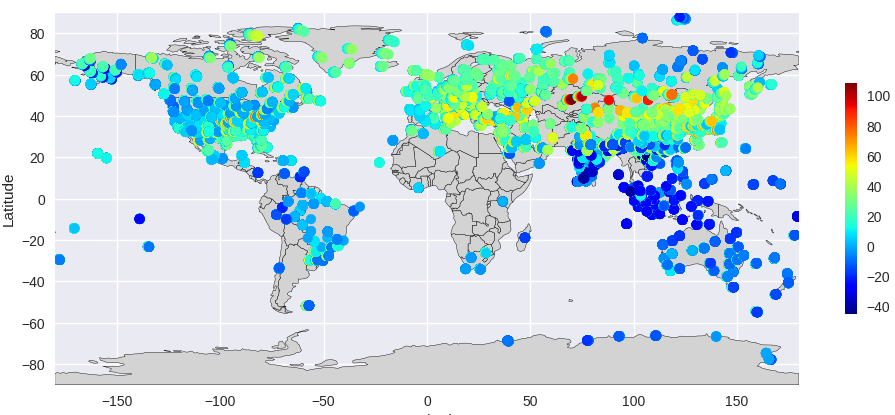
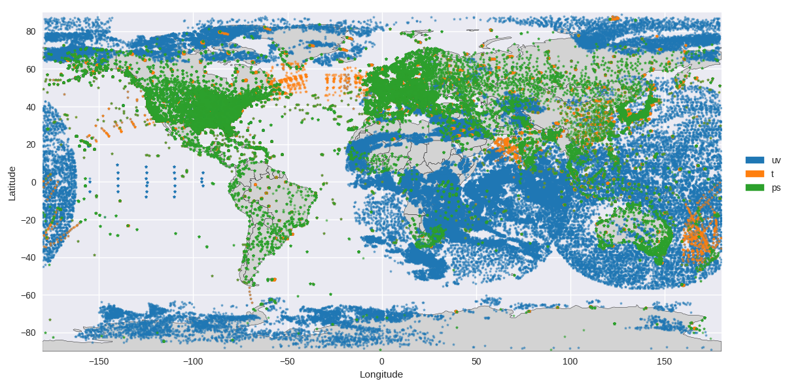
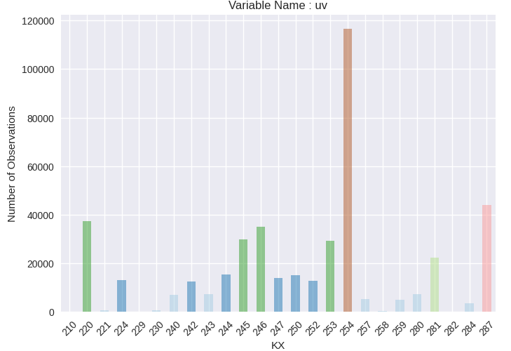
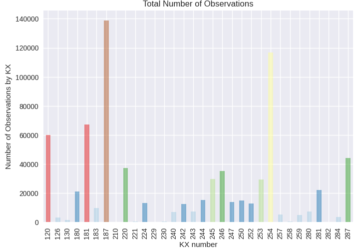
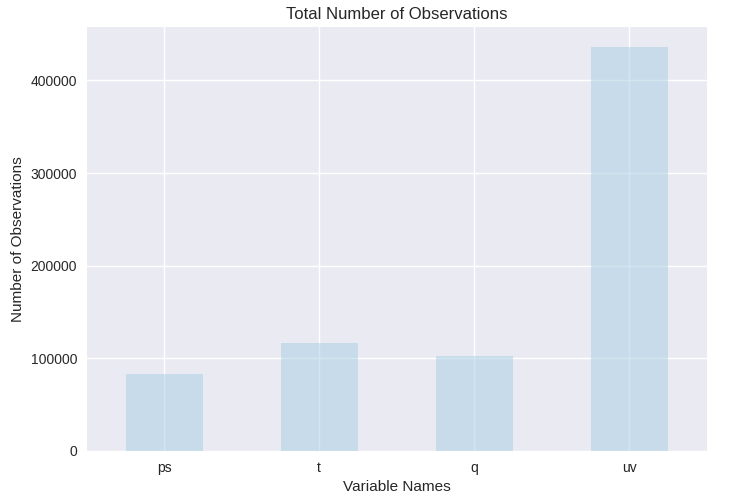

# Aplicação - Introdução

O pacote `readDiag` foi concebido para ser uma ferramenta que possibilita o fácil acesso aos arquivos diagnósticos gerados pelo [Gridpoint Statistical Interpolation (GSI) system](https://github.com/NOAA-EMC/GSI). O pacote é composto principalmente por 2 classes, a primeira para ler os dados (`read_diag`) e outra para fazer diferentes tipos de figuras com dados selecionados (`plot_diag`).

## Classe `read_diag`

A classe read_diag é composta por 5 funções:

1. `__init__(self, diagFile, diagFileAnl=None, isisList=None, zlevs=None)`: sendo `diagFile` o arquivo de diagnóstico do primeiro outer loop com informação do OmF e `diagFileAnl` do último outer loop com informação do OmA. Note que não é necessário informar os dois arquivos, o `diagFileAnl` é opcional. Neste caso, a informação lida (Omf ou OmA) dependerá do outer loop (arquivo diagnóstico) fornecido;
2. `overview(self)`: esta função cria e retorna um dicionário com as informações existentes no arquivo;
3. `pfileinfo(self)`: esta função imprime de forma elegante uma lista com as informações existentes no arquivo;
4. `close(self)`: esta função fecha o último arquivo aberto;
5. `tocsv(self, varName=None, varType=None, dateIni=None, dateFin=None, nHour="06", Level=None, Lay=None, SingleL=None)`: esta função gera um arquivo CSV dos parâmetros OmF e OmA com as seguintes informações: data, média, desvio-padrão e total de dados para a variável e tipo escolhidos.
    
Os dados de entrada da função e funcionalidades são idênticas àquelas da função `time_series` que é apresentada na próxima seção na classe `plot_diag` (item 7 - ver também detalhes das funcionalidades [aqui](#time_series)). O que distingue as duas funções é que esta escreve um arquivo CSV e a outra gera figuras de séries temporais.

## Classe `plot_diag`
    
A classe plot_diag é composta por 7 funções:

1. `plot(self, varName, varType, param, mask=None, **kwargs)`: a função `plot` gera uma figura para a variável `varName` (ex: `uv`), `varType` (ex: `220` (dropssonda)) e `param`, que pode ser várias opções como: `param="obs"` para o valor da observação, `param="omf"` para observação menos background ou `param="oma"` para observação menos análise. Também é possível mascarar os dados com a variável `iuse`, que indica se o dado foi (`iuse=1`) ou não (`iuse=-1` - dado monitorado) utilizado na assimilação. Abaixo há um exemplo executado para `varName="uv"`, `varType=220`, `param="obs"` e mask `iuse==1"`;

    
    
2. `ptmap(self, varName, varType=None, mask=None, **kwargs)`: a função `ptmap` gera uma figura com a localização de todas as observações definidas por `varName` (ex: `uv`) e `varType` (pode ser um único tipo ou uma lista, ex: `[200]` ou `[220,221,257]`. Se `varType` não for informado, então todos os tipos serão incluídos na figura. Também é possível mascarar os dados com a variável `iuse`, que indica se o dado foi (`iuse=1`) ou não (`iuse=-1` - dado monitorado) utilizado na assimilação. Abaixo há um exemplo executado para `varName="uv"`, `varType=[254,242,221,220,257,258,281,280]` e `mask=None`; 

    

3. `pvmap(self, varName=None, mask=None, **kwargs)`: a função `pvmap` é similar à função `ptmap`, com a diferença de não especificar o tipo (`varType`), podendo então escolher uma lista de variáveis, ex: `["uv","ps","t"]`. Abaixo há um exemplo executado para `varName=['uv','ps','t']`, e `mask=None`; 

    

4. `pcount(self,varName,**kwargs)`: a função `pcount` gera um histograma da quantidade de dados para uma determinada variável `varName` (ex: `uv`) e todos os tipos disponíveis (`varType`);

    

5. `kxcount(self,**kwargs)`: a função `kxcount` é similar à `pcount`, porém não especifica a variável (`varName`). Esta função gera um histograma com o total de dados (todas as variáveis somadas) para todos os tipos disponíveis (`varType`);

    

6. `vcount(self,**kwargs)`: a função `vcount` gera um histograma com a quantidade total de dados para cada variável (`ps`, `t`, `q`, `uv`);

    

7. `time_series(self, varName=None, varType=None, dateIni=None, dateFin=None, nHour="06", vminOMA=None, vmaxOMA=None, vminSTD=0.0, vmaxSTD=14.0, Level=None, Lay=None, SingleL=None, Clean=None)`: a função `time_series` pode gerar 6 tipos distintos de figuras, dependendo da configuração especificada na sua chamada. A característica comum entre os 6 tipos é a variação no tempo, enquanto que a diferença entre os 6 tipos é a forma de tratar os níveis verticais. Basicamente estas formas são distribuídas entre variar na vertical (diferentes valores para diferentes níveis/camadas) e fixo na vertical (nível específico, média na camada ou toda a atmosfera). 

A seguir são apresentados os parâmetros de entrada na função e cada uma das opções de figuras será explicada em mais detalhes.
    
| Parâmetro       | Exemplo                                  | Descrição
| :---            | :---:                                    | :---
| `self`          | `['/home/user/diag_conv_01.2019121000']` | Lista com todos os caminhos completos (`caminho/nome_do_arquivo`) de cada tempo da série temporal.             
| `varName`       | `uv`                                     | Nome da variável   
| `varType`       | `220`                                    | Tipo da variável
| `dateIni`       | `2019121000`                             | Data inicial da série temporal
| `dateFin`       | `2019121118`                             | Data final da série temporal
| `nHour`         | `6`                                      | Intervalo de tempo em horas entre cada arquivo na lista `self`
| `vminOMA`       | `-2.0`                                   | Valor mínimo da escala y (ordenada) para OmF e OmA
| `vmaxOMA`       | `2.0`                                    | Valor máximo da escala y (ordenada) para OmF e OmA
| `vminSTD`       | `0.0`                                    | Valor mínimo da escala y (ordenada) para o desvio-padrão
| `vmaxSTD`       | `14.0`                                   | Valor máximo da escala y (ordenada) para o desvio-padrão
| `Level`         | `Zlevs`                                  | Valor do nível a ser feita a série temporal, opções: valor numérico referente ao nível, ex.: 1000 p/ 1000 hPa; `Zlevs` para plotar por camadas (em torno dos níveis padrão); `None` para plotar de todos os níveis.
| `Lay`           | 25                                       | Metade do tamanho da camada (se `Level="Zlevs"`) em hPa se optar por amostragem em camadas. Se `Lay=None`, `Lay` será calculada internamente para preencher toda a atmosfera contendo os níveis padrão.
| `SingleL`       | `All`                                    | Quando `Level` for fixo, ex: 1000 hPa, será considerado exatamente esse nível (usando a opção `SingleL=None`) ou em todos os níveis como uma única camada (usando `SingleL="All"`) ou em uma camada definida em torno do valor de `Level` variando entre `Level-Lay` e `Level+Lay`. Se `Lay` não for informado, será usado um valor padrão de 50 hPa.
| `Clean`         | `True` ou `False`                        | Se `True`, após gerar e salvar a figura, a janela da figura é reiniciada (`plt.clf()`) ou fechada (`plt.close()`), se `False`, este procedimento é eliminado e a figura continua disponível para visualização com `plt.show()`.

Todas as figuras geradas com a opção `Level` igual a `None` ou `Zlevs` conterá no nome o termo `all_levels`, caso contrário será `level` ou `layer`, dependendo da opção `SingleL`.

No decorrer deste notebook são mostrados exemplos com recortes de código para exemplificar o uso das funções acima elencadas.
